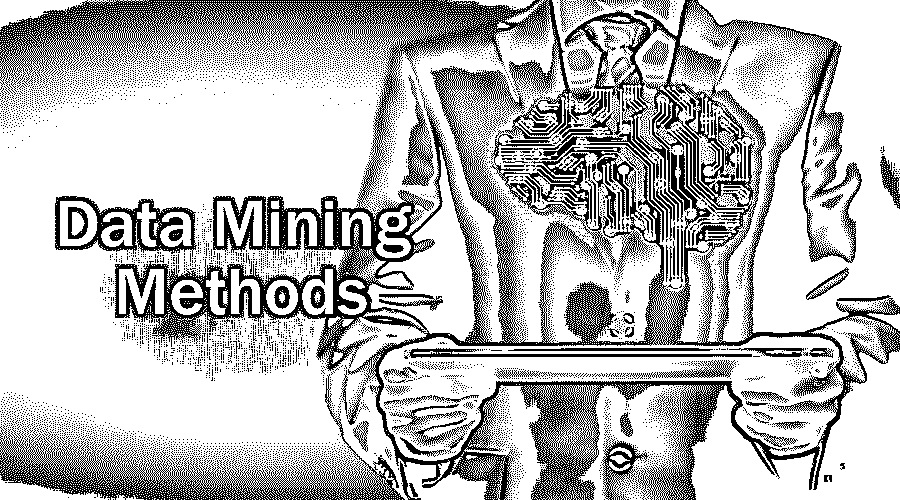
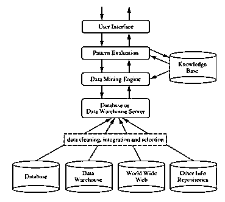
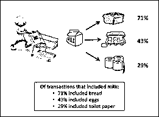
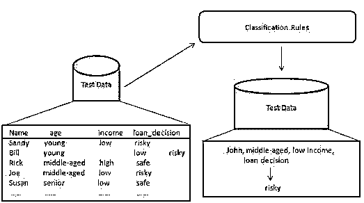
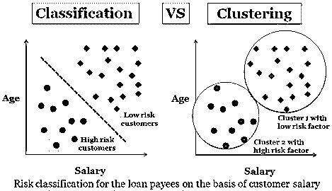
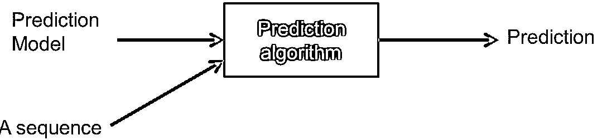
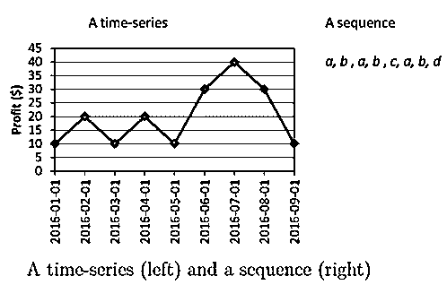
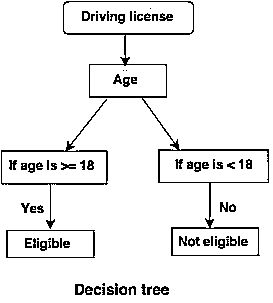
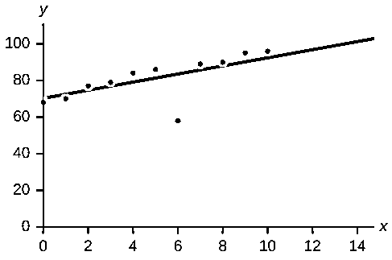

# 数据挖掘方法

> 原文：<https://www.educba.com/data-mining-methods/>

## 数据挖掘方法简介

数据挖掘是在庞大的数据存储中寻找模式。这个过程带来了有用的方法，因此我们可以对数据做出结论。这也产生了关于我们已经拥有的数据的新信息。这些方法包括跟踪模式、分类、关联、异常值检测、聚类、回归和预测。识别模式很容易，因为给定的数据可能会有突然的变化。我们已经收集了数据，并根据不同的部分进行了分类，然后用类别进行分析。聚类根据数据的相似性对数据进行分组。

### 什么是数据挖掘？

它是从海量数据(或大数据)中提取有用信息或知识的过程。通过使用[各种数据挖掘工具](https://www.educba.com/data-mining-tool/)，数据和摄入量之间的差距已经缩小。它也可以被称为从数据中发现知识或 KDD **。**

<small>Hadoop、数据科学、统计学&其他</small>

**来源**:-【www.ques10.com T2】

它可以在各种数据库和信息存储库上执行，如关系数据库、数据仓库、事务数据库、数据流等等。

### 不同的数据挖掘方法

有许多方法用于数据挖掘，但关键的一步是根据业务或问题陈述从中选择适当的形式。这些方法有助于预测未来，然后做出相应的决策。这些也有助于分析市场趋势和增加公司收入。

一些方法是:

*   联合
*   分类
*   聚类分析
*   预言；预测；预告
*   顺序模式或模式跟踪
*   决策树
*   异常值分析或异常分析
*   神经网络

让我们逐一了解每一种数据挖掘方法。

#### 1.联合

它通过识别数据集中的隐藏模式来发现两个或多个项目之间的相关性，因此也被称为关系分析*。*该方法用于购物篮分析，预测客户的行为。

假设，一家超市的营销经理想要确定哪些产品经常一起购买。

举个例子，

Buys (x，“啤酒”)-> buys(x，“筹码”)[支持度= 1%，信心= 50%]

*   这里的 x 代表一起购买啤酒和薯条的顾客。
*   信心表明，如果顾客买了啤酒，有 50%的机会他/她也会接受薯条。
*   支持意味着在所有被分析的交易中，有 1%显示啤酒和薯条是一起买的。

可以考虑许多类似的例子，如面包和黄油或计算机和软件。

关联规则有两种类型:

*   **单维关联规则:**这些规则包含一个重复的属性。
*   **多维关联规则:**这些规则包含多个重复的属性。

**

** 

**来源链接:**【https://www.google.com/search T2】

#### 2.分类

这种数据挖掘方法用于将数据集中的项目区分成类或组。它有助于准确预测集团内实体的行为。这是一个两步过程:

*   **学习步骤(训练阶段):**在该步骤中，分类算法通过分析训练集来构建分类器。
*   **分类步骤:**测试数据用于估计分类规则的准确度或精度。

例如，一家银行公司使用来识别低、中或高信用风险的贷款申请人。类似地，医学研究者分析癌症数据来预测给病人开哪种药。

**来源链接:**–【www.tutorialspoint.com T2】

#### 3.聚类分析

聚类几乎类似于分类，但是在这个聚类中是根据数据项的相似性进行的。不同的组有不同或不相关的对象。它也被称为数据分割，因为它根据相似性将巨大的数据集划分成组。

使用各种聚类方法:

*   分层凝聚方法
*   基于网格的方法
*   分割方法
*   基于模型的方法
*   基于密度的方法

这里也可以考虑贷款申请人的类似例子。下图描述了一些不同之处。

**来源链接:**【https://www.google.com/search T2】

#### 4.预言；预测；预告

这种方法用于根据过去和现在的趋势或数据集来预测未来。预测主要用于结合其他挖掘方法，如分类、模式匹配、趋势分析和关系。

例如，如果销售经理希望根据过去的销售数据来预测每件商品的收入。它对指示缺失数值数据值的连续值函数进行建模。

**来源链接:**–[数据挖掘。菲利普-福尼尔](https://data-mining.philippe-fournier-viger.com/)

[回归分析是进行预测的](https://www.educba.com/what-is-regression-analysis/)最佳选择。它可以用来设置自变量和因变量之间的关系。

#### 5.顺序模式或模式跟踪

这种方法用于识别在一段时间内频繁出现的模式。

例如，一家服装公司的销售经理发现，在冬季来临之前，夹克的销量似乎会增加，或者在圣诞节或新年前夕，面包店的销量会增加。

让我们看一个有图表的例子。

**来源链接:-** [数据挖掘。菲利普-福涅尔-维格](https://data-mining.philippe-fournier-viger.com/)

#### 6.决策树

决策树是一种树形结构(顾名思义)，其中

*   每个内部节点代表对属性的一个测试。
*   分支表示测试的结果。
*   终端节点持有类别标签。
*   最顶端的节点是根节点，它有一个简单的问题，这个问题有两个或更多的答案。相应地，树会增长，并生成类似流程图的结构。

**源闪:**–【www.tutorialride.com T2】

在这项决定中，tree 政府将 18 岁以下或 18 岁以上的公民分类。这将有助于他们决定是否必须向某个特定的城市发放许可证。

#### 7.异常值分析或异常分析:

该方法识别不符合预期模式或预期行为的数据项。这些意外的数据项被认为是异常值或噪声。它们在许多领域都很有用，如信用卡欺诈检测、入侵检测、故障检测等。这也被称为离群数据挖掘**。**

例如，让我们假设下图是使用数据库中的一些数据集绘制的。

这样就画出了最佳拟合线。位于线附近的点显示预期的行为，而远离线的末端是异常值。

这将有助于检测异常并相应地采取可能的行动。

**来源链接:**【https://www.google.com/search T2】

#### **8。**神经网络

这种方法或模型基于生物神经网络。它是像处理单元一样的神经元的集合，它们之间有加权连接。它们用于模拟输入和输出之间的关系。它用于分类、回归分析、数据处理等。这项技术基于三个支柱

*   模型
*   学习算法(监督或非监督)
*   激活功能

**来源链接:-**【www.saedsayad.com T2】

### 推荐文章

这是一个数据挖掘方法的指南，在这里，我们讨论了什么是数据挖掘和不同的挖掘方法的例子。您也可以阅读以下文章，了解更多信息——

1.  [大数据分析软件](https://www.educba.com/big-data-analytics-software/)
2.  [数据结构面试试题](https://www.educba.com/data-structure-interview-questions/)
3.  [重要的数据挖掘技术](https://www.educba.com/data-mining-techniques/)
4.  [数据挖掘架构](https://www.educba.com/data-mining-architecture/)

