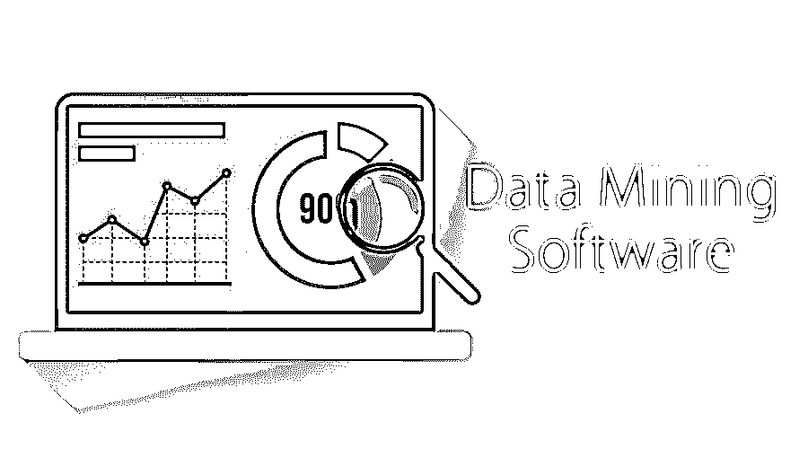

# 数据挖掘软件

> 原文：<https://www.educba.com/data-mining-software/>

## 数据挖掘软件简介

数据挖掘是一个分析数据、识别模式并将非结构化数据转换为结构化数据(按行和列组织的数据)以用于业务相关决策的过程。这是一个从各种数据库中提取大量非结构化数据的过程。数据挖掘是一门跨学科的科学，它拥有由机器使用的数学和计算机科学算法。数据挖掘软件帮助用户分析来自不同数据库的数据并发现模式。数据挖掘工具的主要目的是发现、提取和提炼数据，然后分发信息。

### 数据挖掘软件的特点

以下是数据挖掘软件的不同功能:

<small>Hadoop、数据科学、统计学&其他</small>

*   **易于使用:**数据挖掘软件具有易于使用的图形用户界面(GUI)来帮助用户高效地分析数据。
*   **预处理:**数据预处理是必要的步骤。它包括数据清理、数据转换、数据规范化和数据集成。
*   **可扩展处理:**数据挖掘软件允许可扩展处理，即软件在数据和用户的规模上是可扩展的。
*   **高性能:**数据挖掘软件提高了性能，创造了一个快速生成结果的环境。
*   **异常检测:**它们有助于识别可能有错误或需要进一步调查的异常数据。
*   **关联规则学习:**数据挖掘软件使用关联规则学习，识别变量之间的关系。
*   **聚类:**是将在某种程度上相似的数据进行分组的过程。
*   **分类:**是将已知的结构进行归纳，然后应用于新数据的过程。
*   **回归:**它是估计数据集或数据之间关系的任务。
*   **数据汇总:**数据挖掘工具能够将数据压缩或汇总成信息性的表示。该软件提供交互式数据准备工具。

### 不同的数据挖掘软件

以下是一些顶级的数据挖掘软件:

#### 1.橙色数据挖掘

它是一个开源的数据分析和可视化工具。在这种情况下，数据挖掘是通过 Python 脚本和可视化编程完成的。此外，它还包含数据分析功能以及机器学习和文本挖掘组件。

#### 2.r 软件环境

r 是一个用于图形和统计计算的自由软件环境。它可以在各种 UNIX 平台、MacOS 和 Windows 上运行。这是一套用于计算、图形显示和数据处理的软件工具。

#### 3.Weka 数据挖掘

它是执行数据挖掘任务的机器学习算法的集合。这些算法可以用 Java 代码调用，也可以直接应用于数据集。它是用 Java 编写的，包含机器学习、预处理、数据挖掘、聚类、回归、分类、可视化和属性选择等功能。

#### 4.SpagoBI 商业智能

它是一个开源的商业智能套件。它提供了高级数据可视化特性、广泛的分析功能和功能语义层。SpagoBI 套件的各个模块是 SpagoBI Studio、SpagoBI SDK、SpagoBI Server 和 SpagoBI Meta。

#### 5.蟒蛇

是一个[开放的数据科学平台](https://www.educba.com/data-science-platform/)。是 [R 和 Python](https://www.educba.com/r-vs-python/) 的高性能分发。它包括用于数据挖掘、统计、深度学习、模拟和优化、自然语言处理和图像分析的 R、Scala 和 Python。

#### 6.将军

这是一个开源的免费工具箱。它有各种数据结构和机器学习问题的算法。它的主要焦点是像支持向量机这样的核心机器。它允许用户轻松地组合算法类、多种数据表示和通用工具。它允许隐马尔可夫模型的完全实现。

#### 7.数据融化

它是用于统计、数值计算、科学可视化和大数据分析的软件。这是一个计算平台。它可以在各种操作系统上使用不同的编程语言。

#### 8.自然语言工具包

它是实现 python 程序来处理人类语言数据的平台。它有易于使用的界面。它提供 WordNet 等资源，并有一套文本处理库和一个论坛。它对学生、工程师、研究人员、语言学家和行业用户都很有用。

#### 9.阿帕奇看象人

它的主要目的是为快速构建可扩展的机器学习应用程序创建一个环境。它包含 Apache Spark、Scala 和 Apache Flink 的各种算法。它在 Apache Hadoop 上实现，使用 MapReduce 范式。

#### 10.GNU 八度音阶

它代表了一种为数字计算而构建的高级语言。它在命令行界面上工作，允许用户使用与 Matlab 兼容的语言用数值方法解决线性和非线性问题。它提供了可视化工具等功能。它可以在 Windows、macOS、GNU/Linux 和 BSD 上运行。

#### 11.RapidMiner 入门版:

它为机器学习、数据准备、文本挖掘和深度学习提供了一个集成的环境。它用于商业和业务应用、研究、培训、教育和快速原型制作。它支持数据准备、模型可视化和优化。

#### 12.GraphLab 创建

这是一个[机器学习平台](https://www.educba.com/machine-learning-platform/)来创建一个预测应用程序，包括数据清理、训练模型和开发功能。这些应用程序为欺诈检测、情感分析和客户流失预测等用例提供预测。

#### 13.Lavastorm 分析引擎

它是一个可视化的数据发现解决方案，允许快速整合不同的数据，并连续检测异常值和异常。它为业务用户提供自助服务功能。它提供了转换、获取和组合数据等功能，无需预先规划和编写脚本。

#### 14\. Scikit-learn

它是一个用于 Python 编程的开源机器学习库。它提供了不同的分类、聚类和回归算法，包括随机森林、K-means 和支持向量机。它是为使用 Python 库如 NumPy 和 SciPy 而构建的。

### 结论

本文包含对数据挖掘软件的简要介绍。该软件帮助用户高效快速地执行数据挖掘任务。如果一个人想在数据挖掘领域建立自己的事业，那么强烈推荐这些工具。

### 推荐文章

这是数据挖掘软件的指南。这里我们讨论了数据挖掘的概念、特点和一些不同的软件。您也可以浏览我们推荐的其他文章，了解更多信息——

1.  [什么是数据泄露？](https://www.educba.com/what-is-data-breach/)
2.  [什么是数据处理？](https://www.educba.com/what-is-data-processing/)
3.  [什么是数据仓库？](https://www.educba.com/what-is-data-warehouse/)
4.  [什么是数据可视化](https://www.educba.com/what-is-data-visualization/)
5.  [数据挖掘架构的组件](https://www.educba.com/data-mining-architecture/)

