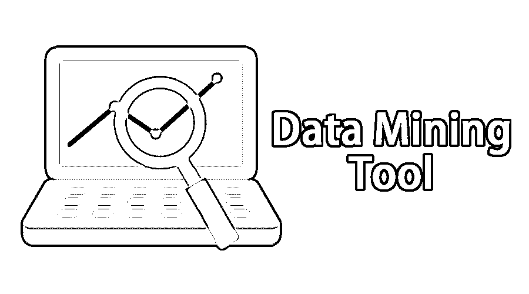

# 数据挖掘工具

> 原文：<https://www.educba.com/data-mining-tool/>

## 什么是数据挖掘工具？

当今世界，几秒钟内就会产生大量数据。为了处理这些数据，我们应该了解一些不同的技术和工具。数据挖掘工具不过是一套用于分析大量数据和其他数据关系的方法。

### 数据挖掘工具列表

这里列出了一些有助于我们分析数据的著名数据挖掘工具:

<small>Hadoop、数据科学、统计学&其他</small>

#### 1.快速采矿机

它由 Rapid Miner 公司开发；因此，这个工具的名字是一个快速矿工。它是用 java 语言编写的[。fast miner 可用于预测分析、商业应用、教育和研究、商业应用等。它提高了交付的速度，因为它遵循模板框架。它不仅提高了交货速度，而且减少了转换时的错误。rapid miner 有三种类型——Rapid Miner Studio、Rapid Miner Server 和 Rapid Miner Radoop。](https://www.educba.com/java-programming-language-features/)

*   **Rapid Miner Studio:** 工作流设计、原型制作、验证等。，都是在本模块中完成的。
*   **Rapid Miner Server:** 该模块用于操作预测数据模型。
*   **Rapid Miner Radoop:** 为了简化预测分析，这个模块在 Hadoop 中执行一个进程。

#### 2.柑橘

它是用 python 语言编写的开源软件。Orange 是分析数据和机器学习的最佳软件。这些组件被称为小部件。这些小部件用于读取数据、分析组件、允许用户选择特性以及显示数据。有了 orange，在小部件的帮助下，数据格式化和移动变得又快又容易。

#### 3.新西兰黑秧鸡

怀卡托大学开发了 weka。这是一个用于预测建模和数据分析的开源软件。Weka [有一个 GUI 界面](https://www.educba.com/course/graphic-user-interface/)，为用户提供简单的交互式访问。它[支持 SQL](https://www.educba.com/what-is-sql/) 并允许用户连接到数据库，通过触发查询来执行操作。它以平面文件格式存储数据。

#### 4\. KNIME

它是由 KNIME.com 公司开发的用于数据分析的开源软件。它是通过结合数据挖掘和机器学习组件构建的。它已被用于药物研究、商业智能和金融分析。

#### 5.西森斯

它不是开源软件；这是授权软件，我们必须购买许可证才能使用。小型和大型组织都使用 Sisense 来处理数据。因为它也支持像 orange 这样的小部件，所以很容易通过拖放来移动数据和创建报告。即使是技术人员也无法使用 Sisense 作为其 GUI 基础。借助 widgets，Sisense 生成的单词有柱状图、饼状图、折线图等形式。

#### 6.阿帕奇看象人

阿帕奇基金会开发了它。Apache Mahout 旨在创建机器学习算法，并专注于数据的回归和聚类分类。由于它是用 java 之类的知名语言编写的，并且包含支持数学运算的 java 库，所以[用于统计分析](https://www.educba.com/top-10-free-statistical-analysis-software/)。

#### 7.SSDT

SSDT 是 SQL Server 数据工具的缩写。它用于扩展 visual studio 中的数据库开发阶段。它广泛用于数据分析，并提供解决商业智能问题的解决方案。SSDT 提供了一个表格设计器来执行表格操作，如创建表格、添加表格数据、删除表格数据、修改表格内容。它允许用户连接到数据库，因为它支持 SQL。

#### 8.连续短促的尖利声

Rattle 是使用 R 语言开发的开源软件。它提供了一个 GUI 界面。内置的日志关闭选项卡使 Rattle 能够为每个活动生成副本。

#### 9.数据融化

它也被称为 DMelt。它用于分析和可视化数据。它是为学生、工程师和科学家设计的。它是平台无关的，这意味着它可以在任何包含 JVM ( Java 虚拟机)的操作系统[上运行。它用于创建 2D 或三维图，随机数，数学运算，代数方程。](https://www.educba.com/what-is-jvm/)

#### 10.IBM Cognos

它适用于商业内幕情报。它用于分析数据、数据报告。

IBM Cognos 的组件

*   **报表工作室**:用于生成报表。
*   **Query Studio:** 包含获得所需结果的查询操作。
*   **Analysis Studio:** 用于处理大量数据，分析数据之间的关系
*   **事件工作室:**用于发布事件通知。
*   Cognos Connection: 这是一个门户网站，用于汇总大量数据并给出报告。

#### 11.斯堪的纳维亚航空公司

它是为管理大量数据而开发的。它允许用户修改数据，将不同位置的数据存储到一个空间中。由于它提供了 GUI 界面，非技术人员也可以快速使用它并有效地处理他们的数据。

#### 12.Teradata

它包含数据仓库工具以及数据挖掘软件。它被广泛用于商业分析。Teradata 用于提供有关数据的信息，如可用产品、售出的产品数量、库存等。

#### 13.邓达斯

这是一个仪表板，分析，报告工具。有了 Dundas，无限的数据转换成为可能。它提供了创建有吸引力的数据的功能，如图表、表格样式、图形、文本格式等。

### 结论

在本文中，我们已经了解了什么是数据挖掘，以及使用哪些工具来完成数据挖掘。

### 推荐文章

这是一个数据挖掘工具指南。这里我们讨论了数据挖掘工具的概念和列表。您也可以浏览我们推荐的其他文章，了解更多信息——

1.  [数据仓库架构](https://www.educba.com/data-warehouse-architecture/)
2.  [什么是数据处理？|定义](https://www.educba.com/what-is-data-processing/)
3.  [什么是数据可视化工具？](https://www.educba.com/data-visualization-tools/)
4.  [了解大数据分析工资](https://www.educba.com/big-data-analytics-salary/)

