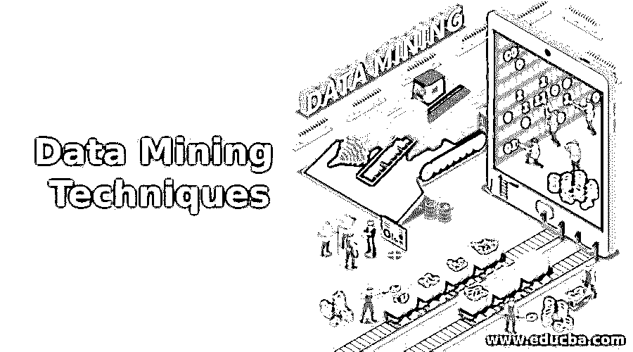

# 数据挖掘技术

> 原文：<https://www.educba.com/data-mining-techniques/>

## 数据挖掘技术简介

在这个主题中，我们将学习数据挖掘技术；随着信息技术领域的进步，各种领域出现了大量的数据库。因此，需要存储和操作重要的数据，以便以后用于决策和改进业务活动。

### 什么是数据挖掘？

它是从大量数据中提取有用信息和模式的过程。它包括数据的收集、提取、分析和统计。它也被称为知识发现过程，从数据或数据/模式分析中挖掘知识。找出有用的数据是一个寻找有用信息的逻辑过程。一旦摄入和设计被发现，它可以用来发展业务。[数据挖掘工具](https://www.educba.com/data-mining-tool/)可以回答与您的业务相关的各种问题，这些问题很难解决。他们还预测未来的趋势，让商业人士做出积极的决策。

<small>Hadoop、数据科学、统计学&其他</small>

数据挖掘包括三个步骤。他们是

1.  **探索**–在这一步中，数据被清除并转换成另一种形式。也决定了信息的性质。
2.  **模式识别**–下一步是选择能够做出最佳预测的模式
3.  **部署**–确定的模式用于获得期望的结果。

### 数据挖掘的好处

以下是给出的好处。

*   趋势和行为的自动预测
*   它可以在新系统和现有平台上实现。
*   它可以在几分钟内分析巨大的数据库。
*   隐藏模式的自动发现
*   有很多模型可以用来快速理解复杂的数据。
*   它的速度很快，使得用户可以在更短的时间内分析大量的数据。
*   它能产生更好的预测。

### 7 种重要的数据挖掘技术

数据挖掘中最重要的任务之一是选择正确的数据挖掘技术。数据挖掘技术必须根据企业的类型和企业面临的问题来选择。必须使用通用方法来提高使用数据挖掘技术的准确性和成本效益。本文主要讨论了七种主要的数据挖掘技术。还有许多其他的数据挖掘技术，但这七种被认为是商业人士更经常使用的。

*   统计数字
*   群聚；聚集
*   形象化
*   决策图表
*   关联规则
*   神经网络
*   分类

#### 1.统计技术

数据挖掘技术统计学是数学的一个分支，涉及数据的收集和描述。许多分析师并不认为统计技术是一种数据挖掘技术。但是，它仍然有助于发现模式和建立预测模型。出于这个原因，数据分析师应该掌握一些关于不同统计技术的知识。在当今世界，人们必须处理许多数据，并从中得出重要的模式。统计数据可以在很大程度上帮助你得到关于他们数据的问题的答案，比如

*   他们的数据库里有哪些途径？
*   一个事件发生的概率是多少？
*   哪些模式对业务更有用？
*   能让您详细了解数据库中有什么的高级摘要是什么？

统计学不仅回答了这些问题，它们还有助于数据的汇总和统计。它还有助于轻松提供有关数据的信息。通过统计报告，人们可以做出明智的决定。有不同形式的统计，但最重要和最有用的技术是收集和统计数据。有很多收集数据的方法，比如

*   柱状图
*   平均
*   中位数
*   方式
*   差异
*   最大
*   福建话
*   线性回归

#### 2.群集技术

聚类是数据挖掘中最古老的技术之一。聚类分析是识别彼此相似的数据的过程。这将有助于理解数据之间的差异和相似之处。这有时被称为分段，允许用户理解数据库中正在发生的事情。例如，保险公司可以根据收入、年龄、保单性质和索赔类型对客户进行分组。

**有不同类型的聚类方法。它们如下。**

*   分割方法
*   分层凝聚方法
*   基于密度的方法
*   基于网格的方法
*   基于模型的方法

最流行的聚类算法是最近邻法。最近邻技术非常类似于聚类。这是一种预测技术，用于预测一个记录中的估计值，在历史数据库中查找具有相似估计值的记录，并使用未分类文档附近表单中的预测值。这种技术表明彼此更接近的对象将具有相似的预测值。通过这种方法，你可以很容易很快地预测最近的项目的重要性。最近邻是最容易使用的技术，因为它们按照人们的想法工作。他们在自动化方面也做得很好。他们可以轻松执行复杂的 ROI 计算。这种技术的准确性与其他数据挖掘技术一样好。

在商业中，最近邻技术最常用于文本检索过程。它们用于查找与被标记为印象深刻的主文档具有共同重要特征的文档。

#### 3.形象化

可视化是用来发现数据模式的最有用的技术。这种技术用在数据挖掘过程的开始。许多类型的研究正在进行中，以产生一个有趣的数据库投影，称为投影寻踪。有很多数据挖掘技术，对于好的数据会有有用的模式。但可视化是一种将劣质数据转化为有用数据的技术，让不同类型的数据挖掘方法用于发现隐藏模式。

#### 4.归纳决策树技术

决策树是一种预测模型，顾名思义，它看起来像一棵树。在这种技术中，树的每个分支都被视为一个分类问题。树叶被认为是与该特定分类相关的数据集的分区。该技术可用于勘探分析、数据预处理和预测工作。

决策树可以被认为是原始数据集的分割，其中分割是出于特定原因而完成的。每个细分市场下的数据在预测的信息方面都有一些相似之处。决策树提供用户容易理解的结果。

统计学家大多使用决策树技术来找出哪个数据库与业务问题更相关。决策树技术可用于预测和数据预处理。

这项技术的第一步也是最重要的一步是种树。生长这棵树的基础在于找到在每一个树枝上可能被问到的最好的问题。在以下任何一种情况下，决策树都会停止生长。

*   如果该段只包含一条记录
*   所有记录都包含相同的特征。
*   这种增长不足以取得任何进展。溢出

CART 代表分类和回归树，是一种数据探索和预测算法，可以更复杂地选择问题。它尝试所有问题，然后选择一个最佳问题，用于将数据分成两个或多个部分。在决定了细节之后，它再次单独询问每个新元素的问题。

另一种流行的决策树技术是 CHAID(卡方自动交互检测器)。它类似于 CART，但有一点不同。卡特帮助选择最佳问题，而 CHAID 帮助选择拆分。

#### 5.神经网络

神经网络是目前人们使用的另一种重要技术。这种技术最常用于数据挖掘技术的起步阶段。人工神经网络是在人工智能社区的基础上形成的。

神经网络易于使用，因为它们在特定程度上是自动化的。因此，不期望用户对工作或数据库有太多的了解。但是要让神经网络高效工作，你需要知道。

*   节点是如何连接的？
*   要使用多少个处理单元？
*   什么时候应该停止训练过程？

这项技术有两个主要部分——节点和链路。

*   **节点**——自由匹配人脑中的神经元
*   **链接**——自由匹配人脑中神经元之间的连接

神经网络是相互连接的神经元的集合，形成单层或多层。神经元的形成及其相互连接称为网络的架构。神经网络模型有很多种，每种模型都有自己的优缺点。每个神经网络模型都有不同的架构，这些架构使用其他学习过程。

神经网络是一种强大的预测建模技术。但是即使是专家也不太容易理解。它创建了非常复杂的模型，不可能完全理解。因此，为了理解神经网络技术，公司正在寻找新的解决方案。已经提出了两种解决方案。

*   第一种解决方案是将神经网络打包成一个完整的解决方案，让它用于单一应用。
*   第二个解决方案是它与专家咨询服务绑定。

神经网络已经用于各种应用中。这已在业务中用于检测行业中发生的欺诈。

#### 6.关联规则技术

这种技术有助于找到两个或多个项目之间的关联。它有助于了解数据库中不同变量之间的关系。它发现了用于识别变量的数据集中的隐藏模式，以及出现频率最高的其他变量。

关联规则提供了两条主要的信息。

*   **支持**–该规则的应用频率如何？
*   **信心**–规则正确的频率如何？

这项技术遵循两个步骤。

*   找到所有频繁出现的数据集。
*   从频繁的数据集中创建强关联规则

**关联规则有三种类型。他们是**

*   多层关联规则
*   多维关联规则
*   数量关联规则

这种技术最常用于零售业，以发现销售模式。这将有助于提高转化率，从而增加利润。

#### 7.分类

数据挖掘技术分类是最常用的数据挖掘技术，它使用一组预先分类的样本来创建一个可以对大量数据进行分类的模型。这种技术有助于获得关于数据和元数据(关于数据的数据)的重要信息。这种技术与聚类分析技术密切相关，它使用决策树或神经网络系统。这项技术涉及两个主要过程

*   **学习**–在此过程中，数据由分类算法进行分析
*   **分类**——在这个过程中，数据用来衡量分类规则的精度

**有不同类型的分类模型。它们如下**

*   决策树归纳分类
*   贝叶斯分类
*   神经网络
*   [支持向量机(SVM)](https://www.educba.com/svm-algorithm/)
*   基于关联的分类

分类技术的一个很好的例子是电子邮件提供商。

### 结论

从这篇文章中，我们了解了重要的数据挖掘技术。并且详细解释了每种技术的特征和规范。它在许多商业领域都是一个重要的工具，而且这种技术最适用于导出问题的解决方案。因此，公司必须使用这些技术来帮助业务人员做出明智的决策。没有单一的方法可以用来解决商业中的问题。所有的数据挖掘技术应该携手解决一个问题。

### 推荐文章

这是数据挖掘技术的指南。这里我们分别讨论了基本概念和 7 种重要的数据挖掘技术。您也可以浏览我们推荐的其他文章，了解更多信息——

1.  [什么是数据分析](https://www.educba.com/what-is-data-analytics/)
2.  [什么是数据可视化](https://www.educba.com/what-is-data-visualization/)
3.  [什么是数据科学](https://www.educba.com/what-is-data-science/)
4.  [什么是大数据技术？](https://www.educba.com/what-is-big-data-technology/)

