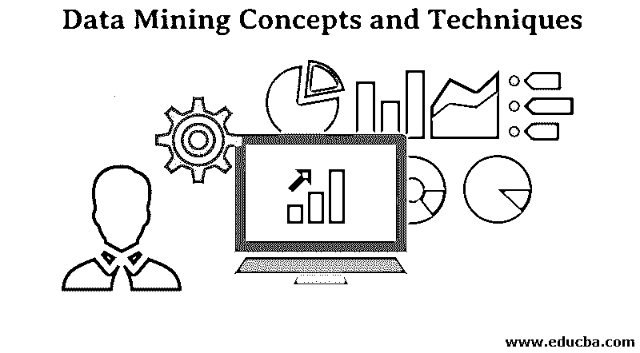
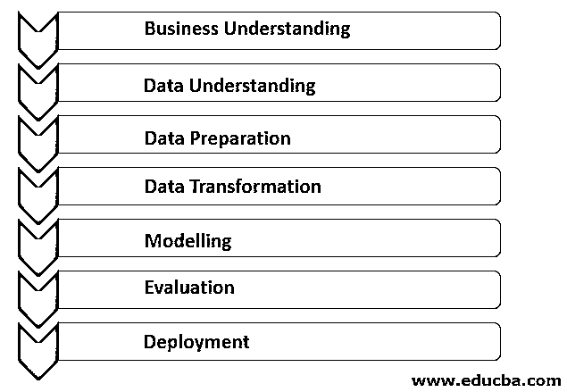

# 数据挖掘概念和技术

> 原文：<https://www.educba.com/data-mining-concepts-and-techniques/>

## 数据挖掘概念和技术介绍

以下文章概述了数据挖掘的概念和技术。数据挖掘是将数据转换成知识信息的一个特征。这是指通过查看大量可用数据来获取一些新信息。使用各种技术和工具，只有遵循正确的程序，才能从数据中预测所需的信息。这有助于各行各业通过识别数据库、数据仓库等现有数据中的一些模式来提取一些所需的信息，以供将来分析。

### 数据挖掘中的数据类型

以下是可以对其执行数据挖掘的数据类型:

<small>Hadoop、数据科学、统计学&其他</small>

*   关系数据库
*   数据仓库
*   高级数据库和信息库
*   面向对象和对象关系数据库
*   事务和空间数据库
*   异构和遗留数据库
*   多媒体和流式数据库
*   文本数据库
*   文本挖掘和 Web 挖掘

### 数据挖掘过程

以下是数据挖掘过程的要点:

#### 1.商业理解

这是数据挖掘实现过程的第一阶段，在这个阶段，所有的需求和客户的业务目标都被清楚地理解。设定适当的数据挖掘目标，同时考虑业务的当前场景和其他因素，如资源、假设和约束。一个合适的数据挖掘计划应该是详细的，并且必须满足我们的业务和数据挖掘目标。

#### 2.数据理解

这个阶段对从数据挖掘过程的各种资源中收集的数据进行健全性检查。首先，来自不同来源的所有数据都根据组织的业务场景进行组织，这些数据可能位于不同的数据库、平面文件等中。检查收集的数据是否正确匹配，因为它们可能不相关。

有时还需要检查元数据，以减少数据挖掘过程中的错误。各种数据挖掘查询用于分析正确的数据，并基于结果；可以检查数据质量。它还有助于检查是否有数据丢失。

#### 3.数据准备

这个过程消耗了项目的最大时间。这个界面包括一个称为数据清理的过程，用于清理在数据理解过程中收集的数据。数据清理过程用于清理数据，以针对具有缺失值的数据排除不适当的噪声数据。

#### 4.数据转换

数据转换操作在下一个状态中执行，该状态用于更改数据，使其对数据挖掘实现过程有用。在这种情况下，聚合、归纳、规范化或属性构造等转换会使数据为数据建模过程做好准备。

#### 5.系统模型化

这是数据挖掘的阶段，在此阶段使用适当的技术来确定数据模式。必须创建各种场景来检查该模型的质量和有效性，并确定在实现这些技术之后，是否达到了业务理解过程中定义的目标。在此过程中发现的模式将被进一步评估，并被发送到业务运营团队进行部署，以便它可以帮助改进组织的业务策略。

#### 6.估价

在这个阶段，对数据挖掘发现进行适当的评估，以决定是否实现业务流程。与这些发现进行了公正的比较。需要将现有的业务运营计划添加到当前的业务运营中，以评估正确发现的信息的变化。

#### 7.部署

在此阶段，使用数据挖掘过程得出的信息被转换为非技术风险承担者可以理解的形式。对于此流程，将创建一个适当的部署计划，其中包括运输、维护和对所发现信息的监控。这样，在将我们的数据挖掘发现移交给业务运营团队的过程中，可以创建适当的项目报告以及经验和教训。

因此，这个过程有助于改进一个组织的商业政策。

### 数据挖掘技术

以下技巧和技术有助于以最有效的方式应用数据挖掘功能:

#### 1.追踪模式

识别数据集中的模式是数据挖掘的基本技术之一。以规则的间隔观察数据，以识别一些异常。例如，可以看出，如果一个特定的人在不同的国家旅行，那么这个人会要求定期订票。因此可以提供一种特殊的信用卡。

#### 2.分类

这是数据挖掘的复杂技术之一，我们需要使用现有数据中的各种属性来创建各种可辨别的类别。这些类别有助于得出各种结论，供我们将来使用。例如，在分析城市中的交通数据时，该区域的交通可以分为低、中、重三类。这将有助于旅行者提前预测交通状况。

#### 3.联合

这种技术类似于模式跟踪技术，但它与相关联的变量有关。这意味着找到了与现有数据相关联的相应数据的模式。跟踪与其他事件相关的事件，并在该数据中找到特定的方式。例如，特定城市交通的文件跟踪数据也可以跟踪城市中最常去的地方。这也有助于追踪城市中著名的旅游景点。

#### 4.离群点检测

这种技术与提取数据模式中的异常有关。例如，一个购物中心的销售在一年的 11 个月里获得了丰厚的利润，但在最后一个月，销售额下降了那么多，面临亏损。在这种情况下，我们需要找出降低销售额的因素，以避免下次出现这种情况。在规则模式中找到这种干扰的技术是异常值检测技术的一部分。

#### 5.群聚；聚集

这种技术类似于分类；唯一的区别在于，它挑选有一些相似之处的一组数据，将它们放在一个组中。例如，基于频率、他们来看演出的频率、他们最常到达的时间以及他们来看哪种类型的电影来对电影院的不同观众进行聚类。

#### 6.回归

这项技术有助于绘制分析所依赖的两个变量之间的关系。在这里，我们试图通过固定其他因变量来确定变量的变化模式。例如，如果我们需要了解如何根据产品的可用性、季节、需求等在商场销售产品。这可以导致业主固定出售价格。

#### 7.预言；预测；预告

数据挖掘最重要的特征是通过研究销售和信用风险的现有和历史模式来降低未来风险并增加组织的利润。在这里，这种类型的技术帮助我们根据历史和当前数据中找到的方法做出未来的决策，并牢记市场变化和威胁。这种技术对数据挖掘最有帮助。

### 数据挖掘工具

人们不需要特定的最新技术来执行数据挖掘。这可以使用任何组织中可用的最新数据库系统和简单工具来完成。此外，当缺少合适的设备时，用户可以创建自己的工具。业内广泛使用的最流行的工具如下:

#### 1.r 语言

这是一个用于统计计算和图形的开源工具。该工具有助于有效的数据处理和存储设施，所有这些功能都得益于以下技术:

*   统计的
*   经典统计测试
*   时间序列分析
*   分类
*   图形技术

#### 2.Oracle 数据挖掘

这个工具通常被称为 ODM 它是 Oracle 高级分析数据库的一部分。该工具有助于分析数据仓库中的数据，并生成有助于做出预测的详细见解。这些东西有助于研究顾客行为；产品需求有助于增加销售机会。

实施数据挖掘面临的挑战:

*   需要熟练的专家来进行复杂的数据挖掘查询。
*   目前的模型可能不适合未来国家的数据库。可能不适合未来的条件。
*   管理大型数据库面临的困难。
*   可能需要修改业务实践来使用已经发现的信息。
*   异构数据库和来自全球的信息会导致复杂的集成信息。
*   数据挖掘有一个先决条件，即数据必须具有多样性。否则，结果可能不准确。

### 结论-数据挖掘概念和技术

在本文数据挖掘概念和技术中，数据挖掘是一种跟踪过去数据并使用它进行未来分析的方法。这与从数据库中已经存在的最新资产中提取分析所需的信息是一样的。数据挖掘可以在[各种类型的数据库](https://www.educba.com/types-of-database/)上进行，如空间数据库、RDBMS、数据仓库、多重和遗留数据库等。整个挖掘过程包括业务理解、数据理解、数据准备、建模、演化、部署。

各种数据挖掘技术可以使数据挖掘有效地工作，例如分类、回归关联等。使用情况取决于场景。最有用的数据挖掘工具是 R 语言和 Oracle 数据。数据挖掘的主要缺点是训练专家操作分析软件的困难。有各种各样的行业使用数据挖掘进行分析，如银行、制造业、超市、零售服务提供商等。

### 推荐文章

这是数据挖掘概念和技术的指南。这里我们讨论数据挖掘过程、技术和工具。您也可以浏览我们的其他相关文章，了解更多信息-

1.  [数据挖掘的优势](https://www.educba.com/advantages-of-data-mining/)
2.  [什么是数据挖掘？](https://www.educba.com/what-is-data-mining/)
3.  [数据挖掘过程](https://www.educba.com/data-mining-process/)
4.  [数据科学技术](https://www.educba.com/data-science-techniques/)

