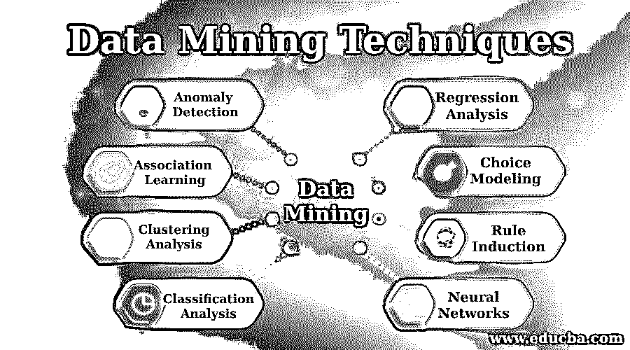

# 商业数据挖掘技术

> 原文：<https://www.educba.com/data-mining-techniques-for-business/>

## 商业数据挖掘技术介绍

数据挖掘一词最早出现在 20 世纪 90 年代。在此之前，统计学家使用术语“数据钓鱼”或“数据挖掘”来定义没有预先得出假设的数据分析。数据挖掘工具过程的最重要的目标之一是收集易于应用于大型数据集的结论性信息。每种类型都会导致不同的结果/效果。这意味着认识到商业问题将有助于品牌实施适当的数据挖掘技术并获得最佳结果。同时，重要的是要记住，数据挖掘技术也指发现有趣的未知模式、不寻常的记录或以前未被发现的相关性。

大数据是当今任何品牌增长故事中最重要的方面之一，无论是大品牌还是小品牌。目前，公司正在利用大数据分析技术来实现公司在客户满意度和组织增长方面的重要目标。同时，理解和分析大数据对于组织的成功发展和扩张至关重要，这一点至关重要。这就是为什么数据挖掘技术是有用的，因为它们可以帮助公司有效地分析大数据。虽然有多种数据挖掘技术可用，但它们迎合不同的问题，并提供对特定后续业务问题的洞察。因此，获得有价值见解的最佳方式之一是通过数据挖掘软件。一个用来描述整个数据分析范围的术语，数据挖掘技术包括收集、提取、分析和统计方法。这就是为什么必须制定一个伟大的战略，以便品牌/组织清楚地了解数据挖掘技术的影响。

<small>Hadoop、数据科学、统计学&其他</small>

### 8 种重要的数据挖掘技术

下面列出了一些基本的技术。

1.  #### Abnormal or abnormal value detection

异常或异常值检测是一种数据挖掘技术，它在数据集中搜索与预测模式或预期行为相似的数据项。

异常值也称为异常值，它为品牌和组织提供关键的可操作信息，因为异常值是一组数据库或数据组合中明显偏离一般平均值的对象。

它不同于其他数据。这就是为什么离群数据挖掘工具需要额外的关注和分析，因为它提供了对特定问题的不同看法。这种类型的[数据挖掘技术](https://www.educba.com/data-mining-techniques/)可用于检测关键系统中的欺诈和风险。

当数据挖掘技术的独特特征可以被充分分析并帮助分析人员发现系统中的任何缺点时，它们是理想的。

反过来，这可以指示欺诈行为、有缺陷的程序或特定理论无效的领域，从而使安装正确的系统变得安全有效。

重要的是要记住，离群值在广泛的数据挖掘技术中非常普遍。虽然离群值并不总是有害的，但它们可以帮助品牌找到独特的数据挖掘技术。

无论是哪种情况，通过异常或异常值检测得出的结果都需要进一步分析才能得出结论性的结果。

2.  #### Association rule learning

这种数据挖掘技术基于发现大型数据库中变量之间令人兴奋的关系。这种数据挖掘技术用于发现数据中隐藏的模式。

它们可用于识别数据中的变量以及出现频率最高的不同变量的同现。关联规则数据挖掘技术广泛应用于零售商店，用于发现销售数据中的模式。

这些数据挖掘工具可以推荐新产品，特别是发现人们向他人推荐哪种类型的产品，或者向客户推荐哪种新产品。

关联规则学习是一种有益的数据挖掘技术，可以有效地提高品牌的转化率。沃尔玛在 2004 年实施了一个很好的例子来证明联想学习的有效性。

这些数据挖掘技术发现，在飓风来临之前，草莓汽水的销量增长了 7 倍。由于这一发现，沃尔玛一直在气旋前将该产品放在收银台，从而创造更好的销售转化率。

3.  #### Cluster analysis

这种类型的数据挖掘技术被定义为识别彼此相似的数据挖掘工具；聚类分析有助于营销人员了解数据的相似性和差异性。

由于聚类具有共同的特征，它们可以用来改进目标算法。例如，如果某个特定的客户群购买了某个特定品牌的产品，可以创建一个特定的活动来帮助销售该产品。

了解这一点可以帮助品牌有效地提高销售转化率，增加品牌影响力和参与度。此外，人物角色的创建是聚类分析的结果。

人物角色是代表目标人群中不同用户类型的虚构角色，这些用户可能会使用类似的网站、品牌或产品。

像这样，聚类分析的一个重要方面，人物角色帮助品牌做出明智的营销选择和创造强大的活动。

4.  #### Classification and analysis

这种数据挖掘技术有一个系统的过程，用于获取关于元数据(关于数据的数据)和数据的重要和相关的信息；分类分析有助于品牌识别不同类别的数据挖掘技术。

分类分析与聚类分析密切相关，因为它们能有效地对数据挖掘工具做出更好的选择。电子邮件是一个众所周知的分类分析示例，因为它使用算法根据电子邮件是合法邮件还是垃圾邮件来进行分类。

这是通过对邮件使用[数据挖掘软件](https://www.educba.com/data-mining-software/)来完成的，例如，指示它们是垃圾邮件还是合法邮件的单词和附件。

5.  #### Regression analysis

另一个工具，回归分析，帮助品牌定义变量的依赖性。这是基于从一个变量到另一个变量的反应的单向因果关系的假设。

虽然独立变量可以相互影响，但相关性通常不会受到双向影响，这与相关性分析的情况不同。回归分析可以显示一个变量依赖于另一个变量，而不是相反。

由于回归分析是确定客户满意度的理想方法，它可以帮助品牌发现关于客户忠诚度的新的和不同的见解，以及外部因素如何影响服务水平，如天气条件。

回归分析的一个很好的例子是使用这种数据挖掘技术来匹配交友网站上的人。许多网站根据人们的喜好、兴趣和爱好使用变量来匹配他们。

6.  #### Select Modeling

一个精确的通用数据挖掘工具 choice modeling 可以帮助品牌对顾客的决策行为进行概率预测。

由于品牌必须关注其目标受众，选择建模有助于品牌以这样的方式使用其数据挖掘技术，以便他们可以在可能进行有效购买的客户身上尽最大努力；选择建模用于确定帮助客户做出选择的最关键因素。

基于像地点、过去的购买和态度这样的变量，选择模型帮助品牌决定消费者做出营销选择的可能性。通过投资选择建模，品牌可以迅速帮助全面提高其销售额。

7.  #### Rule induction

这种类型有助于开发基于观察的正式规则；规则归纳是另一种数据挖掘工具。从这种数据挖掘技术中提取的规则可以表示数据挖掘软件的科学模型或数据中的局部模式。

还有，归纳范式就是关联规则。关联规则是找出变量之间有效关系的过程，尤其是在大型数据库中。

数据挖掘软件技术有助于品牌发现单个产品之间的规律。例如，如果顾客买了黄油，他们也有可能会买面包。

关联规则的主要焦点是理解如果客户正在执行特定的功能，比如说，A 实现功能 B 的可能性很高。

这种理解可以帮助品牌预测销售并创建智能营销解决方案，包括促销定价和商店和商场中更好的产品放置。

8.  #### neural network

在数据挖掘技术的形成阶段，神经网络有自己的好处和优势。神经网络最显著的优点是它创建高度准确的预测模型，可以有效地应用于许多问题。

网络有两种[类型，即神经和人工。真正的神经网络是生物性的。也就是说，人脑可以做出模式和预测。](https://www.educba.com/types-of-network/)

在这个过程中，它根据情况做出选择。人工程序是那些在计算机系统上实现的程序。

人工神经网络的名字来源于科学家试图让计算机软件以人脑的方式思考的历史发展。

尽管大脑要复杂得多，但神经网络可以执行人脑可以执行的许多任务。

很难说神经网络何时被用作数据挖掘工具，但是在第二次世界大战期间发现了对这种数据挖掘技术的研究。

从那时起，神经网络已经走过了漫长的道路，许多数据分析师一直在使用它来解决现实世界的预测问题，并改善算法的结果。

此外，神经网络中许多最重要的突破都是在应用问题上，如改善客户预测或欺诈检测。他们可以帮助品牌发现更新更好的与顾客联系的方法。

神经网络已经成功地帮助品牌和组织处理了许多问题，如检测信用卡的欺诈使用。

它们还被应用于军事等领域，用于自动驾驶无人驾驶车辆，以纠正书面文本中的英语单词。

对于一个品牌来说，最难做的事情之一就是决定哪一个可能是正确的选择。

这是因为最佳使用取决于品牌所面临的问题类型，他们希望通过使用数据挖掘技术来解决这些问题。

有时试错会帮助一个品牌更好地解决这个问题。也就是说，市场和客户在不断变化，完全是动态的，这也是一个现实。

这些动态已确保不可能有完美的数据挖掘技术，因为成功预测未来几乎是不可能的。

它们是必不可少的，因为它们可以帮助科学家和组织使用相关的数据挖掘软件，并更好地适应这种不断变化的环境和经济。

这可以帮助创建模型，这些模型将有助于以更加集中和增强的方式预测变化，因为用于数据挖掘技术的模型越多，就可以为品牌创造越多的商业价值。

总的来说，它正在帮助品牌以更加科学和系统的方式理解数据挖掘工具，从而一方面增强并确保更好的品牌联系，另一方面创造更好的增长故事。

### 推荐课程

这是数据挖掘技术的指南。在这里，我们讨论了八种关键的数据挖掘技术，它们可以使你的业务全面而成功地向前发展。您也可以看看以下课程，了解更多信息——

1.  [数据挖掘概念和技术](https://www.educba.com/data-mining-concepts-and-techniques/)
2.  [数据挖掘过程](https://www.educba.com/data-mining-process/)
3.  [数据挖掘聚类分析](https://www.educba.com/data-mining-cluster-analysis/)
4.  [数据挖掘应用](https://www.educba.com/data-mining-applications/)

