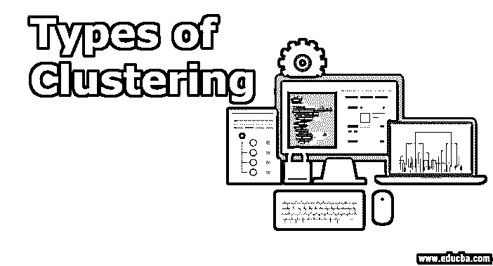
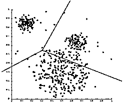
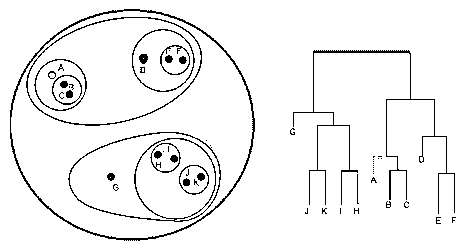
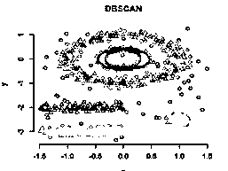
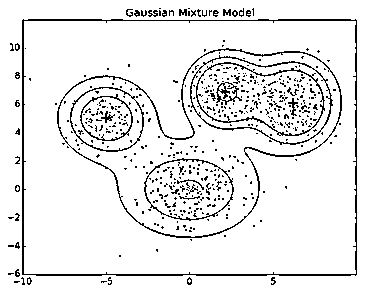

# 聚类的类型

> 原文：<https://www.educba.com/types-of-clustering/>

## 聚类类型概述

聚类被定义为根据将相似的数据点放在一个称为聚类的组中的原则，将数据点分组为一组集合的算法。这种聚类方法分为硬方法(在这种情况下，每个数据点最多属于一个聚类)和软方法(在这种情况下，数据点可以属于多个聚类)。此外，还提出了多种聚类方法，如分区聚类、层次聚类、基于密度的聚类、分布模型聚类、模糊聚类等。

### 聚类的类型

概括地说，聚类技术的方法分为两种类型，即硬方法和软方法。在硬聚类方法中，每个数据点或观察值只属于一个聚类。在软聚类方法中，每个数据点不会完全属于一个聚类；相反，它可以是多个集群的成员。它具有一组对应于在给定聚类中的概率的隶属系数。

<small>Hadoop、数据科学、统计学&其他</small>

目前，有不同类型的聚类方法在使用中；在本文中，让我们看看一些重要的方法，如层次聚类、分区聚类、模糊聚类、基于密度的聚类和基于分布模型的聚类。现在让我们用一个例子来讨论其中的每一个:

#### 1.划分聚类

分区聚类是一种聚类技术，它将数据集分成一定数量的组。[例如，KNN 的 K 值将在我们训练模型之前决定]。它也可以被称为基于质心的方法。在这种方法中，形成聚类中心[质心],使得当与其他聚类质心一起计算时，该聚类中的数据点的距离最小。这种算法最流行的例子是 [KNN 算法](https://www.educba.com/knn-algorithm/)。这就是分区聚类算法的样子

#### 2.分层聚类

它是一种聚类技术，将数据集分成几个聚类，用户在训练模型之前不需要指定要生成的聚类数。这种类型的聚类技术也称为基于连通性的方法。在这种方法中，不会对数据集进行简单的划分，但是它为我们提供了在一定距离后合并的聚类的层次结构。[在数据集上完成分层聚类](https://www.educba.com/hierarchical-clustering/)后，结果将是数据点的基于树的表示[树状图],分为多个聚类。这是训练完成后层次聚类的样子。

来源链接:[层次聚类](https://www.statisticshowto.com/wp-content/uploads/2016/11/clustergram.png)

在划分聚类和层次聚类中，我们可以注意到的一个主要区别是划分聚类。我们将预先指定我们希望数据集分成多少个簇的值；在分层聚类中，我们不预先指定这个值。

#### 3.基于密度的聚类

在该聚类中，技术聚类将通过基于数据图中不同密度的各种密度区域的分离来形成。基于密度的空间聚类和噪声应用(DBSCAN)是这类技术中最常用的算法。该算法的主要思想是，对于聚类中的每个点，在给定半径的邻域中应该有最小数量的点。到目前为止，在上面讨论的聚类技术中，如果仔细观察，我们可以注意到所有技术中的一个共同点，即形成的簇的形状不是球形就是椭圆形或者凹形。DBSCAN 可以形成不同形状的簇；当数据集包含噪声或异常值时，这种类型的算法最适合。这是基于密度的空间聚类算法在训练完成后的样子。

来源链接:[基于密度的聚类](http://www.sthda.com/sthda/RDoc/figure/clustering/dbscan-density-based-clustering-density-based-clustering-1.png)

#### 4.基于分布模型的聚类

在这种类型的聚类中，通过识别来自相同分布(正态、高斯)的聚类中所有数据点的概率来形成技术聚类。这类技术中最流行的算法是使用高斯混合模型(GMM)的期望最大化(EM)聚类。

像层次聚类和划分聚类这样的普通聚类技术不基于形式模型；划分聚类中的 KNN 使用不同的 K 值产生不同的结果。由于 KNN 和 KMN 考虑的是聚类中心的均值，所以在某些情况下，它并不是最适合高斯混合模型。我们假设数据点是高斯分布的；这样，我们有两个参数来描述聚类的形状和标准偏差。这样，对于每个聚类，分配一个高斯分布。称为期望最大化的优化算法用于获得这些参数的最佳值(平均值和标准偏差)。这是 EM–GMM 训练后的样子。

来源链接:[基于分布模型的聚类](http://www.datascribble.com/wp-content/uploads/2018/04/unsup1.png)

#### **5。模糊**聚类

它属于软方法聚类技术的一个分支，而上述所有聚类技术都属于硬方法聚类技术。在这种聚类技术中，靠近中心的点可能是另一个聚类的一部分，其程度高于同一聚类边缘的点。属于给定聚类的点的概率是介于 0 到 1 之间的值。这类技术中最流行的算法是 FCM(模糊 C 均值算法)。这里，聚类的质心计算为所有点的平均值，通过它们属于该聚类的概率进行加权。

### 结论

这些是目前使用的一些不同的聚类技术，在本文中，我们介绍了每种聚类技术中的一种流行算法。我们必须根据我们的数据集和我们需要满足的要求来选择我们使用的技术类型。

### 推荐文章

这是聚类类型的指南。在这里，我们讨论不同类型的聚类的基本概念及其示例。您也可以看看以下文章，了解更多信息–

1.  [层次聚类算法](https://www.educba.com/hierarchical-clustering-algorithm/)
2.  [机器学习中的聚类](https://www.educba.com/clustering-in-machine-learning/)
3.  [数据分析技术的类型](https://www.educba.com/types-of-data-analysis-techniques/)
4.  [数据分析类型的完整指南](https://www.educba.com/types-of-data-analysis/)

