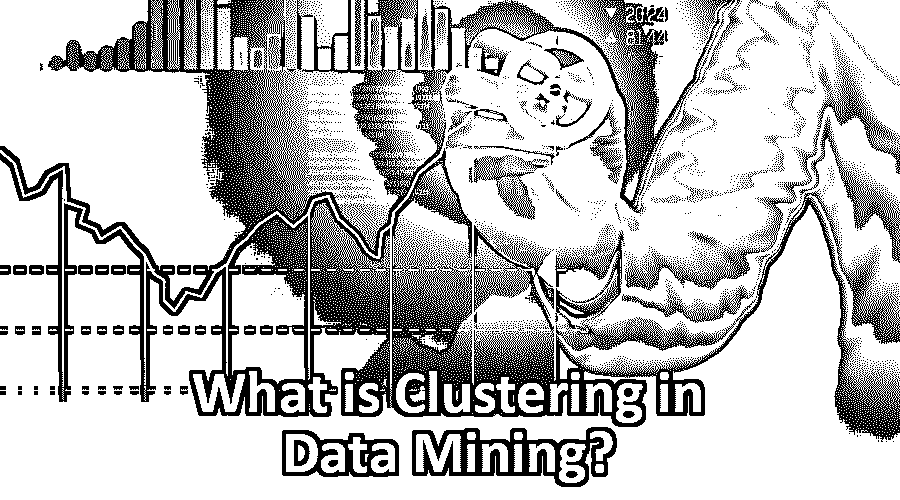
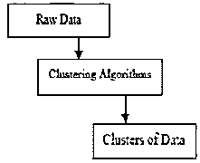
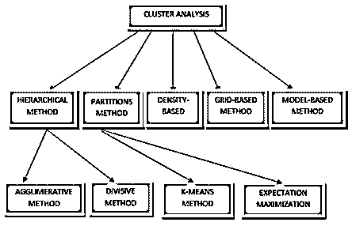
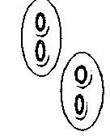

# 什么是数据挖掘中的聚类？

> 原文：<https://www.educba.com/what-is-clustering-in-data-mining/>

## 数据挖掘简介

这是一种数据挖掘方法，用于将数据元素放在相似的组中。聚类是将数据对象划分为子类的过程。聚类质量取决于我们使用的方法。聚类也称为数据分段，因为大型数据组是根据其相似性来划分的。

### 什么是数据挖掘中的聚类？

聚类是根据特定对象的特征和相似性对其进行分组。至于数据挖掘，这种方法使用一种特殊的连接算法(T1)来划分最适合所需分析的数据。这种分析允许一个对象不属于或者严格地说不属于一个集群，这被称为这种类型的硬分区。然而，平滑的划分表明相同程度的每个对象属于一个集群。可以创建更具体的划分，如多个集群的对象，可以强制单个集群参与，甚至可以在组关系中构建分层树。这个文件系统可以基于不同的模型以不同的方式放置。这些不同的算法适用于每一个模型，区分它们的属性和结果。好的聚类算法能够独立于聚类形状来识别聚类。聚类算法有 3 个基本阶段，如下所示

<small>Hadoop、数据科学、统计学&其他</small>

### 数据挖掘中的聚类算法

根据最近描述的集群模型，许多集群可以将信息划分到一个数据集中。应该说每种方法都有自己的优缺点。算法的选择取决于数据集的属性和性质。

### 数据挖掘中的聚类方法

数据挖掘中不同的聚类方法解释如下:

1.  基于划分的方法
2.  密度法
3.  基于质心的方法
4.  层序法
5.  基于网格方法
6.  基于模型的方法

#### 1.基于划分的方法

分区算法将数据分成许多子集。

让我们假设分区算法为数据库中存在的数据和 n 个对象构建一个分区。因此，每个部分将表示为 ask ≤ n。

这给出了数据分类在 k 个组中的想法，如下所示

图 1 显示了聚类中的原始点

图 2 显示了应用算法后的分区聚类

这表示每个组至少有一个对象，并且每个对象必须恰好属于一个组。

#### 2.密度法

这些算法基于数据集参与者的高密度在确定的位置产生聚类。它将集群中的组成员的一些范围概念聚集到一个密度标准水平。这样的过程在检测组的表面区域时表现较差。

#### 3.基于质心的方法

在这种类型的操作系统分组技术中，值向量引用几乎每个集群。与其他组相比，每个对象都是组的一部分，具有最小的值差异。应该预先定义组的数量，这是这种类型的最重要的算法问题。这种方法最接近于识别的主题，并广泛用于最优化问题。

#### 4.层序法

该方法将创建一组给定数据对象的分层分解。根据层次分解是如何形成的，我们可以对层次方法进行分类。该方法如下所示

*   凝聚方法
*   分裂的方法

凝聚法也称为自上而下法。这里，我们从构成一个独立组的每个对象开始。它继续将项目或群组紧密地融合在一起

分裂法也被称为自上而下的方法。我们从同一群中的所有事物开始。这种方法是严格的，也就是说，一旦融合或分裂完成，就永远不能取消

#### 5.基于网格方法

基于网格的方法在对象空间中工作，而不是将数据划分到网格中。网格是根据数据的特征划分的。通过使用这种方法，非数值数据易于管理。数据顺序不影响网格的划分。基于网格的模型的一个重要优点是它提供了更快的执行速度。

**层次聚类的优势如下**

1.  它适用于任何属性类型。
2.  它提供了与粒度级别相关的灵活性。

#### 6.基于模型的方法

该方法使用基于概率分布的假设模型。该方法通过对密度函数进行聚类来定位聚类。它反映了数据点的空间分布。

### 聚类在数据挖掘中的应用

聚类可以在许多领域有所帮助，如生物学、植物和动物按其属性和营销分类；聚类将有助于识别具有相似行为的特定客户记录的客户。在许多应用中，如市场调查、[、模式识别、](https://www.educba.com/pattern-recognition/)、数据和图像处理，聚类分析被大量使用。聚类还可以帮助广告商在其客户群中找到不同的群体。而他们的客户群可以通过购买模式来定义。它在生物学中用于确定植物和动物分类，以便对具有相似功能的基因进行分类，并洞察群体固有的结构。在地球观测数据库中，聚类还可以更容易地找到土地上类似用途的区域。它有助于根据房屋的类型、价值和目的地来识别房屋和公寓组。web 上文档的聚类也有助于信息的发现。聚类分析是一种深入了解数据分布的工具，可作为[数据挖掘功能](https://www.educba.com/what-is-data-mining/)观察每个聚类的特征。

### 结论

聚类在数据挖掘及其分析中非常重要。在本文中，我们已经看到了如何通过应用各种聚类算法来进行聚类，以及它在现实生活中的应用。

### 推荐文章

这是数据挖掘中什么是集群的指南。这里我们讨论了数据挖掘中聚类的基本概念、不同方法以及应用。您也可以浏览我们推荐的其他文章，了解更多信息——

1.  [什么是数据处理？](https://www.educba.com/what-is-data-processing/)
2.  [如何成为一名数据分析师？](https://www.educba.com/what-is-data-analyst/)
3.  [什么是 SQL 注入？](https://www.educba.com/what-is-sql-injection/)
4.  [什么是 SQL Server 的定义？](https://www.educba.com/what-is-sql-server/)
5.  [数据挖掘架构概述](https://www.educba.com/data-mining-architecture/)
6.  [机器学习中的聚类](https://www.educba.com/clustering-in-machine-learning/)
7.  [层次聚类算法](https://www.educba.com/hierarchical-clustering-algorithm/)
8.  [层次聚类|凝聚型&分裂型聚类](https://www.educba.com/hierarchical-clustering/)

