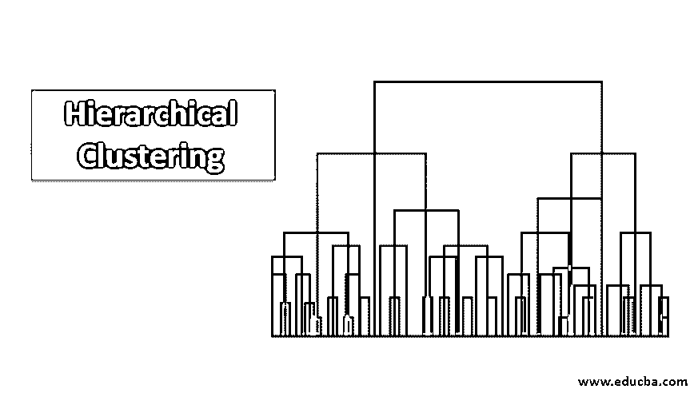
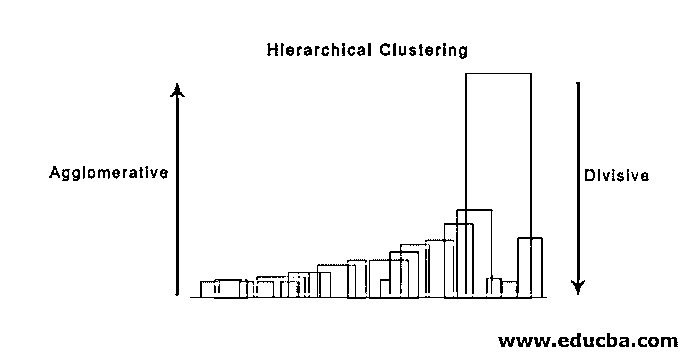

# 分层聚类

> 原文：<https://www.educba.com/hierarchical-clustering/>

## 分层聚类简介

分级聚类被定义为一种无监督的学习方法，其基于被定义为聚类的相似性度量将数据分成不同的组，以形成分级结构；这种聚类分为凝聚聚类和分裂聚类，其中凝聚聚类从每个元素作为一个聚类开始，并根据特征和相似性开始合并它们。除非形成一个聚类，否则这种方法也称为自底向上方法。同时，在分裂聚类中，我们反过来做。还已知具有自顶向下的方法，即无监督学习，并且选择属性来测量相似性是特定于应用的。

### 数据层次的集群

*   凝聚聚类
*   分裂聚类

让我们举一个数据的例子，5 名学生获得的分数，将他们分组参加即将到来的比赛。

<small>Hadoop、数据科学、统计学&其他</small>

| 学生 | 马克斯（英格兰人姓氏） |
| 英语字母表中第一个字母 | Ten |
| 英语字母表的第 2 个字母 | Seven |
| 英语字母表中第三个字母 | Twenty-eight |
| 英语字母表中第四个字母 | Twenty |
| 英语字母表中第五个字母 | 35s |

#### 1.凝聚聚类

*   首先，我们将这里的每个点/元素权重视为聚类，并继续合并相似的点/元素以在新的级别形成新的聚类，直到我们剩下单个聚类是自底向上的方法。
*   单一连锁和完全连锁是聚集集群的两个流行的例子。除此之外，平均连杆和质心连杆。在单个链接中，我们在每一步中合并两个聚类，其两个最近的成员具有最小的距离。在完全连锁中，我们合并最小距离成员，这提供了最小的最大成对距离。
*   邻近矩阵是执行层次聚类的核心，它给出了每个点之间的距离。
*   让我们为表中给出的数据制作一个近似矩阵；因为我们计算每个点与其他点之间的距离，所以它将是 n × n 形状的非对称矩阵，在我们的例子中是 5 × 5 矩阵。

一种流行的距离计算方法是:

1.  欧几里德距离(平方)

`dist((x, y), (a, b)) = √(x - a)² + (y - b)²`

2.  曼哈顿距离

`dist((x, y), (a, b)) =|x−c|+|y−d|`

欧几里德距离是最常用的，我们将在这里使用相同的，我们将与复杂的联系。

| 学生(集群) | 英语字母表中第一个字母 | 英语字母表的第 2 个字母 | 英语字母表中第三个字母 | 英语字母表中第四个字母 | 英语字母表中第五个字母 |
| 英语字母表中第一个字母 | Zero | Three | Eighteen | Ten | Twenty-five |
| 英语字母表的第 2 个字母 | Three | Zero | Twenty-one | Thirteen | Twenty-eight |
| 英语字母表中第三个字母 | Eighteen | Twenty-one | Zero | Eight | Seven |
| 英语字母表中第四个字母 | Ten | Thirteen | Eight | Zero | Fifteen |
| 英语字母表中第五个字母 | Twenty-five | Twenty-eight | Seven | Fifteen | Zero |

邻近矩阵的对角元素将总是 0。该点与同一点之间的距离将始终为 0；因此，对角元素从分组考虑中免除。

这里，在迭代 1 中，最小距离是 3；因此，我们合并 A 和 B 以形成聚类，通过将(A，B)聚类点取为 10，即最大值为(7，10 ),再次形成具有聚类(A，B)的新的邻近矩阵，因此新形成的邻近矩阵将是

| 簇 | (甲、乙) | 英语字母表中第三个字母 | 英语字母表中第四个字母 | 英语字母表中第五个字母 |
| (甲、乙) | Zero | Eighteen | Ten | Twenty-five |
| 英语字母表中第三个字母 | Eighteen | Zero | Eight | Seven |
| 英语字母表中第四个字母 | Ten | Eight | Zero | Fifteen |
| 英语字母表中第五个字母 | Twenty-five | Seven | Fifteen | Zero |

在迭代 2 中，7 是最小距离；因此，我们合并 C 和 E，形成一个新的集群(C，E)；我们重复迭代 1 中遵循的过程，直到我们得到单个集群，这里我们在迭代 4 停止。

整个过程如下图所示:

(A，B，D)和(D，E)是在迭代 3 中形成的 2 个集群；在最后一次迭代中，我们可以看到只剩下一个集群。

#### 2.分裂聚类

首先，我们将所有点视为单个聚类，并以最远的距离将它们分开，直到我们在每一步都以单个点作为单个聚类结束(不一定要在中间停止，这取决于我们希望每个聚类中的元素的最小数量)。与凝聚式聚类正好相反，是一种自上而下的方法。分裂聚类是重复 k 表示聚类的一种方式。

在聚集聚类和分裂聚类之间进行选择同样取决于应用，但是需要考虑以下几点:

1.  分裂聚类比凝聚聚类更复杂。
2.  如果我们不生成到单个数据点的完整层次结构，分裂聚类会更有效。
3.  凝聚聚类通过考虑局部模式而不是初始考虑全局模式来决定，这是不可逆转的。

### 层次聚类的可视化

一个非常有用的可视化层次聚类的方法，在商业中很有帮助，就是树形图。树状结构是记录合并和分裂顺序的树状结构。垂直线代表集群之间的距离；垂直线之间的距离和聚类之间的距离成正比，即距离越大，聚类越可能不相似。

我们可以用树突图来决定集群的数量；画一条与树状图上最长的垂直线相交的线。相交的几条垂直线将是要考虑的组的数量。

下面是树形图的例子。

有非常简单和直接的 python 包和函数来执行层次聚类和绘制树形图。

1.  科幻小说中的等级制度。
2.  用于可视化的 cluster . hierarchy . dent ogram。

#### 使用分层聚类的常见场景

1.  产品或服务营销的客户细分。
2.  城市规划，确定建造构筑物/服务设施/建筑的地点。
3.  例如，社交网络分析会找出所有多尼女士的粉丝，为他的传记片做广告。

### 分层聚类的优势

优点如下:

1.  在像 k-means 这样的部分聚类中，聚类前要知道聚类的个数，这在实际应用中是不可能的。相反，在层次聚类中，不需要预先知道聚类的数量。
2.  分层聚类输出分层结构，即比部分聚类返回的平面聚类的非结构化集合更能提供信息的结构。
3.  分层聚类很容易实现。
4.  在大多数情况下都能带来结果。

### 结论

当呈现数据时，聚类的类型有很大的不同；与部分聚类相比，层次聚类信息更丰富，更易于分析，因此更受青睐。它通常与热图联系在一起。不要忘记，选择用来计算相似性或不相似性的属性主要影响聚类和层次结构。

### 推荐文章

这是一个层次聚类的指南。在这里，我们将讨论分层聚类的简介、优点以及使用分层聚类的常见场景。您也可以浏览我们推荐的其他文章，了解更多信息——

1.  [聚类算法](https://www.educba.com/clustering-algorithm/)
2.  [机器学习中的聚类](https://www.educba.com/clustering-in-machine-learning/)
3.  [R 中的层次聚类](https://www.educba.com/hierarchical-clustering-in-r/)
4.  [聚类方法](https://www.educba.com/clustering-methods/)

