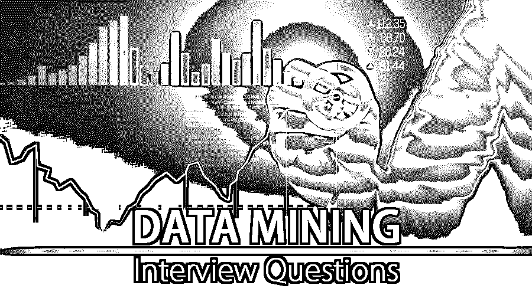

# 数据挖掘面试问题

> 原文：<https://www.educba.com/data-mining-interview-questions/>

## 数据挖掘面试问答介绍

数据挖掘是组织用来将原始数据转换成有用的所需信息的过程。它用于从大量数据中提取模式和知识。它涉及数据库和数据管理方面、数据预处理、复杂性、验证、在线更新和发现后模式。数据挖掘的实际任务是执行大量数据的自动分析，以提取未知的和有趣的方式，如异常记录组、数据记录、依赖关系。

其他术语用于数据挖掘，如数据钓鱼、数据窥探和数据挖掘。数据挖掘遵循收集数据并[加载到数据仓库](https://www.educba.com/what-is-data-warehouse/)的过程。在服务器中存储和管理数据之后，业务分析师或相关人员以所需的方式组织这些数据。在该软件分类之后，基于用户要求或输入的结果和最后阶段是以要求的格式显示请求的数据。

<small>Hadoop、数据科学、统计学&其他</small>

如果是找数据挖掘相关的工作，需要准备 2022 年的数据挖掘面试问题。根据不同的职位描述，每个面试确实是不同的，但是要通过面试，你需要对数据挖掘有一个好的和精确的了解。

在这里，我们准备了重要的数据挖掘面试问答，帮助你在面试中取得成功。这些顶级面试问题分为两部分:

### 第 1 部分—数据挖掘面试问题(基础)

这第一部分包括基本的数据挖掘面试问题和答案

#### 1.解释数据挖掘的技术？

**答案:**
技术有序列模式、预测、回归分析、聚类分析、分类分析、关联规则学习、异常或离群点检测、决策树。

#### 2.说明数据挖掘的优势？

**回答:**
数据挖掘的主要[优势](https://www.educba.com/advantages-of-data-mining/)是在银行和其他金融公司或机构中利用这一点，根据用户的上次交易和行为模式来检查违约者。它还用于在互联网上发送或推送正确的广告。基于[机器学习算法](https://www.educba.com/machine-learning-algorithms/)，网页基于用户以前的历史和兴趣或在互联网上的搜索来显示。

让我们转到下一个数据挖掘面试问题

#### 3.解释数据挖掘的范围？

**答:**
数据挖掘的范围是趋势和行为的自动预测，以前未知模式的自动发现。它用于自动化在大型数据库中查找预测信息的过程。数据挖掘工具用于扫描数据库。它也被用来识别以前隐藏的模式。

#### 4.列出数据挖掘的类型？

**答案:**
这是数据挖掘面试中问的基本问题。集成、选择、数据清理、数据转换、模式评估和知识表示是数据挖掘的类型。

#### 5.解释数据挖掘和数据仓库的区别？

**答:**
数据挖掘过程，它使用查询来探索数据，或者它意味着分析数据并分析结果或输出。这有助于报告、战略规划和可视化有意义的数据集。数据仓库是从各种资源中提取数据，然后对数据进行验证和存储的过程。

### 第 2 部分—数据挖掘面试问题(高级)

现在让我们来看看高级数据挖掘面试问题和答案。

#### 6.你能告诉我，一般来说，数据挖掘可以解决哪些问题吗？

**答:**
数据挖掘是一个关键的过程，因为它用于从系统或组织的大量数据中验证和筛选数据。数据是如何流动的，流程是什么，可以根据数据挖掘结果来定义。数据挖掘广泛应用于市场营销、服务、[人工智能(AI)](https://www.educba.com/careers-in-artificial-intelligence/) 、政府情报(GI)和广告等行业。还有其他行业，如电信、电子商务、医疗保健、能源、生物数据分析、犯罪机构、零售、信息检索(如通信系统)、教育和销售。

#### 7.解释数据挖掘查询的用途或为什么数据挖掘查询更有帮助？

**答:**
数据挖掘查询主要帮助将模型应用到新的数据中，以产生单个或多个结果。它还允许我们批量提供参数等输入值。该查询可以更有效地检索案例，这符合特定的模式。它获得训练数据的统计记忆，并帮助获得代表模型中模式的典型案例的准确设计和规则。它有助于提取回归公式和其他解释方法的计算。它还检索模型中使用的各个案例的详细信息。它包括在分析中没有使用的数据，并且通常在添加新信息的帮助下保留模型，并执行任务和交叉验证。

让我们转到下一个数据挖掘面试问题。

#### 8.解释数据挖掘中的聚类？

**答案:**
数据挖掘中的聚类是指将一组抽象对象分成相似项的类。在数据挖掘中，数据对象的聚类被视为一个组，在进行聚类分析时，数据的划分是按组进行的。基于相似的数据对这些组进行标记。数据聚类用于图像处理、数据分析、模式识别和其他类似的市场研究。它有助于识别区域，并根据通过网络或任何其他介质搜索信息收集的数据对文档进行分类。它主要用于检测应用程序，以检查在线交易的欺诈行为。聚类分析在数据挖掘中是必需的，因为它具有可扩展性、处理不同种类属性的能力、可解释性、处理杂乱数据和高维数据的能力。

#### 9.什么是基于机器学习的数据挖掘方法？

**答案:**
这是高级数据挖掘面试中问的问题。机器学习主要用于数据挖掘，因为它涵盖自动计算过程，并且它基于逻辑或二元运算。我们必须关注决策树方法，并且结果主要是从步骤的逻辑顺序中演化而来的。机器学习通常遵循的原则是，允许我们处理更一般的数据类型，包括案例，并且在这些类型中，属性的数量可能会有所不同。机器学习是用于数据挖掘和人工智能的流行技术之一。

#### 10.解释数据挖掘的主要元素？

**答:**
数据挖掘主要帮助提取信息，转换和加载数据到数据仓库系统中。它主要在一个基于多维的数据库管理系统中存储和管理数据。它通过应用软件分析数据，并以有用的格式显示出来，这些数据主要由专业人员或业务分析师访问。

### 推荐文章

这是数据挖掘面试问题和答案列表的基本指南。在这里，我们涵盖了一些常见的面试问题及其详细的答案，以帮助候选人轻松应对面试。您也可以阅读以下文章，了解更多信息——

1.  [Java EE 面试问题](https://www.educba.com/java-ee-interview-questions/)
2.  [APEX 面试问题–2018 年更新](https://www.educba.com/apex-interview-questions/)
3.  [顶角 2 面试问题](https://www.educba.com/angular-2-interview-questions/)
4.  [数据挖掘架构](https://www.educba.com/data-mining-architecture/)

