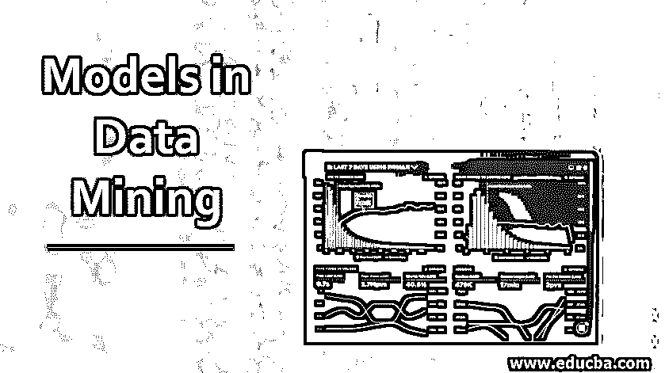
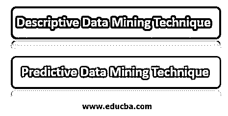
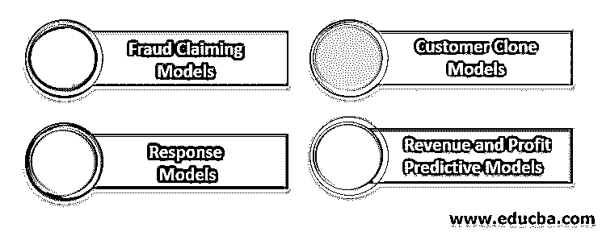
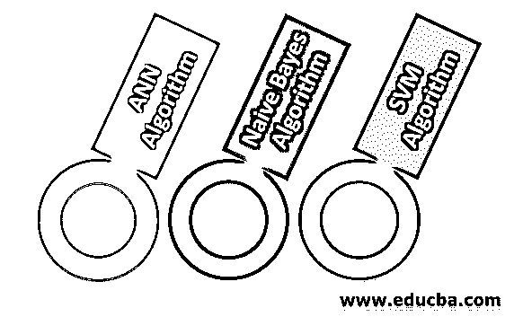

# 数据挖掘中的模型

> 原文：<https://www.educba.com/models-in-data-mining/>

## 数据挖掘中的模型简介

数据挖掘使用原始数据来提取信息，实际上是从数据中挖掘所需的信息。数据挖掘的应用范围非常广泛，包括政治模型预测、天气模式模型预测、网站排名预测等。数据挖掘也用于使用大数据作为原始数据源的组织，以挖掘所需的数据，这可能非常复杂。

### 数据挖掘中使用的技术

通过在原始数据上应用算法来创建数据挖掘模式。挖掘模型不仅仅是算法或元数据处理程序。它是一组数据、模式和统计数据，可用于正在获取的新数据，以生成预测并获得一些关于关系的推断。以下是数据挖掘中使用的一些技术。

<small>Hadoop、数据科学、统计学&其他</small>

#### 1.描述性数据挖掘技术

这种技术通常优选用于生成交叉列表、相关性、频率等。这些描述性数据挖掘技术用于通过使用原始数据作为输入并发现重要模式来获得关于数据规律性的信息。这种方法的另一个应用是在原始数据的更大范围内理解吸引人的群体。

#### 2.预测数据挖掘技术

预测挖掘技术的主要目标是识别未来的结果，而不是当前的趋势。许多函数用于目标值的预测。属于这一类的技术是分类、回归和时间序列分析。数据建模是这种预测分析的必要条件，这种分析使用一些变量来预测其他变量的不确定的未来数据。

### 数据挖掘中的模型类型

下面提到了一些数据挖掘模型及其说明:

#### 1.欺诈索赔模型

欺诈是许多行业面临的挑战，尤其是保险业。这些行业需要使用原始数据不断进行预测，以便能够理解欺诈指控并采取行动。我们可以跟踪以原始数据形式到达的索赔，并识别其欺诈的可能性，从而为保险公司节省大量资金。

#### 2.客户克隆模型

客户克隆模型可以根据组织的“最佳客户”的特征来预测哪些潜在客户极有可能做出响应。

#### 3.响应模型

预测数据挖掘响应模型有助于组织识别分离其客户群的使用模式，以便与这些客户建立联系。这种响应模型是预测和识别特定产品目标客户群或潜在客户的最佳方法。该产品符合开发的模型的使用。这些模型被应用于识别极有可能具有目标特征的客户。

#### 4.收入和利润预测模型

收入和利润预测模型将响应或无响应特征与给定的收入估计值相结合，尤其是在订购量、利润或月度账单差异很大的情况下。正如我们所知，并非所有的响应都具有相同或相等的价值，能够增加响应的模型不一定会获得我们的利润。收入和利润预测技术表明，与其他应答者相比，那些应答者极有可能通过他们的应答增加收入或利润增量。这些是一些模型类型，还有更多模型类型可以帮助从原始数据集中挖掘出所需的数据。

### 数据挖掘算法

存在许多数据挖掘算法；我们将在这里讨论其中的几个。让我们看看为什么我们需要算法来挖掘数据。在当今世界，数据生成量巨大，大数据非常普遍，我们需要一些算法来预测模式和分析。基于我们希望应用于数据的挖掘模型，我们有不同的算法。其中一些如下所示:

#### 1.人工神经网络算法

这种人工神经网络算法的灵感来自于生物神经网络，就像典型的计算机架构。该算法对不确定的大量数据使用近似函数来获得某种模式。它们通常被表示为相互连接的神经元系统，这些神经元可以输入并执行计算以提供输出。

#### 2.朴素贝叶斯算法

朴素贝叶斯算法是基于贝叶斯定理的，这种算法是在数据维数较高时使用的。贝叶斯分类器能够通过输入原始数据来提供可能的输出。这里也有可能在运行时添加新的原始数据并获得预测。朴素贝叶斯分类器会在提交到输出之前考虑所有的概率。

#### 3.SVM 算法

这种 [SVM 算法在过去十年中获得了](https://www.educba.com/svm-algorithm/)很多关注，并被应用到最广泛的应用领域。该算法基于统计学习理论和结构风险评估及最小化原则。它可以识别决策边界，也称为超平面，它可以产生最佳的类分离，从而在分离超平面之间创建最大可能的距离。SVM 是最稳健和最准确的分类技术，但是具有较高成本和耗时的缺点。

### 优势

数据挖掘模型有许多优点，下面列出了其中一些:

*   这些模型帮助组织识别客户的购物模式，然后建议可以采取的适当步骤来增加收入。
*   这些模型可以帮助我们提高网站优化，使客户可以很容易地发现所需的东西。
*   这些模型有助于我们开展营销活动，确定有利的领域和方法。
*   这将有助于我们确定客户群及其需求，以便提供所需的产品。
*   它有助于提高品牌忠诚度。
*   它有助于衡量收入增长因素的盈利能力。

### 结论

我们已经看到了数据挖掘的定义以及为什么需要它，并且理解了描述性和预测性数据挖掘模型之间的区别。此外，我们已经看到了一些数据挖掘模型和一些算法，帮助组织更好地了解原始数据。最后，我们看到了数据挖掘模型的一些优势。

### 推荐文章

这是数据挖掘模型指南。在这里，我们讨论数据挖掘中最重要的模型类型，以及它们的优点和算法。您也可以浏览我们推荐的其他文章，了解更多信息——

1.  [数据挖掘有哪些类型？](https://www.educba.com/type-of-data-mining/)
2.  [顶级数据挖掘应用列表](https://www.educba.com/data-mining-applications/)
3.  [数据挖掘架构的组件](https://www.educba.com/data-mining-architecture/)
4.  [数据挖掘面试问题](https://www.educba.com/data-mining-interview-questions/)

