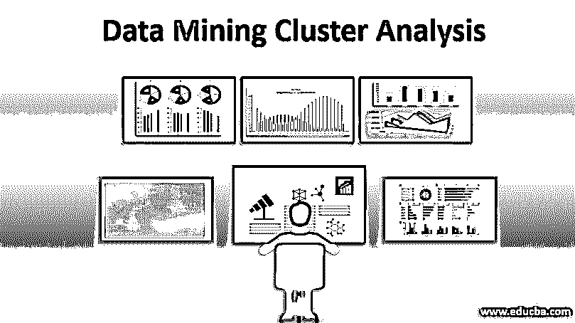
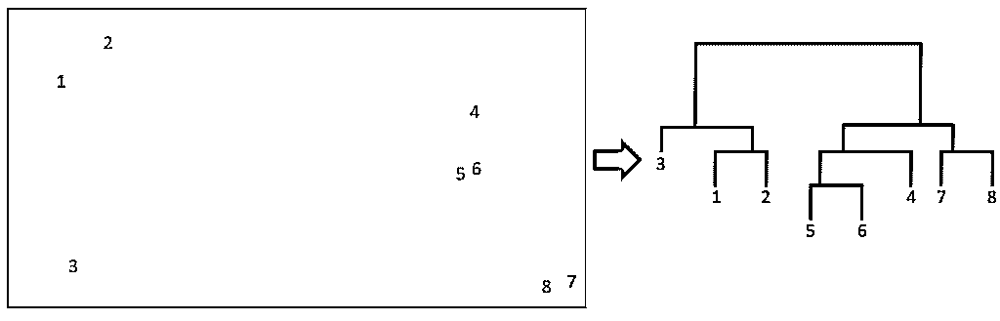

# 数据挖掘聚类分析

> 原文：<https://www.educba.com/data-mining-cluster-analysis/>

## 数据挖掘聚类分析简介

数据挖掘聚类分析用于将具有相似特征的数据点分组到一个组中，即通过不同的可用方法(如基于密度的方法、基于网格的方法、基于模型的方法、基于约束的方法、基于划分的方法和分层方法)找到有用组中对象的相似性，将数据划分到组的集合中。这个特征被广泛用于模式识别、图像处理和数据分析的研究中。

### 什么是聚类分析？

如上所述，集群背后的意图。它是一种方法，在机器学习和人工智能中，抽象对象被转换为包含相似类型对象的类。例如，在拥有客户数据库的商店中，我们可以将客户分组，并根据该组中存在的好恶来确定销售产品的目标。或者，在流媒体中，我们可以将人们分成不同的群组，并根据一个人的口味以及他们属于哪个群组来推荐电影。

<small>Hadoop、数据科学、统计学&其他</small>

在聚类分析中，我们首先尝试通过查找组中对象的相似性来将数据集划分成组，然后，如果需要，给它分配一个标签。聚类的主要优点是它试图在数据集中挑选出有用的特征，并使用它们来区分不同的组。由于这个原因，它也能适应变化。在聚类分析中，我们希望记住聚类集之间的区别，以充分应用聚类分析在数据挖掘中的意义。

*   **排他与非排他:**在排他簇中，我们将只拥有特定簇中的数据点，而在非排他簇中，数据点可以同时属于两个或更多个簇。
*   **模糊 vs 非模糊:**在一个模糊级别的聚类中，数据点属于所有权重在 0 到 1 之间的聚类，所有权重之和应为 1。这也称为概率聚类。在非模糊聚类中，情况相反，数据点属于一个特定的聚类。
*   **部分与完整:**在部分过程中，出于各种业务原因，我们希望只对部分数据进行集群。
*   **异类 vs 同类:**异类中，簇的大小、形状和密度可能不同，但异类中，确保簇具有相同的形状、大小和密度。

### 数据挖掘聚类分析方法

在数据挖掘中，有许多方法可以用来进行聚类。它们是:

#### 1.分割方法

顾名思义，整个数据集被划分为‘k’个分区。一旦分区完成，通过迭代重定位技术改进分区的方法将被实施以满足两个主要要求:

*   一个数据点应该只在一个群集中。
*   每个组或分区将包含至少一个对象。

迭代重定位技术的一个例子是 K-means，其中“K”是聚类的数量，选择任意的 K 个中心，然后优化以得到“K”个中心。使用的距离度量类型最少。

#### 2.层序法

对于层次聚类，让我们看看它是如何做到的；接下来，将更容易理解相同的意图。当获取数据时，数据点的距离被自动计算并形成矩阵形式。现在，一旦计算出矩阵，就要连续执行两个步骤，识别出彼此接近的簇，然后组合在一起。杵的每一步都成为一个分裂的节点，一直执行到所有的都杵在一起。下面使用树状图的示意图更容易理解。

#### 3.密度法

顾名思义，这个算法背后的意图就是密度。在这里，聚类不断增长，直到邻域中的点密度超过阈值。

#### 4.基于网格方法

这种方法的主要区别在于，数据点在聚类中不起主要作用，但周围数据的值空间起主要作用。在基于网格的方法中，我们面临各种优势，其中下面提到的两个优势起着主要作用。

*   快速处理时间。
*   仅取相应维度中的单元数量进行评估。

#### **5。基于模型的方法**

这里顾名思义，识别出最适合数据的模型，并且通过密度函数的聚类来定位聚类。

#### 6.基于约束的方法

在这种方法中，提示用户进行约束，作为识别聚类和形成所需聚类的交互方式。

### 挖掘聚类分析的应用

在当今世界中，聚类分析有着广泛的应用，从小到对象的分割、可能是商店中的人或物的对象，到直接从评论的情感如何的文本中分割评论。

下面是聚类分析的主要应用，虽然不是一个详尽的列表。

*   聚类分析广泛用于模式识别、图像处理或探索性数据分析。
*   聚类分析可用于识别相似的地理区域，并进行作物增产分析或投资评估。
*   人们可以使用聚类来对 web 搜索中的文档进行分组。
*   金融机构在欺诈检测中广泛使用聚类分析，同时使用聚类和异常值检测。
*   在[探索性数据分析](https://www.educba.com/exploratory-data-analysis/)中，data scientist 使用聚类来推导数据分布的基本原理。
*   在零售领域，人们使用聚类对客户进行细分，以针对不同的产品。

### 结论

总之，在执行集群时，应该记住不同的要求。这些不同于可伸缩性，在可伸缩性中，需要分析这些算法对于大型数据库的可伸缩性。此外，应该记住在聚类算法中高维数据的管理有多好。最后，聚类算法是一个强有力的工具，正如我们所说的，能力越大，责任越大。因此，在大型数据集中执行聚类时，应该记住这些点。

### 推荐文章

这是数据挖掘聚类分析指南。这里我们讨论什么是数据挖掘聚类分析，以及它的方法和应用。您也可以浏览我们推荐的其他文章，了解更多信息——

1.  [机器学习中的聚类](https://www.educba.com/clustering-in-machine-learning/)
2.  [层次聚类](https://www.educba.com/hierarchical-clustering/)
3.  [R 中的层次聚类](https://www.educba.com/hierarchical-clustering-in-r/)
4.  [聚类算法](https://www.educba.com/clustering-algorithm/)

