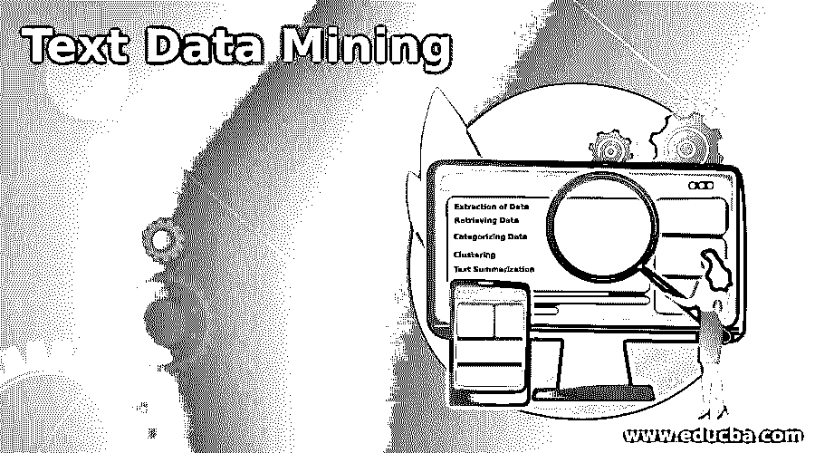

# 文本数据挖掘

> 原文：<https://www.educba.com/text-data-mining/>

## 文本数据挖掘简介

在多学科领域中，对文本进行分析以通过统计手段在不同模式和趋势的帮助下获得高质量的信息，可以是统计模式学习，具有不同的步骤，如数据收集、自然语言处理、信息提取和数据挖掘，以便将非结构化数据转换为有用的信息，使公司从结果中得出的事实和关系中形成有用的决策，这被称为文本数据挖掘。

### 文本数据挖掘的类型

下面给出了文本数据挖掘的类型:

<small>Hadoop、数据科学、统计学&其他</small>

#### 1.数据提取

这是从非结构化数据中提取有用信息的过程。相关数据之间的关系和实体被识别和标注。此外，从非结构化或半结构化数据中记录数据的实体和属性。这些信息存储在数据库中。每当需要时，关系的模式被检查并用于业务或任何其他需要。检查存储数据的效率，以便数据存储过程有助于未来的需要。

#### 2.检索数据

这是根据用户需求从数据中提取所需模式和集合的另一个过程。例如，用户可以使用一组特定的单词或模式来搜索数据，以便于理解数据。算法用于识别搜索数据的用户模式，以便更快地提供相关信息。此外，这些算法有助于系统识别要跟踪的用户行为，以发现相关数据的相同模式。谷歌搜索是检索数据技术的最好例子。

#### 3.分类数据

这个过程属于数据科学家的监督学习技术。这也被称为自然语言处理。根据数据库的数据，选择预定义的主题并赋予数据。文档被收集和分析以给出数据的正确标题，并被处理以供进一步分析。这个过程很简单，就好像用户知道相关的主题，他们可以用该主题进行搜索，因此不需要分析整个数据。这节省了时间和数据分析师的工作。此外，在不同的环境中自动化这个过程是很容易的。事实上，这个过程已经是自动化的，因此垃圾邮件过滤和网页分类以及其他数据科学技术可以很容易地应用到 NLP 的过程中。

#### 4.群聚；聚集

聚类是一种著名的文本挖掘技术，它根据文本信息中的主题或结构将数据分类成小的簇。该过程是忙乱的，因为用户不必知道数据的先验信息；很难形成有用的集群。这在技术上是该方法的缺点。如果聚类被识别，该过程充当其他文本挖掘过程的预处理技术，因为这是分类数据的标准方法。它以这样一种方式对数据进行分类，即同一组中的所有成员必须比其他组中的成员彼此更相似。这使得数据分析变得容易。

#### 5.文本摘要

顾名思义，相关文本的摘要就是在这种技术中形成的。通过自动压缩数据向用户提供有价值的信息。检查不同的文本源，以便由数据形成精确的信息，并且摘录与大量原始文档相同。在文本摘要中使用不同的技术，因为这个过程需要不同的输入。神经网络和回归模型是文本摘要中常用的技术。长文本被缩短，以便由整个文本形成摘要。这使得浏览摘要的用户能够轻松地检索和理解数据。

### 文本数据挖掘方法

下面给出了文本数据挖掘的方法:

#### 1.文件分类

每当有许多文档时，无论是在线还是离线，这都是识别所需数据的最佳方式。自动文档分类有助于使用少量关键字轻松识别数据。Wordnet 或专家知识工具有助于找到术语或聚类之间的关系，从而轻松实现自动化。此外，这可以通过将属性和值彼此配对并创建单词的实体关系来完成，尽管单词在文档中的重复出现并不常见。

通过使用某些术语并将它们关联起来，可以将一组文档与另一组文档区分开来。此外，关联有助于识别给定文档集中数据的模式和频率。另一种常见的文档分类方法是文档聚类，其中类似集合的文档被识别并聚类到类似的组中，如上所述。可以为文档分类形成某些规则，因为与其他数据相比，这是不同且困难的。文档将是巨大的，并且上下文将彼此不同。

#### 2.基于关键字的分类

当某些单词或短语频繁出现时，最好将这些单词联系起来，以便形成相关性。这有助于进行数据的关联挖掘和自动化过程。必须对数据进行预处理，通过分析和识别术语来避免混淆单词。可以形成算法来识别常见的单词，并且可以容易地识别模式。这种自动化过程减少了人工工作，并产生相关的结果来确认数据。关联挖掘是基于数据中的术语完成的，因为每个重复出现的单词都被标识为术语或项目。

世界范围内的数据大多是非结构化的，这里文本数据挖掘的重要性就显现出来了。如果不从非结构化数据中收集信息，数据收集本身就变得无关紧要。使用传统工具存储大量数据并从数据中收集信息成为一个挑战，而文本数据挖掘在这方面有很大帮助。

### 推荐文章

这是文本数据挖掘指南。这里我们分别讨论文本数据挖掘的介绍、类型和方法。您也可以看看以下文章，了解更多信息–

1.  [数据挖掘聚类分析](https://www.educba.com/data-mining-cluster-analysis/)
2.  [什么是数据挖掘？](https://www.educba.com/what-is-data-mining/)
3.  [数据挖掘简介](https://www.educba.com/introduction-to-data-mining/)
4.  [数据挖掘过程](https://www.educba.com/data-mining-process/)

