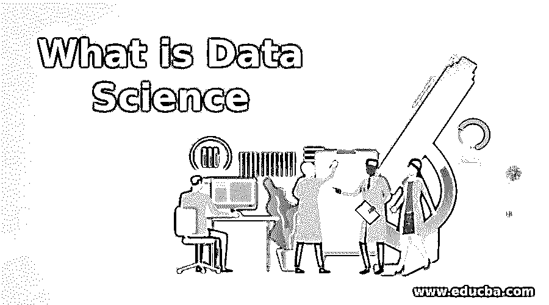
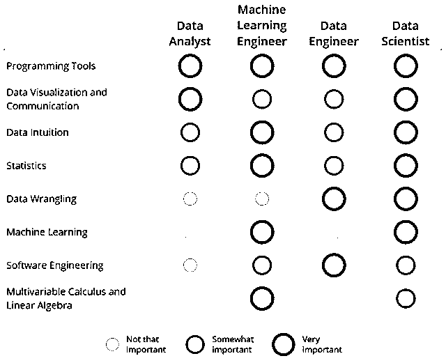
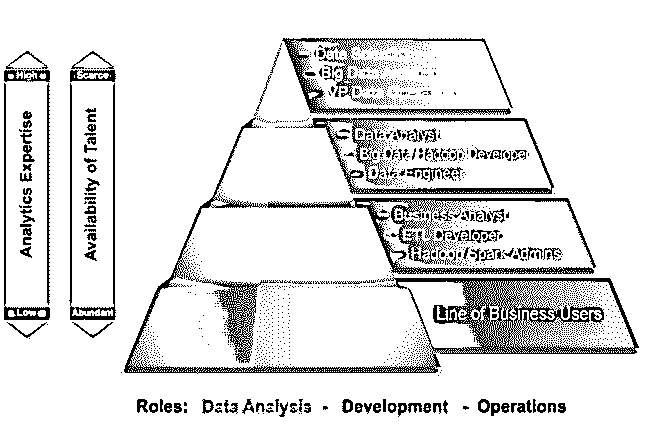
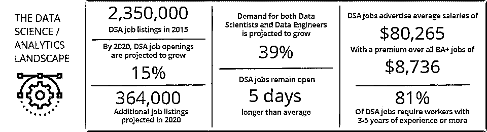

# 什么是数据科学

> 原文：<https://www.educba.com/what-is-data-science/>

## 什么是数据科学？

一个蓬勃发展的职业生涯涉及几个学科，用科学的方法、过程和算法从大量数据中提取信息，无论是分类数据还是连续数据。可以形成一种关于数据的明确理论，称为数据科学。它包括领域知识、统计数据和编码技能，因为所有这些都结合在一起可以得到想要的结果。大量的数据科学涉及应用机器学习和深度学习作为过去的研究来预测未来，或者行为领域的研究需要没有数据科学就无法分析的数据。

### 数据科学的子集

*   这是数学和统计学、机器学习、领域知识、IT 和软件开发的混合体。
*   数学和统计学是核心，因为从[探索性数据分析](https://www.educba.com/exploratory-data-analysis/)到模型构建的一切都需要处理数字、向量、概率等等。
*   机器学习可以进一步分为深度学习和人工智能，它是数据科学的建模子集。此外，[基本软件开发](https://www.educba.com/what-is-software-development/)和 IT 技能被认为是应用于这些领域所必需的。
*   最后，由于不同的企业使用不同的数据进行预测，拥有业务或领域知识对确定结果的准确性大有帮助。使用正确的数据对于验证我们输出的可信度至关重要。

### 了解数据科学

<small>Hadoop、数据科学、统计学&其他</small>

它主要是用来从数据中发现隐藏模式的科学。这些隐藏的模式或见解可以在几个领域取得突破性的成果，并改善人们的生活。上图显示了工作流程中的六个阶段，这有助于进行预测和构建用于生产的模型。

### 使用数据科学

数据科学工作将分为以下几类:

*   **理解问题:**在你深入到问题的实现之前，问题陈述必须是清晰的。知道要发现什么对于获得正确的数据和得出完美的解决方案至关重要。
*   **获得正确的数据:**一旦理解了问题，获得正确的数据进行操作就势在必行了。
*   **探索性数据分析:**据说一个数据科学家做的工作百分之九十都是数据角力。术语“数据争论”指的是在将数据输入模型之前对其进行清理和预处理。这些步骤包括检查重复数据、异常值、空值和其他一些不符合所需业务数据惯例的异常。
*   **数据可视化:**一旦数据被清理和预处理，就有必要对数据进行可视化，以确定用于我们的模型的正确特征或列。
*   **分类编码:**该步骤适用于输入特征是分类的并且需要转换成数字(0，1，2 等)的情况。)在我们的模型中使用，因为机器不能处理类别。
*   **模型选择:**为特定的问题陈述选择正确的模型是至关重要的，因为每个模型都不能完美地适合每个数据集。
*   **使用正确的度量:**基于业务领域，应该选择确定模型完美性的度量。
*   **沟通**–商人、股东往往不了解数据科学的技术诀窍。因此，有必要用简单的术语向企业传达调查结果，制定措施来减轻任何可预见的风险。
*   **部署:**一旦构建了模型，并且企业对结果感到满意，就可以将模型部署到生产中，并在产品中使用。

### 你能用数据科学做什么？

它正在迅速消耗我们的日常生活。从早上醒来到上床睡觉，没有一刻数据科学的影响不影响我们。

让我们来看看数据科学的一些用途，这些用途最近让我们的生活变得简单了。

#### 示例#1

YouTube 是我们日常生活中最喜欢的娱乐、知识和新闻方式。比起浏览长篇文章的幻灯片，我们更喜欢看视频。但是我们是如何变得如此沉迷于 YouTube 的呢？是什么让 YouTube 如此独特和与众不同？

答案很简单。YouTube 使用我们的数据来推荐视频；接下来我们想看看。它使用推荐系统算法来跟踪我们的搜索模式，并基于此；它的智能系统向我们展示了那些与我们看过的视频有些关联的视频，这样我们就可以粘在这个频道上，继续浏览其他视频。

基本上，根据我们的喜好手动寻找可能对我们有帮助的视频会节省我们的时间和精力。

#### 实施例 2

与 YouTube 类似，推荐系统也用于网飞、亚马逊等电子商务网站。

在网飞的例子中，我们看到的那些电视节目或电影与我们看过的有些关联，因此节省了我们寻找更多类似视频的时间。

此外，亚马逊根据我们的购买模式推荐产品。它显示了其他买家已经购买的产品，以及基于我们的购物习惯或模式我们可能购买的产品。

#### 实施例 3

数据科学的突破之一是亚马逊的 Alexa 或者苹果的 Siri。我们经常发现在手机上浏览联系人信息很乏味，或者懒得设置闹钟或提醒。

在这点上，虚拟助理系统只通过听我们的命令来为我们做所有的事情。我们告诉 Alexa 或 Siri 我们想要的东西。该系统使用[自然语言处理](https://www.educba.com/what-is-natural-language-processing/)拓扑将我们的自然声音转换为文本(我们稍后会看到)，并从该文本中提取见解来解决我们的问题。

通俗地说，这个智能系统使用语音语音术语来节省时间和解决我们的问题。

#### 实施例 4

数据科学已经减轻了运动员和体育领域相关人员的生活。如今大量可用的数据可以用来分析运动员的健康和精神状况，从而为比赛做好准备。

此外，这些数据可以用来制定策略，甚至在比赛开始前就击败对手。

#### 实施例 5

数据科学也让医疗保健行业的生活变得更加轻松。医务人员和研究人员可以使用深度学习来分析细胞，从一开始就阻止疾病的发生。

他们还可以根据数据预测为患者开出适当的药物。

### 顶级数据科学公司

*   它被认为是 21 世纪最受欢迎的工作，来自不同背景的专业人士都开始了成为数据科学家的旅程。
*   如今，几乎每个公司都在尝试采用数据科学来简化流程，加快运营速度，以确保最佳时间内的准确性。这样的公司数不胜数，因为不同的公司出于各种原因使用数据，因此将一家公司与另一家公司相提并论是不公平的。
*   随着美国的发展，印度的市场也在扩大，这在未来只会让专业人士受益。

以下是数据科学得到广泛应用的一些顶级公司:

*   JP 摩根、德勤、Bitwise、Salesforce、LinkedIn、Flipkart、WNS、Mc Kinsey & Company、IBM、Ola Cabs、Mu 适马、Stripe、亚马逊、Big Basket、网飞、Wipro、Enterprise Bot、埃森哲、Myntra、Manthan、TCS、思科、笛卡尔分析、HCL、EDGE Networks、沃尔玛实验室、Cognizant、[24]7.ai、Target Corporation、TEG Analytics、Citrix、Sigmoid、脸书、Twitter、Google Inc .、Gobble、Reliance、Square、niki.ai、Dropbox、Airbnb、Khan
*   你可以找到几个数据科学职位空缺的网站是——LinkedIn，事实上，是 Hired，和 AngelList。

### 谁是学习数据科学技术的合适受众？

*   它与数据有关，每个领域都以某种方式使用数据。因此，要成为数据科学家，你不需要属于某个特定的学科。
*   然而，你需要做的是有一个好奇的心态和渴望从数据中挖掘出真知灼见。

### 数据科学的优势

下面是提到的优点:

*   它可以帮助减轻时间和预算分配的限制，并有助于业务的增长。
*   机器决定了几项人工任务的结果，这些结果可能比人的效果更好。
*   它有助于防止贷款违约，[用于欺诈检测](https://www.educba.com/fraud-detection-analytics/)以及金融领域的其他几个用例。
*   从原始、非结构化的文本数据中获得洞察力。
*   预测未来的结果可以防止许多大公司的财务损失。

### 必需的数据科学技能

以下是所需的数据科学技能:

上图表明了基于不同角色所需技能的重要性。

编程、数据可视化、通信、数据直觉、统计学、数据争论、机器学习、软件工程和数学是任何想要进入数据科学领域的人的必备技能。

### 为什么要用？

数据科学在学术界和现实生活中的应用大相径庭。而在学术界，它被用来解决几个很酷的项目，如图像识别，人脸检测等。

另一方面，它在日常生活中被用来防止欺诈、指纹检测、产品推荐等。

### 范围

数据科学的机会或范围是无限的。如上图所示，根据技能组合和专业水平，一名专业人员可以在数据科学领域担任多种不同的角色。

### 我们为什么需要数据科学？

*   如今，许多工作都是手工完成的，需要花费大量的时间和资源，这通常会阻碍项目预算的分配。大公司有时会寻找解决方案来优化此类任务，并确保预算和资源约束得到缓解。
*   它允许自动化繁琐的过程，并产生如此出色的结果，这可能是不可能的手工工作。

### 这项技术对你的职业发展有什么帮助？

《福布斯》的这项调查表明，这是未来，而且它会一直存在下去。手工工作的时代已经结束，数据科学将自动完成每一项这样的任务。因此，如果你想在未来的行业中保持相关性，你必须学习不同的方面，增加你被雇佣的机会。

### 结论

如果你是一名毕业生或在职专业人士，现在正是你希望登上数据科学之船并参与数据科学社区的时候了。

### 推荐文章

这是什么是数据科学的指南。在这里，我们讨论了数据科学的各种子集、其生命周期、优势、需求等。您也可以浏览我们推荐的其他文章，了解更多信息——

1.  [数据科学和数据可视化](https://www.educba.com/data-science-vs-data-visualization/)
2.  [数据科学面试问题及答案](https://www.educba.com/data-science-interview-questions/)
3.  [数据科学 vs 人工智能](https://www.educba.com/data-science-vs-artificial-intelligence/)
4.  [数据科学算法简介](https://www.educba.com/data-science-algorithms/)

