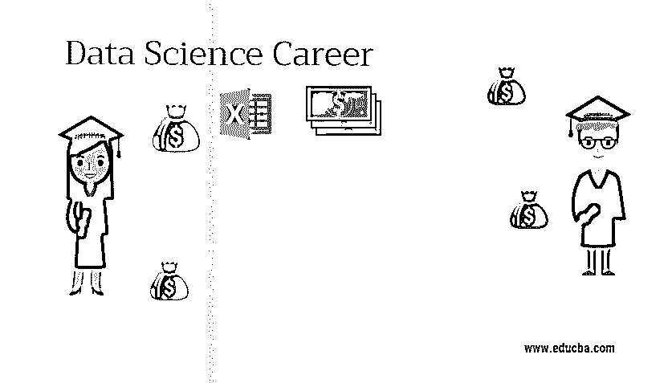

# 数据科学职业

> 原文：<https://www.educba.com/data-science-career/>

## 数据科学职业介绍

[数据科学](https://www.educba.com/what-is-data-science/)是一个需要通过分析数据来解决复杂问题的职业。这是一个相当复杂的领域，科学家要处理商业、医疗保健等领域的数百万个数据点。在当今世界，数据在组织、个人、机构中扮演着至关重要的角色；每个人在日常交易中都或多或少地与数据相关，并且数据量会一如既往地增加。随着数据量每秒都在增长，应该解决的最重要的问题是存储和处理数据。在传统的关系数据库管理系统中，数据是结构化的，与我们今天遇到的大量数据相比，数据量较少。如今，由于先进的技术和社交网站等各种来源，数据可以是结构化的、半结构化的和非结构化的。

此外，结构化数据是使用[商业智能工具](https://www.educba.com/business-intelligence-tool/)分析的，但是当非结构化或半结构化数据出现时，同样的方法就不灵活了。随着数据变得复杂，我们需要复杂的工具来分析它们。数据科学是复杂数据(如非结构化和半结构化数据)分析的答案。从无人驾驶汽车到了解客户的购买模式，Data Science Career 提供了处理如此复杂的数据并改善其业务的解决方案。

<small>Hadoop、数据科学、统计学&其他</small>

### 构建数据科学职业所需的教育

要从事数据科学方面的职业，应该拥有与之相关领域的学士或硕士学位，如计算机科学、数学等。此外，此人需要处理商业、医疗保健等领域的数据点。并且应该非常热衷于学习，对探索复杂问题充满好奇，能够通过使用高度先进的算法来可视化数据，这将有助于组织确定对业务有用的统计数据和模式。

数据科学职业所需的[技能是 SQL、统计分析和微软 Excel。除了这些技能，像 R 和 Python 这样的编程语言以及 Tableau 这样的可视化工具中的技能也会非常有用。](https://www.educba.com/skills-required-for-data-scientist/)

*   SQL 是使用数据科学的重要组成部分之一，因为没有数据库，我们就无法访问或分析数据。所以对于数据科学来说，掌握 SQL 是必须的。
*   Microsoft Excel 是一个基本工具，用于使用许多内置的程序工具(如数据透视表)分析数据，这些程序工具可以汇总和重新组织数据。
*   数据科学中的 Python 和 R 语言有助于分析和应用统计技术。此外，它们[有助于数据可视化](https://www.educba.com/what-is-data-visualization/)，这有助于清晰、高效地交流信息。

### 数据科学的职业道路

我们已经讨论了数据的重要性及其每秒钟的增长，不用说，数据科学职业为专业人士带来了令人兴奋的职业道路。这是一个具有多重角色的职业，因为它是许多不同领域的结合。数据科学的角色可以是程序员、分析师和统计学家等。由于海量数据和分析需求，数据科学的机会很多，这为业务增加了巨大的价值。

### 就业岗位

由于数据科学职业是一个多角色的领域，各种工作岗位是商业智能分析师、数据分析师、数据挖掘工程师、数据架构师、数据科学家等。

*   商业智能分析师需要理解涉及业务的功能，并被期望执行数据分析、数据挖掘等。商业智能分析师通过分析数据来找出数据模式，从而帮助组织改善其地位。
*   数据分析师通过编程语言和分析工具帮助检查原始数据，以产生有意义的结果。基本职责包括清理和维护数据，然后分析数据并呈现出来。
*   数据挖掘工程师的角色包括使用高级算法分析其组织的数据，以及相关的第三方。
*   数据架构师通过与设计人员、开发人员和用户合作，负责设计集成和维护数据源的蓝图。
*   数据科学家通过分析大量数据来发现趋势，以进行进一步分析。这提供了对数据的更深入的了解。数据科学家与业务和 IT 部门合作，分析数据集、理解数据并解决复杂的业务问题。

### 薪水

数据量增长如此之快，数据科学职业道路的作用将是至关重要的，因为分析数据将很快增加。全球对数据科学的需求不断增长，数据科学家的平均年薪约为 10，000 美元。随着数据科学家为数据带来巨大价值，组织也认识到了大数据的重要性。因此，由于对专业人士的需求很高，数据科学职业人士的预期薪酬也居高不下。

### 职业前景

随着大数据的蓬勃发展，组织正在雇用越来越多的数据专业人员。随着对专业人士的需求日益增加，数据科学家将会有一个光明和有前途的职业生涯。此外，许多组织依靠大数据来改善业务和提供更好的客户服务，因此它有很大的职业前景。

### 结论

随着[大数据技术](https://www.educba.com/what-is-big-data-technology/)的流行，数据对于组织来说至关重要，组织很大程度上依赖于他们收到的海量数据来获得洞察力。数据科学是编程技能、统计学、建模和算法等知识的结合。所以这个领域的机会是众多的，这个领域的专业人士在事业上一定会蒸蒸日上。

### 推荐文章

这是一本数据科学职业指南。在这里，我们讨论了数据科学的教育、所需技能、工作职位、工资和职业前景。您也可以浏览我们推荐的其他文章，了解更多信息——

1.  [商业分析职业](https://www.educba.com/career-in-business-analytics/)
2.  [商业智能面试问题](https://www.educba.com/business-intelligence-interview-questions/)
3.  [电子学习职业](https://www.educba.com/career-in-e-learning/)
4.  [如何将数据库连接到 PHP？](https://www.educba.com/how-to-connect-database-to-php/)

