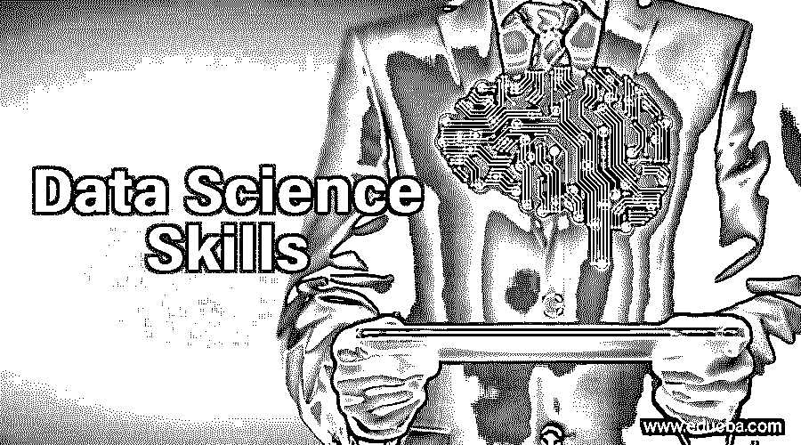
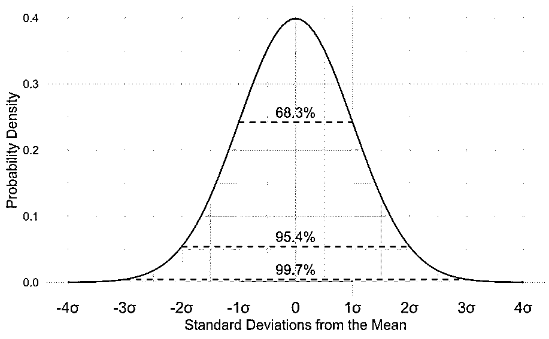
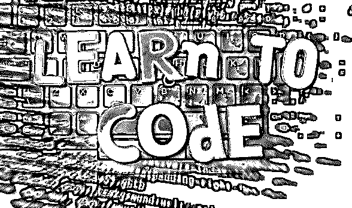

# 数据科学技能

> 原文：<https://www.educba.com/data-science-skills/>

## 数据科学技能介绍

数据科学啊，这样一个美丽的职业在热爱做这份工作的人的言行中！作为每一份工作的重要点，对职业的热爱是必不可少的。要热爱这份工作，一个人应该具备做同样工作的必要技能，无论是天生的还是后天获得的。我们已经看到许多商人从他们的家族获得企业，并把它建成一个帝国。和其他商业阶层，他们准备好面对最坏的情况，获得技能，成为最优秀的人。现在，让我们看看数据科学技能。

### 数据科学技能的类型

以下是数据科学技能的类型:

<small>Hadoop、数据科学、统计学&其他</small>

#### 1.技术

我们当中有多少人在上学期间讨厌数学这门学科？几乎我们所有人都是对的。在这里，我要告诉你一个令人心碎的消息。数学对于数据科学非常重要，无论是统计学、概率学、代数还是其他什么。统计数据告诉我们，我们收集的数据有一个模式或没有。它让我们说，每个数据都应该有一个均值和方差。概率向我们展示了数据的未来，无论它是否会发生。同时，它也讲述了过去。

线性代数是数据科学的基础，因为数据围绕着函数和方程。此外，我们可以从数据中得到向量和矩阵，这是线性代数的一个重要部分。如果你想成为数据科学的大师，你必须知道线性代数是如何工作的。开始热爱数学，它会带你到达伟大的高度。

#### 2.编程技能

统计学家用笔和纸或计算器来分析一家公司的销售或衡量竞争对手公司的销售的日子已经一去不复返了。现在我们可以通过编程来做所有这些事情，不是所有这些，而是更多。我们可以看到数据从长远来看能带我们走多远，数据在过去是否一致，以及我们现在做得如何。

在 Python 中为数据科学服务的[最佳编程语言](https://www.educba.com/best-programming-languages/)和 [R 编程语言](https://www.educba.com/r-programming-language/)如果你学了一次 Python，就没有回头学习其他编程语言的可能，因为 Python 简单明了。考虑两个人用他们都知道的语言交谈。需要的时候，画草图来准确地表达一个人的意思。这就是我们正在用 Python 做的事情。程序没有头文件交互。对于你觉得复杂的问题，有指定的库为你做这项工作。导入它们，并认为它已经完成。r 编程语言据说是给完全不懂程序的人用的。但是相信我，这比你想象的要容易。r 多用于需要更多草图的时候。掌握两种语言是很好的，但一种语言可以让你在一开始就达到一个更高的水平。

#### 3.可视化技能

当我们读报纸时，我们会略读和跳过最重要的新闻，但我们读的大多是梗概。这是一个人的观念，看到任何东西，并在头脑中记录下来。那么可视化技能在数据科学中是否不可或缺？我会用一个大大的“是”来回答。也许 100 页的全部数据可以缩减为两三个图表。你不觉得很酷吗？我觉得如此。

为了绘制图表，人们必须将数据的模式可视化。那么有没有一些工具可以帮助我们做到这一点呢？我也很高兴对这个问题说是。Excel 是一个很好的工具，它可以根据我们的需要绘制必要的图表。其他一些数据可视化工具包括 Tableau、Infogram 和 Datawrapper 等。当我们迷失在数据的海洋中时，有许多工具可以帮助我们。无论大小，数据对于得出我们的结论并将其提交给管理层都是必不可少的。除了帮助我们制作图表，[数据可视化](https://www.educba.com/what-is-data-visualization/)工具还能做什么？

#### 4.通讯技能

将我们的发现传达给团队成员或高级管理层是非常重要的。交流帮助我们达到一个比我们真正为之奋斗的更高的层次。成为一名优秀的沟通者有助于我们分享想法，并找出数据中的差异(如果有的话)。在展示数据发现和规划未来的项目中，演示技巧是最重要的。在演示过程中，看着对方的眼睛来传达信息是很重要的。

然而，在准备从事数据科学时，有一种避免这种技能的趋势。伙计们，这不是最后一项需要掌握的技能，而是在学习其他技能时需要掌握的技能。做了数学计算后，如果问题以一个吹总结结束，看起来很美。在编程时，建议在代码之间添加注释，以便那些浏览代码的人更好地理解它。可视化工具只有在用恰当的标题修饰并给出恰当的解释时，才能达到完美的效果。因此，书面和口头技能在数据科学中是不可避免的。

### 结论

那么，我是否错过了任何可以让你进入数据科学领域的技能呢？分析技能同样重要，尽管我没有强调，因为数学涵盖了所有这些热门话题。对数据的好奇心和让团队合作的领导技能让你在数据科学领域表现出色。我想以没有技能被低估来结束这篇文章。并且所有的技能都可以获得，成为一名专业的数据科学家。努力专注于你正在做的事情；做数据清理的一点耐心，从长远来看是不可避免的。

### 推荐文章

这是数据科学技能指南。在这里，我们讨论了成为专业数据科学家所需的简介和不同类型的数据科学技能。您也可以浏览我们的其他相关文章，了解更多信息-

1.  [数据科学平台](https://www.educba.com/data-science-platform/)
2.  [数据科学语言](https://www.educba.com/data-science-languages/)
3.  [数据科学职业](https://www.educba.com/data-science-career/)
4.  [数据科学生命周期概述](https://www.educba.com/data-science-lifecycle/)

