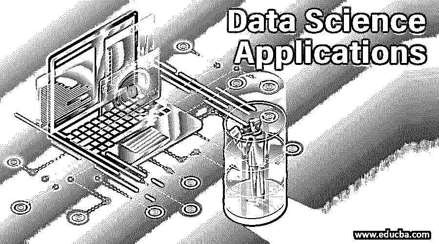
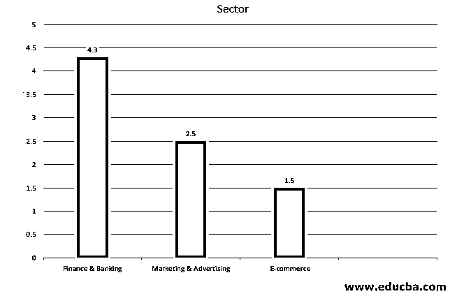

# 数据科学应用

> 原文：<https://www.educba.com/data-science-applications/>

## 数据科学应用简介

数据科学几乎在所有可能的行业都引起了轰动！为什么不呢！这是业界关注的最热门话题。它正在改变世界，并为未来的问题提供答案。而且，它正在为未来的商店带来许多惊喜。众所周知，许多行业每天都在产生大量数据，而[数据科学](https://www.educba.com/what-is-data-science/)使用这些数据进行决策。由于它是要求最高、最有前途的领域，也是所有行业的必需品，因此它被广泛应用于许多行业，如医疗保健、保险、电子商务、银行、金融、制造、运输等。超过其他行业。它已经成为许多行业最大收入的驱动力。借助数据科学的力量，我们肯定会看到这些行业比以往任何时候都发展得更快。在这里，我们将讨论数据科学应用，下面将详细解释。

### 数据科学的应用

BFSI 部门是数据科学应用最受欢迎的部门。它包括银行、金融服务和保险。根据专家的研究，金融服务和银行部门几乎占据了 36%的市场份额，位居第一。营销和广告行业排名第二，占 25%，电子商务行业排名第三，占数据科学市场的 15%。

<small>Hadoop、数据科学、统计学&其他</small>

数据科学正在以革命性的方式改变世界。它正在改变感知数据的方式。让我们试着了解现有数据科学在广泛领域的应用。

#### 1.金融与银行

金融和银行业是最早采用数据科学应用的行业。银行和金融行业拥有执行风险分析的自动化任务。这些行业在很大程度上以数据为中心，并充当其业务增长的燃料。数据科学家构建流程，从可用的原始数据中提取洞察力，然后执行各种分析，如[统计分析](https://www.educba.com/statistical-analysis/)、预测、风险分析等。这种应用正被用于风险分析、实时分析、消费者分析、客户数据管理、欺诈检测等。

*   **风险分析:**在这个项目中，我们试图煽动公司可能面临的来自竞争对手、信贷、市场等的各种风险。训练数据可以从客户信息、金融交易等中生成。，用于开发评估客户价值的风险评分模型。
*   **实时分析:**随着技术的进步，我们现在可以在数据生成后立即对其进行处理。在实时情况下，交易发生在几秒钟内，需要实时监控。由于 Kafka、Flume 等实时数据管道，这一功能成为可能。
*   **消费者分析:**银行&金融行业利用消费者分析为他们最有价值的客户提供定制产品。他们通过他们的购买模式、购买能力和许多其他属性来观察消费者行为，以获得客户终身价值，并通过这些客户增加他们的业务。
*   **欺诈检测:**在金融&银行业，发现欺诈交易意义重大，因为这些交易与货币价值直接相关。分析师试图检测数据中的异常模式，并实时生成可疑交易警报，以防止欺诈。聚类机制用于从数据中得出欺诈模式。

#### 2.营销和广告

以下是一些营销和广告数据科学应用:

*   要进入这个市场，我们必须有一个可靠的战略来锁定特定的客户，我们还需要根据他们的需求对他们进行细分。
*   数据科学通过[预测和描述性分析](https://www.educba.com/predictive-analytics-vs-descriptive-analytics/)帮助我们做同样的事情，预测和描述性分析利用了某些聚类技术，如询问方法、分层等。
*   我们还可以利用数学建模技术，如神经网络，这有助于了解客户与特定客户群的接近程度。一个例子是社交媒体分析，我们从各种社交媒体网站获取数据，如脸书、Twitter、Instagram、snap chat 等。
*   我们分析这些数据，并设计一个合适的营销计划，以满足客户的需求。这些数据对我们分析顾客在购买任何产品时的心态或他们的在线行为非常有用；例如，在的情况下使用 A/B 测试来找出哪个广告对我们的业务最有利可图和最有效；我们也可以使用其他策略，如内容营销和广告计划。

#### 3.电子商务

零售业和电子商务这两大行业是数据科学的主要受益者；这些应用包括:

*   推荐系统，在数据科学的帮助下，根据顾客购买的产品向他们推荐新产品。
*   预测分析，主要用于预测。
*   建立适当的客户群，并根据客户对产品价格进行必要的调整。

在这两个行业中，先进的推荐系统(基本上是协同过滤和基于内容的过滤的组合)被回归使用。基于这些系统，我们将根据客户购买产品的历史和具有相似品味的人购买的产品来提供见解。他们还使用情感分析来分析客户给出的反馈，并从中获得洞察力以进行改进。这些情感分析系统使用自然语言处理，这是数据科学中的一个小众学科，只专注于文本挖掘和学习。

### 结论

从本文中，我们可以了解到数据科学已经对所有主要行业产生了重大影响，如医疗保健、电子商务、金融和银行、交通运输等。，用于改进他们的产品和客户群。数据科学必须成为所有行业不可或缺的一部分，因为这是行业在各自领域发展和前进的唯一途径。我们看到的数据科学的另一个主要应用是金融和银行业中使用的欺诈检测；他们还使用 BI 工具来分析各种数据趋势。

### 推荐文章

这是数据科学应用指南。在这里，我们将讨论简介和前三大数据科学应用，以改进产品和客户群。您也可以阅读以下文章，了解更多信息——

1.  [什么是数据科学家？](https://www.educba.com/what-is-a-data-scientist/)
2.  [数据科学机器学习](https://www.educba.com/data-science-machine-learning/)
3.  [数据科学技术](https://www.educba.com/data-science-techniques/)
4.  什么是数据集市？

