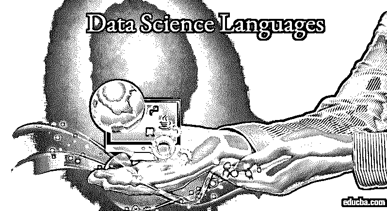
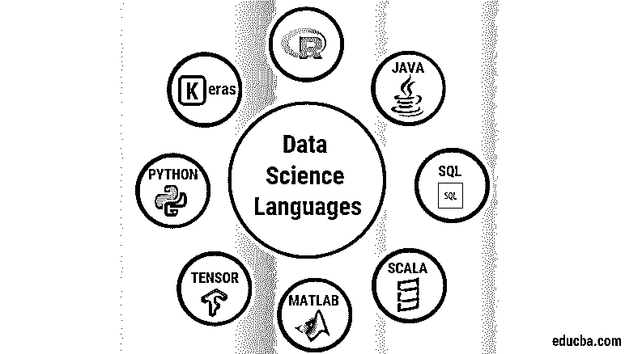

# 数据科学语言

> 原文：<https://www.educba.com/data-science-languages/>

## 数据科学语言简介

数据科学已成为当今的顶级技术之一，并成为市场上的热门词汇。数据科学家是一个关键角色，必须处理数学问题和分析解决方案，还需要工作、理解和熟悉同样适用于[数据科学和机器学习](https://www.educba.com/data-science-vs-machine-learning/)的编程语言。有必要访问您收集的数据，为此，需要正确的技能和完美的工具的完美结合，以便为您提供符合您期望的结果和提供的信息。

数据科学的范围与日俱增，预计在未来的许多年里还会增加。数据科学涉及许多领域，如统计学、数学、信息技术、计算机科学等。你应该对其中一种语言有很好的实践能力，但是在你的简历中有一种以上的语言从来都不是一个坏主意。由于数据科学家和数据科学爱好者的需求不断增长，迫切需要列出所有可能的数据科学语言的组合列表。

<small>Hadoop、数据科学、统计学&其他</small>

### 数据科学中的顶级编程语言

数据科学有许多用于机器学习的技术语言。

#### 1.大蟒

首先也是最重要的，你在周围环境中一定听说过的语言是 Python 编程语言。阅读和编码毫不费力；函数式编程语言参与核心开发领域，并有效地帮助数据科学。大多数库都是用这种语言预定义的。这些图书馆包括 sci-kit learn、pandas、numpy、sci-py、matplotlib 等。

Python 如此受欢迎的一个主要原因是它在程序员中的易用性和简单性，以及它快速组合和集成顶级算法的灵活性和能力，这些算法通常用 Fortran 或 C 语言编写。此外，随着数据科学、预测建模和机器学习的出现和快速发展，Python 开发人员的需求呈指数级增长。因此，它在 web 开发、数据挖掘、科学计算等领域得到了广泛的应用。

#### 2.r 编程

一种统计语言，如果不一定是关于 Python 的，一定是关于 R 的。与 Python 及其原生语言相比，这是一种相当传统的语言，作为开源语言，它成为最广泛使用的工具之一，R 基金会为统计计算提供了图形和统计计算软件环境。这个领域的技能组合有非常高的就业机会，因为它们与数据科学和机器学习密切相关。这种语言完全是为分析目的而构建的，因此它提供了许多统计模型。公共的 R 包存储库和归档列表包含 8000 多个网络贡献包。RStudio、微软和许多顶级巨头都做出了贡献，并得到了 R 社区的支持。

#### 3.Java 语言(一种计算机语言，尤用于创建网站)

当它必须与 Java 有关时，我认为实际上不需要太多的解释。这是一种常青的编程语言，在其进入的每个技术领域都非常成功。以前是 Sun 的门生，现在是 Oracle 的门生，后者一直在关注每一个新的 Java 版本中与日常市场相关的新特性。它主要用来作为任何架构和框架的主干。因此，数据科学用于交流和建立连接，并管理负责实现机器学习和数据科学的底层组件的工作。

#### 4.斯卡拉

另一种流行的编程语言是 [scala 函数式编程语言](https://www.educba.com/scala-the-functional-approach/)，它主要基于与 Apache spark 的一项协议及其工作，使其能够更快地工作并优化性能。这也是一种开源的通用编程语言，直接在 JVM 之上运行[。这主要与大数据和 Hadoop 相关，因此在使用案例涉及大量数据时效果很好。它是一种强类型语言，因此很容易在程序员中使用。此外，它对 JVM 或 Java 虚拟机的支持允许与 Java 语言的互操作性。因此，scale 可以成为一种强大的通用编程语言，从而成为该领域的首选之一。](https://www.educba.com/what-is-jvm/)

#### 5.结构化查询语言

结构化查询语言或 SQL(通常缩写)是数据库和后端系统的核心，也是数据科学中最流行的语言之一。它很好地用于查询和编辑通常存储在关系数据库中的信息。它还主要用于保存和获取数十年的数据。

当 it 必须减少查询时间、周转时间并利用其快速处理时间管理大型数据库时，这成为流行的选择。一般来说，在数据科学和技术领域，你可以拥有的最大资产之一就是学习 SQL 语言的使用。今天，市场上已经出现了许多其他的查询组件和许多其他的 [NoSQL 数据库，但是它们都源于 SQL 编程语言。](https://www.educba.com/what-is-nosql-database/)

#### 6.Matlab

这种语言是核心数据科学语言之一，负责快速、可靠和稳定的算法，用于数值计算。它被认为是最适合科学家、数学家、统计学家和开发人员的语言之一。它可以很容易地玩典型的数学变换和概念，如拉普拉斯，傅立叶，积分和微分。

关于数据科学爱好者和数据科学家的最好的部分是，这种语言提供了一系列内置和定制的库，这对新兴的数据科学家很有用，因为他们不必深入研究来应用 [Matlab](https://www.educba.com/what-is-matlab/) 的知识。

#### 7\. TensorFlow

Tensorflow 是一种广泛使用的语言，它标志着数据科学领域的出现。谷歌开发了这个，这个开源库在进行数字计算和运算时变得越来越受欢迎。这个框架基于数据的广泛适用性。它用于图形计算等情况，在这些情况下，它可以利用调优的 C++代码。

使用 TensorFlow 的一个主要优势是它使用 GPU 和 CPU 以及分布式编程。这基于深度学习的概念，可以在短时间内根据大量数据训练巨大的神经网络。这被称为谷歌大脑团队的第二级生成系统，为谷歌搜索、云语音和照片等大规模服务提供动力。

#### 8\. Keras

Keras 是一个用于深度学习的极简主义 Python 库。它运行在 [Theano 或 TensorFlow](https://www.educba.com/theano-vs-tensorflow/) 之上；它的主要目的是[为了开发和研究的目的，方便快捷地实现机器学习模型](https://www.educba.com/machine-learning-models/)。可以看出，这是在 Python 的遗留版本和当前版本(即 2.7 或 3.5)上运行的。并且可以看出在 CPU 或 GPU 上运行时是无缝的。它利用了四个指导原则，即——极简主义、模块化、Python 和可扩展性。重点是模型思想，主要模型是序列，它是一层线性堆栈。

这意味着层将被添加到创建的序列中，并且计算必须按照预期的计算顺序进行。一旦你定义，你可以使用编译模型，它使用底层框架和组件来优化计算，从而指定损失函数和被使用的优化器；然后检查模型的可行性并与数据相符合。这可以通过在特定时间使用一批数据来完成，或者通过启动整个模型训练机制来完成。然后，这些模型可以用于预测。构建可以总结如下，定义模型，确保它是可编译的，拟合你的模型，对它进行预测。

### 结论

当今市场上广泛使用各种数据科学编程语言。如果一种语言在任何方面比另一种语言更好，这是无法明确说出的。这完全取决于您的项目或组织中的用例类型，并且可以相应地选择语言；所有语言都有各自的优缺点，因此，需要进行基本的介绍性分析，以了解哪种语言最适合用于数据科学。我希望你喜欢我们的文章。请继续关注更多类似的内容。

### 推荐文章

这是数据科学语言指南。这里我们讨论了数据科学中使用的 8 种不同语言的基本概念。您也可以浏览我们推荐的其他文章，了解更多信息——

1.  [什么是张量流？](https://www.educba.com/what-is-tensorflow/)
2.  [MATLAB 中的数据类型](https://www.educba.com/data-types-in-matlab/)
3.  [R 编程语言](https://www.educba.com/r-programming-language/)
4.  [数据科学算法的类型](https://www.educba.com/data-science-algorithms/)

