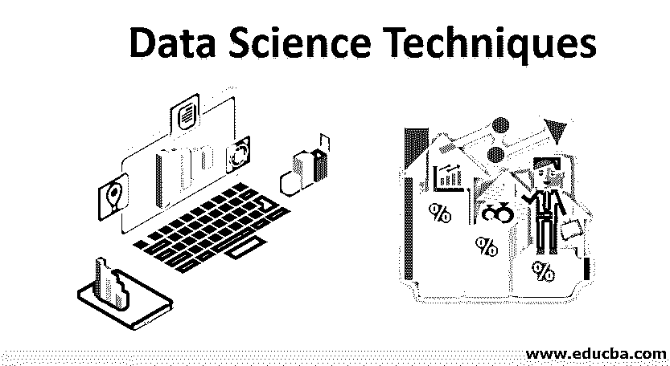
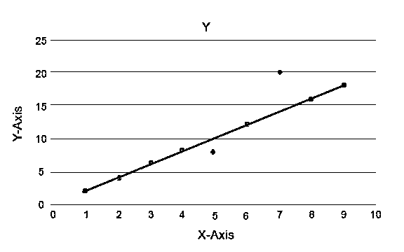
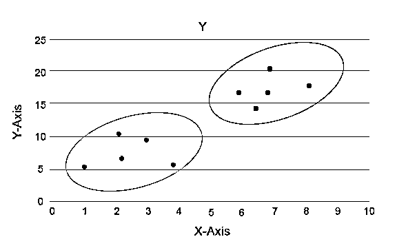

# 数据科学技术

> 原文：<https://www.educba.com/data-science-techniques/>

## 数据科学技术简介

在当今世界，数据是新的黄金，不同类型的分析可供企业使用。数据科学项目的结果因可用数据的类型而有很大差异，因此影响也是一个变量。因为有许多不同种类的分析可用，所以必须了解需要选择哪些基线技术。数据科学技术的基本目标是搜索相关信息并检测薄弱环节，这往往会使模型表现不佳。

### 什么是数据科学？

[数据科学](https://www.educba.com/what-is-data-science/)是一个跨越多个学科的领域。它融合了科学的方法、过程、算法和系统来收集知识并进行研究。该领域包括各种流派，是统一统计、数据分析和机器学习的公共平台。在这方面，统计和实时数据的理论知识与机器学习中的[技术](https://www.educba.com/machine-learning-techniques/)携手合作，为企业带来丰硕的成果。使用数据科学中采用的不同技术，我们在当今世界可以做出更好的决策，否则人类的眼睛和大脑可能会忽略这一点。记住，机器永远不会忘记！要在数据驱动的世界中实现利润最大化，数据科学的魔力是必备的工具。

<small>Hadoop、数据科学、统计学&其他</small>

### 不同类型的数据科学技术

在接下来的几个段落中，我们将研究其他项目中使用的常见数据科学技术。尽管有时数据科学技术可能是特定于业务问题的，并且可能不属于以下类别，但是将其称为各种类型是完全可以的。我们将技术分为受监督的(我们知道目标影响)和不受监督的(我们不知道我们试图实现的目标变量)。在下一个层次，这些技术可以按照以下方面进行划分

*   我们将得到的输出或者业务问题的意图是什么
*   使用的数据类型。

让我们首先看看基于意图的隔离。

#### 1.无监督学习

*   **异常检测**

在这种技术中，我们识别整个数据集中的任何意外事件。由于行为不同于数据的实际发生，潜在的假设是:

1.  这些情况发生的次数很少。
2.  行为上的差异是显著的。

解释了异常算法，例如隔离森林，它为数据集中的每个记录提供一个分数。该算法是基于树的模型。使用这种类型的检测技术及其受欢迎程度，它们被用于各种商业案例，例如，网页浏览量、流失率、每次点击收入等。在下图中，我们可以解释异常是什么样子的。

这里蓝色的代表数据集中的异常。它们不同于常规的趋势线，出现的几率较小。

*   **聚类分析**

通过这种分析，主要任务是将整个数据集分成组，以便一组数据点中的趋势或特征是相似的。在数据科学术语中，我们称之为集群。例如，有一个在零售业务中扩展业务的计划，根据我们过去的数据，了解新客户在一个新地区的行为变得非常必要。为群体中的每个个体设计一个策略变得不可能。尽管如此，将群体划分到集群中是有用的，以便在一个组中有效，并且是可伸缩的。

在这里，蓝色和橙色是不同的集群，具有独特的特质。

*   **关联分析**

这种分析有助于我们在数据集中的项目之间建立有趣的关系。这种分析揭示了隐藏的关系，并有助于以关联规则或频繁项集的形式表示数据集项。关联规则分为两个步骤:

1.  **频繁项目集生成:**在此，在频繁出现的项目被设置在一起的地方生成一个集。
2.  **规则生成:**上面建立的集合经过不同的规则形成层，在它们之间建立一个隐藏的关系。例如，集合可以分为概念问题、实现问题或应用问题。然后在各自的树中向下分支，以构建关联规则。

例如，APRIORI 是一种关联规则构建算法。

#### 2.监督学习

*   **回归分析**

在[回归分析](https://www.educba.com/what-is-regression-analysis/)中，我们将因变量/目标变量和剩余变量定义为自变量，并最终假设一个/多个自变量如何影响目标变量。有一个自变量的回归称为单变量回归，有多个自变量的回归称为多变量回归。让我们理解使用单变量，然后缩放为多变量。

比如 y 是目标变量，x 1 是自变量。所以，从直线知识来看，我们可以把方程写成 y = mx 1 + c，这里“m”决定 x1 对 y 的影响有多强烈，如果“m”非常接近零，就意味着随着 x 1 的变化，y 没有受到强烈的影响。大于 1 的数字，影响变得更强，x 1 的小变化导致 y 的大变化，与一元变量类似，in 多元变量可以写成 y = m1x1+m2x2+m3x3…………，这里每个自变量的影响是由其对应的“m”决定的。

*   **分类分析**

类似于聚类分析，分类算法以类的形式建立目标变量。聚类和分类的区别在于，我们不知道数据点属于哪个组，而在分类中，我们知道它属于哪个组。而且从组数应该是一个固定数的角度来看，它不同于回归；与回归不同，它是连续的。分类分析中有许多算法，例如，支持向量机、逻辑回归、决策树等。

### 结论

总之，我们知道每种类型的分析都很庞大，但是我们可以为不同的技术提供一点风味。在接下来的几篇笔记中，我们将分别介绍它们，并详细讨论每种父技术中使用的不同子技术。

### 推荐文章

这是数据科学技术指南。在这里，我们详细讨论数据科学中的介绍和不同类型的技术。您也可以浏览我们推荐的其他文章，了解更多信息——

1.  [数据科学工具| 12 大工具](https://www.educba.com/data-science-tools/)
2.  [数据科学算法与类型](https://www.educba.com/data-science-algorithms/)
3.  [多元回归的例子](https://www.educba.com/multivariate-regression/)
4.  数据科学生命周期的简要概述

