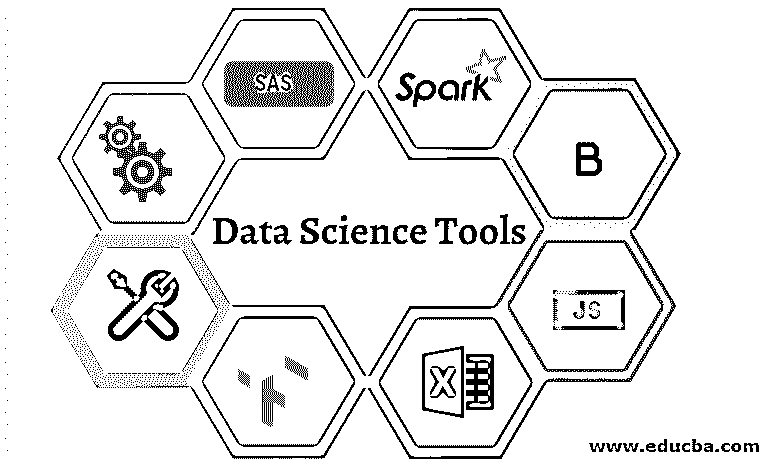
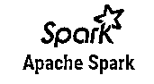
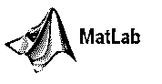
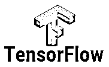

# 数据科学工具

> 原文：<https://www.educba.com/data-science-tools/>

## 数据科学工具简介

数据科学家应提取、操作、预处理和生成信息预测。为此，它需要不同的统计工具和编程语言。在本文中，我们将讨论数据科学家用来进行数据事务的一些数据科学工具，我们将了解这些工具的主要功能、它们的优势以及不同数据科学工具的比较。

因此，我们将在这里讨论数据科学。因此，基本上，我们可以说数据科学是 21 世纪最著名的领域之一。公司雇佣数据科学家，让他们洞察行业，改进产品。数据科学家负责分析和管理各种非结构化和结构化数据，并且是决策者。要做到这一点，数据科学必须以它希望使用不同工具和编程语言的方式来适应时代。我们将使用其中一些工具来分析和生成预测。现在，我们将讨论数据科学工具。

<small>Hadoop、数据科学、统计学&其他</small>

### 顶级数据科学工具

以下是大多数数据科学家使用的 14 种最佳数据科学工具列表:

#### 1.斯堪的纳维亚航空公司

它是纯粹为统计目的而设计的信息科学工具之一。SAS 是大公司分析信息的专有闭源软件。对于统计建模，SAS 利用基本的 SAS 语言编程。它通常被专家和企业用在商业软件中。作为一名数据科学家， [SAS 提供了](https://www.educba.com/what-is-sass/)无数的统计库和工具来建模和组织数据。虽然 SAS 具有高度的可信任性和强大的支持，但它的成本很高，并且只被较大的行业使用。此外，几个 SAS 库和包不在基础包中，升级成本很高。

**SAS 的特性:**

*   管理
*   报告输出格式
*   数据加密算法
*   SAS 工作室
*   支持各种数据格式
*   它对第四代编程语言具有灵活性

#### 2.阿帕奇火花

Apache Spark，或简称为政治火花，是一个强大的分析引擎和最常用的数据科学工具。Spark 专门用于批处理和流处理。许多 API 允许信息科学家访问机器学习信息、SQL 存储等。，反复。它比 Hadoop 有所改进，并且比 Map-Reduce 快 100 倍。 [Spark](https://www.educba.com/what-is-apache-spark/) 有许多机器学习 API，可以帮助数据科学家预测信息。Spark 可以比其他大数据平台更好地管理流信息。与其他只能批量处理历史信息的分析工具相比，Spark 可以实时处理信息。在 Python、Java 和 R 中，Spark 提供了几个 API。然而，Spark 与 Scala 最强的结合是一种虚拟的基于 Java 的编程语言，本质上是跨平台的。

**阿帕奇 Spark 的特点:**

*   阿帕奇火花速度很快。
*   它还具有高级分析功能。
*   Apache spark 也有一个实时流处理。
*   本质上是动态的。
*   它还具有容错功能。

#### 3.BigML

BigML，另一个非常常用的数据科学工具。它为机器算法处理提供了一个交互式的、基于云的 GUI 环境。BigML 为该领域提供标准化的基于云的软件。它允许企业中多个领域的企业使用机器学习算法。BigML 是高级建模专家。它利用大量的算法进行机器学习，包括聚类和分类。您可以基于您的信息需求，使用使用 Rest APIs 的 BigML web 接口创建一个免费帐户或高级帐户。它支持交互式信息视图，并让您能够在移动或物联网设备上导出可视化图表。除此之外，BigML 还提供了多种自动化技术来自动化调优，甚至自动化可重用的脚本。

#### 4.D3.js

Javascript 主要作为客户端的脚本语言。D3.js，你可以通过 [Javascript](https://www.educba.com/what-is-javascript/) 库在我们的网络浏览器上创建交互式可视化。通过各种 D3.js APIs，您可以使用各种特性在浏览器中进行动态查看和数据分析。动画转场的使用是 D3.js 的另一大特色，D3.js 动态实现客户端更新，通过信息修改主动在浏览器上体现可视化。这可以与 CSS 结合使用，生成带插图的临时可视化效果，帮助您在网页上执行定制的图形。总的来说，这对于基于物联网的信息科学家来说是一个有益的工具，他们需要客户端交互来进行可视化和信息处理。

**D3 . js 的特性:**

*   它基于 javaScript。
*   它可以创建动画过渡。
*   这对于物联网中的客户端交互非常有用。
*   它是开源的。
*   可以和 [CSS 结合使用。](https://www.educba.com/what-is-css/)
*   这对于制作交互式可视化很有用。

#### 5.MatLab

对于数学信息，Matlab 是一个多范数制计算环境。这是一个闭源软件，有助于矩阵、算法和统计信息建模。在几个科学领域中，Matlab 是最常用的。Matlab 用于数据科学中的神经网络和模糊逻辑模拟。您可以使用 Matlab 图形库生成强大的可视化效果。在图像和信号处理中，也使用 Matlab。对于信息科学家来说，这使得它非常通用，因为它解决了所有问题，从分析和清理到强大的深度学习算法。此外，Matlab 是一个最佳的数据科学工具，因为它可以简单地包含到商业应用程序和集成系统中。它还允许从信息提取到决策脚本重用的自动化任务。

**Matlab 的特点:**

*   对深度学习有用。
*   它提供了与嵌入式系统的轻松集成。
*   它有一个强大的图形库。
*   它可以处理复杂的数学运算。

#### 6.擅长

数据分析仪器可能是最常用的。Excel 是由微软创建的，主要用于计算工作表，目前通常用于数据处理、复杂和可视化计算。Excel 是一种高效的数据科学分析工具。Excel 仍然是传统的信息分析工具。Excel 有几个公式，表格，过滤器，切片器等等。您还可以使用 Excel 生成您的个性化特征和公式。虽然 Excel 仍然是强大的数据可视化和平板电脑的理想选择，但它并不是用来计算大量数据的。

您还可以将 SQL 连接到 Excel，并使用它进行数据管理和分析。许多数据科学家使用 Excel 作为交互式图形设备，以方便信息的预处理。随着 Microsoft Excel 工具库的推出，现在计算复杂的分析变得简单多了。但与 SAS 等更复杂的数据研究工具相比，它仍然失败了。总的来说，Excel 是微型和非企业级数据分析的最佳工具。

**Excel 的特点:**

*   对于小规模的数据分析，这是时髦的。
*   Excel 也用于电子表格计算和可视化。
*   用于数据分析的 Excel 工具包。
*   它提供了与 SQL 的简单连接。

#### 7.我是 NLTK

NLTK 代表[自然语言处理](https://www.educba.com/what-is-natural-language-processing/)。数据科学中最常见的领域是自然语言处理。它是关于开发统计模型，帮助机器理解人类的语言。这些统计模型是机器学习的组成部分，通过几种算法帮助计算机理解自然语言。Python 语言配备了专门为此开发的自然语言工具包(NLTK)库集合。NLTK 通常用于不同的语言处理方法，如标记化、词干化、标记、解析和机器学习。它由 100 多家收集机器学习模型信息的公司组成。

#### 8\. TensorFlow

TensorFlow 已经成为标准的机器学习工具。最新的机器学习算法，像深度学习，都是常用的。开发人员以张量的多维数组命名 TensorFlow。它是一个开源的、不断发展的工具箱，以其提升的计算效率和能力而闻名。TensorFlow 可以在 CPU 和 GPU 上运行，最近出现在更强的 TPU 系统上。TensorFlow 由于其高处理能力而具有广泛的应用，例如语言识别、图像分类、药物发现、图像生成和语言生成。

**张量流特征:**

*   张量流很容易训练。
*   它还有未来专栏。
*   TensorFlow 是一个开源且灵活的工具。

#### 9.新西兰黑秧鸡

Weka 或者说怀卡托的知识分析环境是 Java 写的机器学习。[机器学习算法](https://www.educba.com/machine-learning-algorithms/)是几个数据挖掘机器的集合。Weka 包括不同的学习机器，如分级、聚类、回归、可视化和信息开发。它是一个开源的 GUI 软件，使实现机器学习算法变得更加简单和用户友好。机器学习对信息的作用不用一行代码就能理解。它非常适合初学者的机器学习数据科学家。

#### 10\. Jupyter

Project Jupyter 是一个基于 IPython 的开源工具，帮助开发人员开发开源软件和交互式计算体验。支持多种语言，如 Julia、Python 和 R。它是一种在 web 应用程序上编写实时代码、可视化和讲座的工具。Jupyter 是一个旨在满足数据科学需求的常用工具。这是一个交互式环境，数据科学家可以在其中完成他们的任务。它也是一个强大的讲故事工具，因为它包含几个演示特征。你可以使用 [Jupyter 笔记本](https://www.educba.com/what-is-juypter-notebook/)清理、统计计算、查看和生成预测机器学习模型。它是 100%开源的，因此是免费的。有一个名为 Jupyter environment online 的合作实验室，在云上运行和购买 Google Drive 信息。

#### 11.表

Tableau 是一个交互式可视化软件，打包了强大的图形。该公司专注于商业智能领域。Tableau 最重要的元素是它与数据库、平板电脑、OLAP 立方体等接口的能力。Tableau 还可以可视化地理数据，并绘制地图的长度和纬度以及这些特征。您还可以使用其分析工具来评估可视化信息。您可以在 Tableau 的互联网平台上与活跃的社区分享您的结果。虽然 Tableau 是公司软件，但 Tableau Public 有免费版本。

**画面特征:**

*   Tableau 有一个移动设备管理。
*   它提供了文档 API。
*   它提供了 JavaScript API。
*   ETL 刷新是 Tableau 的重要特性之一。

#### 12\. Scikit-learn

Scikit-learn 是一个基于 Python 的机器学习算法库。一个常用于评估和数据科学的工具易于直接执行。机器学习系统支持一系列特征，包括信息预处理、聚类、回归降维、分类等。Scikit-learn 使使用复杂的机器学习算法变得简单，因此，它是在需要快速原型制作的情况下需要基本[机器学习](https://www.educba.com/what-is-machine-learning/)的研究的最佳平台。

### 结论

我们可以得出结论，信息科学需要广泛的工具。数据科学工具用于分析信息，创建美观的交互式可视化，并使用算法创建强大的预测模型。因此，在本文中，我们看到了用于数据科学分析的不同工具及其特性。您可以根据自己的需求和工具的特性来选择工具。

### 推荐文章

This is a guide to Data Science Tools. Here we discuss the introduction and top data science tools for better understanding. You can also go through our other suggested articles to learn more –

1.  [QlikView Tools](https://www.educba.com/qlikview-tools/)
2.  [tensorlow 替代品](https://www.educba.com/tensorflow-alternatives/)
3.  [机器学习工具](https://www.educba.com/machine-learning-tools/)
4.  [SAS 操作员](https://www.educba.com/sas-operators/)

