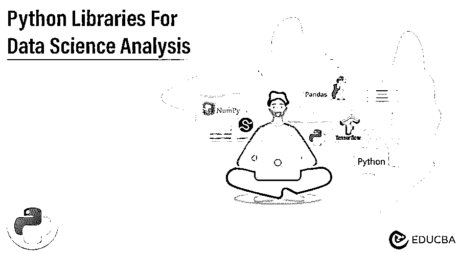
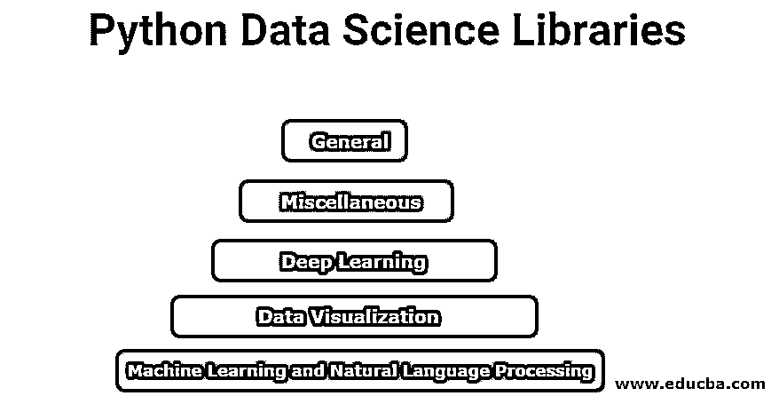

# 用于数据科学分析的 Python 库

> 原文：<https://www.educba.com/python-libraries-for-data-science/>

## 用于数据科学分析的 Python 库

各种库包含了 pythons，如 TensorFlow、Theano、PyTorch、ApacheSpark、OpenCV、NetworkX、幕府将军、Matplotlib 等。，通过各种机器学习和深度学习算法对数据进行数据挖掘操作。最后，derived 被称为用于数据科学的 Python 库，有助于从数据中获得尽可能好的见解，并有助于基于统计和可视化见解做出正确的决策。

### Python 数据科学库分析

Python 中的顶级数据科学库分析

<small>网页开发、编程语言、软件测试&其他</small>

1.  普通图书馆
2.  数据可视化
3.  机器学习和自然语言处理
4.  深度学习
5.  多方面的

基于这些操作，我们将 python 数据科学库分为以下几个部分。

#### 1.普通图书馆

**a. NumPy:** NumPy 代表数值 Python。它是科学和数学计算的基础库之一。例如，它帮助我们进行高效的 N 维数组操作、集成 C/C++和 Fortran 代码、涉及线性代数的复杂数学变换、傅立叶变换等。

b. Pandas: 它是最受欢迎的用于阅读、操作和准备数据的库。Pandas 提供了高效、易用的数据结构，有助于在内存和外部数据格式(如 CSV、JSON、Microsoft Excel、SQL 等)之间操作数据。

该库的主要特点是:

*   附带快速有效的 DataFrame 对象。
*   数据集的高性能合并和智能索引。
*   低延迟实现是用 Cython 和 C 等语言编写的。

c. SciPy: SciPy 是另一个流行的用于数学和统计操作的开源库。scipy 的核心数据结构是 NumPy 数组。它帮助数据科学家和开发人员处理线性代数、域转换、统计分析等。

#### 2.数据可视化

**a. Matplotlib:** 是一个可视化的 2D 绘图库，灵感来源于 MATLAB。Matplotlib 提供高质量的二维图形，如条形图、分布图、直方图、散点图等。，代码行很少。像 MATLAB 一样，它也给用户选择低级功能的灵活性，如线条样式、字体属性、轴属性等。通过面向对象的接口或一组函数。

**b. Seaborn:** Seaborn 基本上是一个构建在 Matplotlib 之上的高级 API。它带有一个可视化的 reacher 和信息统计图表，如热图，计数图，紫线图等。

c. Plotly: Plotly 是另一个流行的开源 python 图形库，用于高质量的交互式可视化。除了 2D 图形，它还支持三维绘图。Plotly 广泛用于数据的浏览器内可视化。

#### 3.机器学习和自然语言处理

**a . ScikitLearn:**ScikitLearn 可能是用于机器学习和预测分析的最广泛使用的 Python 库之一。它为分类、回归、聚类、模型调整、数据预处理和降维任务提供了广泛的有效算法集合。它建立在 NumPy、SciPy 和 Matplotlib 之上；因此，它易于使用，开源，并可在各种环境中重用。

**b. LightGBM:** 在你数据科学学习的后期，你会遇到基于树的学习算法和集成。当今机器学习中最重要的方法之一是 boosting。LightGBM 是微软的一个流行的开源[渐变增强框架](https://www.educba.com/gradient-boosting-algorithm/)。

lightgbm 的主要特性是:

*   并行和 GPU 支持的执行。
*   牢度和更好的准确性。
*   处理大规模数据集的能力，并支持分布式计算。

c .惊喜:推荐系统是现代基于人工智能的应用程序感兴趣的重要领域。国家艺术推荐系统使企业能够为他们的客户提供高度个性化的产品。令人惊讶的是一个有用的开源 Python 库来构建推荐系统。它提供了评估、分析和比较算法性能的工具。

**d. NLTK:** NLTK 代表自然语言工具包。这是一个处理人类语言数据集的开源库。它对于文本分析、情感分析、语言结构分析等问题非常方便。

#### **4。深度学习**

**a. TensorFlow:** TensorFlow 是 Google 为终结机器学习和深度学习解决方案而推出的开源框架。它将低级控制交给用户来设计和训练高度可扩展和复杂的[神经网络](https://www.educba.com/what-is-neural-networks/)。Tensorflow 可用于桌面和移动设备，并通过包装器支持大量编程语言。

**b. Keras:** Keras 是一个开源的高级深度学习库。它提供了使用 TensorFlow 或 theano(类似 TensorFlow 的另一个低级 python 库)作为后端的灵活性。此外，Keras 还为开发深度学习模型提供了一个简单的高级 API。

它适用于快速原型和开发工业用神经网络模型。Keras 的主要用途是分类、文本生成、摘要、标记、翻译、语音识别等。

#### **5。杂项**

a. OpenCV: OpenCV 是一个流行的 python 库，用于解决计算机视觉问题(涉及图像或视频数据的任务)。这是一个具有跨平台支持的高效框架，非常适合实时应用。

**b. Dask:** 如果你的计算能力较低或者无法访问大型集群，Dask 是可伸缩计算的完美选择。Dask 提供低级 API 来为内部应用程序构建定制系统。因此，当在本地机器中处理大规模数据集时，您可以选择 Dask 而不是 Pandas。

### 结论

python 中有一组丰富的 python 库可用于各种数据驱动的操作。本文讨论了数据科学社区中最流行和最广泛使用的 python 库。然后，基于问题陈述和组织实践，在实践中选择合适的 python 库。

### 推荐文章

这是一本关于数据科学的 Python 库的指南。在这里，我们已经讨论了用于数据科学的 python 概述和不同的库。您也可以浏览我们推荐的其他文章，了解更多信息——

1.  [Python 的优势](https://www.educba.com/advantages-of-python/)
2.  [Python 替代品](https://www.educba.com/python-alternatives/)
3.  [Python 字符串函数](https://www.educba.com/python-string-functions/)
4.  [python 中的 matplotlib](https://www.educba.com/matplotlib-in-python/)

