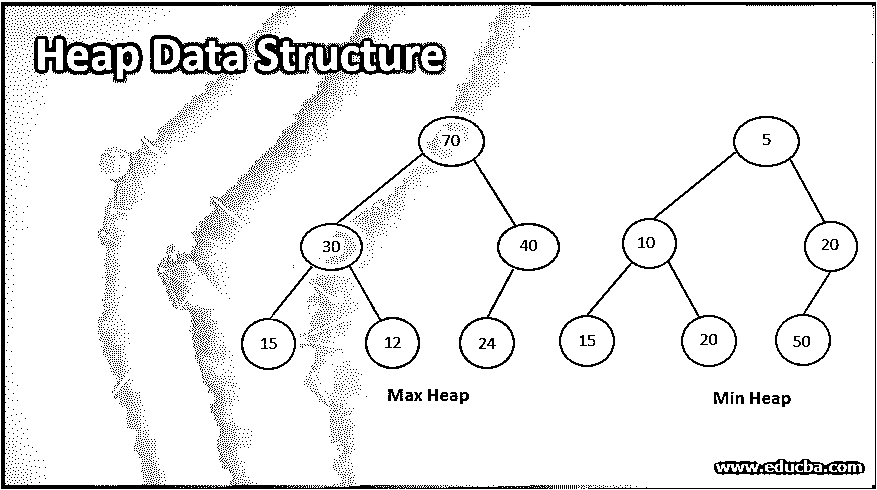
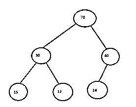
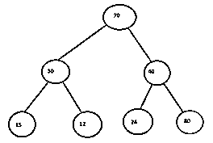
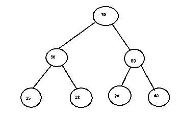
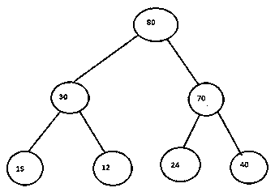
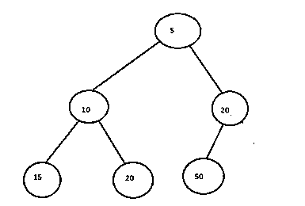
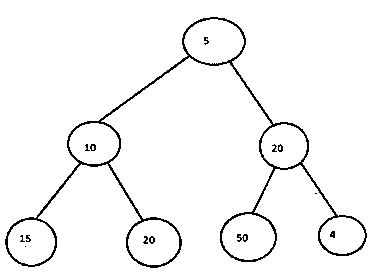
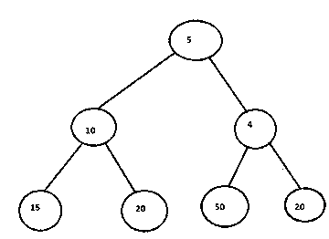

# 堆数据结构

> 原文：<https://www.educba.com/heap-data-structure/>

## 堆数据结构的定义

堆是一种特殊类型的树，它满足某些条件，例如它是一个完整的二叉树，在最大堆的情况下，堆中父节点中的值总是大于或等于其子节点中的值，或者父节点中的值小于其子节点中存储的值。这种类型的数据结构是为了实现优先级队列等场景而构建的，在这些场景中，需要挑选具有最低或最高优先级的元素。此外，堆中的树总是平衡的。

### 堆数据结构类型

堆数据结构的类型有:

<small>Hadoop、数据科学、统计学&其他</small>

#### 1.最大堆

这是一种堆，其中根元素中的值大于或等于其子节点中的元素。

##### 算法

*   步骤 1:首先在堆的末尾创建一个新的节点 N。
*   步骤 2:要添加的新元素将被分配给这个节点 N
*   步骤 3:重复步骤 3 和 4，直到节点到达其正确的位置。
*   步骤 3:将节点 N 的值与 N 的父节点进行比较。
*   步骤 4:如果 parent[N]

##### 工作

最大堆是一个完整的二叉树，它将元素存储在其一个循环之后的节点中，即父节点[N]大于或等于其子节点。max heap 的元素按照以下标准映射到数组 my_arr 中

1.  堆的根存储在数组 my_arr 的第一个位置。
2.  如果一个元素存储在数组中的 m 位置，那么它的左子元素存储在 2*m+1 位置。
3.  节点的右子节点存储在 2*m +2 位置。
4.  此外，元素的根大于或等于其子节点。

通过这种方式，max- heap 可以映射到内存中的一个数组，并可以使用这些准则轻松地检索。可以在 max heap 上执行插入、删除、访问等各种操作。

它在需要按降序对元素进行排序的应用程序中很有帮助，因为堆中最高的元素位于根，可以一个接一个地移除，并在堆中剩余的元素上再次构建堆。它也是高效的，并且增强了程序和存储器的性能。

##### 例子

让我们探索上面给出的 max- heap 的一个例子，在这个例子中，我们向堆中添加一个值为 80 的新元素。

**步骤 1:** 首先，我们在堆的最后添加一个值为 80 的新节点，它是节点 40 的右子节点。如果节点 24 不在那里，我们将插入节点 80 作为堆的左子节点。

**步骤 2:** 现在我们将比较新节点 80 与其父节点，即 40。既然 80 > 40 那么我们就互换节点。现在 80 岁成了 40 岁的父母。

**步骤 3:** 现在我们将比较节点 70 和 80，因为 80 > 70，因此我们将交换这些节点。现在，我们将看到 80 处于正确的位置，因此最大堆已经成功构建。

#### 2.最小堆

这是一种类型的堆，其中存储在根节点中的元素的值小于或等于存储在其子节点中的元素的值。

##### 算法

*   步骤 1:首先在堆的末尾创建一个新的节点 N。
*   步骤 2:要添加的新元素将被分配给这个节点 N
*   步骤 3:重复步骤 3 和 4，直到节点到达其正确的位置。
*   步骤 3:将节点 N 的值与 N 的父节点进行比较。
*   第四步:如果父节点的值大于子节点的值，那么交换它们。

##### 工作

最小堆是一个完整的二叉树，它将元素存储在其一个循环之后的节点中，即父节点[N]小于或等于其子节点。max heap 的元素按照以下标准映射到数组 my_arr 中

5.  堆的根存储在数组 my_arr 的第一个位置。
6.  如果一个元素存储在数组中的 m 位置，那么它的左子元素存储在 2*m+1 位置。
7.  节点的右子节点存储在 2*m +2 位置。
8.  此外，元素的根小于或等于其子节点。

通过这种方式，max- heap 可以映射到内存中的一个数组，并可以使用这些准则轻松地检索。可以在最小堆上执行插入、删除、访问等各种操作。

它在需要以递增的顺序对元素进行排序的应用程序中很有帮助，例如优先级队列，因为堆中的最小元素位于根处，可以逐个移除，并在堆中的剩余元素上再次构建堆。它也是高效的，并且增强了程序和存储器的性能。

##### 例子

在这个例子中，当一个值为 5 的新节点被插入到上面给定的堆中时，我们将构建一个最小堆。

**步骤 1:** 首先我们将在堆的末尾插入值为 4 的新节点。看看它的位置是否正确。正如我们所见，新节点的父节点是 20，4 >是 20，因此我们需要将这两个节点的编码交换到算法的第 4 步。

**步骤 2:** 现在节点 4 已经被交换到新的位置。现在我们将比较节点 4 和它的父节点 5，我们看到 5 > 4，因此需要再次交换。

**步骤 3:** 现在，新节点 4 位于 min 堆的根。现在，我们观察到节点 4 位于其正确的位置，因此新节点 4 已成功插入，新的最小堆也已构建。

**T2】**

 **#### 3.二元堆

这是一种二叉堆，是一棵满足完全二叉树所有性质的二叉树。进一步的二进制堆可以使用上面的 2

### 结论

堆数据结构是一种特殊类型的平衡完全二叉树，它或者以 max-heap 形式存在，其中父节点的值总是大于或等于子节点中的值，或者以 min-heap 形式存在，其中父节点的值小于或等于子节点中的值。

### 推荐文章

这是一个堆数据结构指南。这里我们还讨论了堆数据结构的定义和类型，并给出了解释。您也可以看看以下文章，了解更多信息–

1.  [数据结构中的 B+树](https://www.educba.com/b-plus-tree-in-data-structure/)
2.  [在数据结构中合并排序](https://www.educba.com/merge-sort-in-data-structure/)
3.  [在数据结构中搜索](https://www.educba.com/searching-in-data-structure/)
4.  [数据结构中的堆栈](https://www.educba.com/stack-in-data-structure/)

**