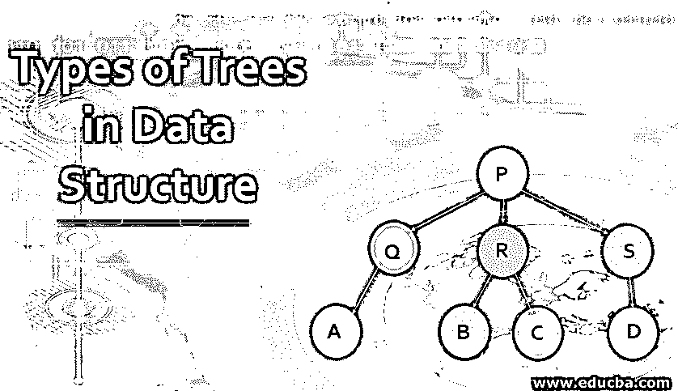
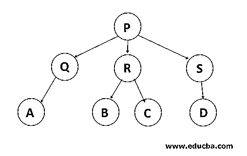
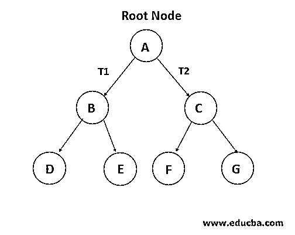
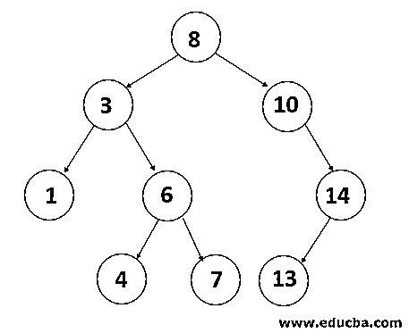
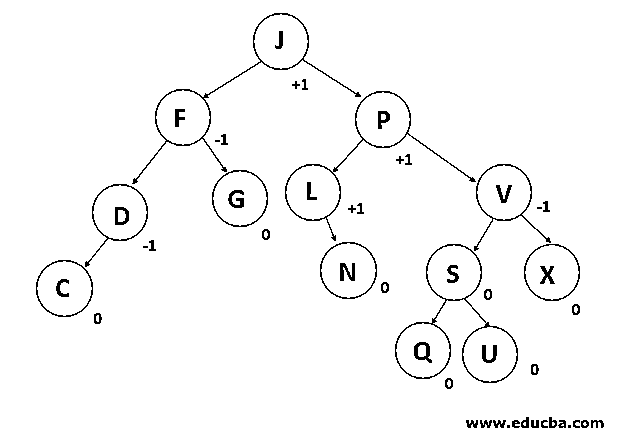
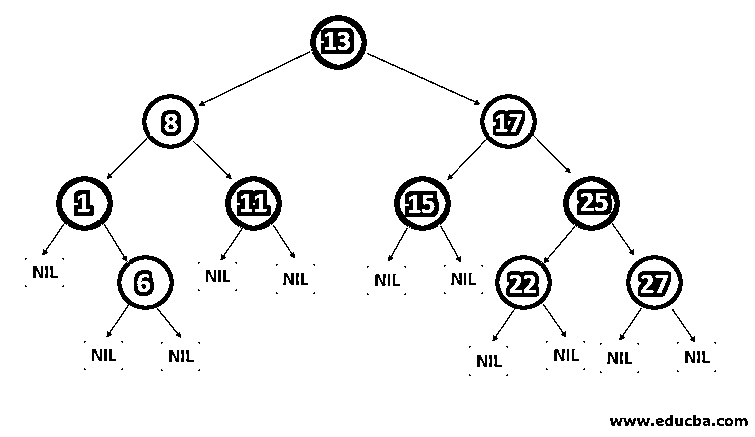

# 数据结构中的树类型

> 原文：<https://www.educba.com/types-of-trees-in-data-structure/>

## 数据结构中的树介绍

在了解数据结构中树的类型之前，首先我们来研究一下数据结构中的树。计算机领域中的树也被称为真实世界的树，然而真实世界和计算领域的树之间的区别在于，它被可视化为颠倒的，根在它的顶部，并且从根分支到树叶。在各种现实世界的应用程序中，树数据结构被用来展示具有父子层次结构的不同节点之间的关系。因此，它也被称为层次数据结构。它最受欢迎的是简化和加速搜索和排序。它被认为是最强大和最先进的数据结构之一。树是非线性数据结构的表示。可以使用不同的用户定义或原始类型的数据来显示树。我们可以使用数组、类、链表或其他类型的数据结构来实现树。它是一组相互关联的节点。节点被附加到边上来演示这种关系。

<small>Hadoop、数据科学、统计学&其他</small>

在上面给出的图中，P 是树的根，P 也是 Q、R 和 S 的父，Q 是 P 的子，因此 Q、R 和 S 是兄弟。同时，P 是 A、B、C、D 和 e 的祖父母。

### 什么是树？

树是一种分层数据结构，它自然地分层存储信息。树数据结构是最有效和最成熟的数据结构之一。表示由边连接的节点。

**树的属性:**每棵树都有特定的根节点。根节点可以跨越每个树节点。它被称为根，因为树是唯一的根。每个孩子只有一个父母，但是这个父母可以有很多孩子。

### 数据结构中的树类型

以下是数据结构中的树类型:

#### 1.通用树

如果在树的层次结构上没有设置约束，则该树称为一般树。在一般的树中，每个节点可以有无限数量的子节点。这棵树是所有其他树的超集。

#### 2.二叉树

二叉树是这样一种树，在这种树中，可以为每个父节点找到最多两个子节点。这些孩子被称为左孩子和右孩子。这比大多数其他树更受欢迎。当某些约束和特征被应用到二叉树中时，许多其他的如 AVL 树、BST(二叉查找树)、RBT 树等也被应用。也被使用。当我们向前推进时，我们将详细解释所有这些风格。

#### 3.二叉查找树

二叉查找树(BST)是一个二叉树扩展，有几个可选的限制。在 BST 中，节点的左子值应该小于或等于父值，右子值应该总是大于或等于父值。这个二叉查找树属性使它成为搜索操作的理想选择，因为我们可以在每个节点精确地确定值是在左子树还是右子树中。这就是搜索树被命名的原因。

#### 4.AVL 树

AVL 树是一个二叉查找树自平衡。以发明家阿德尔森-韦尔希和兰迪斯的名字命名 AVL。这是第一棵动态平衡的树。基于树是否平衡，为 AVL 树中的每个节点分配平衡因子。节点 kids 的高度最多为 1。AVL·万。在 AVL 树中，正确的平衡因子是 1、0 和-1。如果树有一个新的节点，它将被旋转以确保它是平衡的。然后它将被旋转。查看、插入和移除等常见操作在 AVL 树中花费 O(log n)时间。它主要应用于处理查找操作时。

#### 5.红黑树

另一种自动平衡树是红黑色的。根据红黑树的属性，红黑树的名字是因为红黑树的每个节点上都涂有红色或黑色。它维持着森林的平衡。即使这个树不是完全平衡的，搜索操作也只需要 O (log n)时间。当新节点被添加到红黑树中时，节点将被旋转以保持红黑树的属性。

#### 6\. N-ary Tree

这种带有节点的树的最大子节点数是 n。二叉树是两年树，每个二叉树节点最多有 2 个子节点。一棵完全的 N 元树是这样的树，其中一个节点的子节点不是 0 就是 N。

### 树的优点

现在我们将了解树的优势:

*   该树反映了数据结构连接。
*   树用于层次结构。
*   它提供了一个有效的搜索和插入过程。
*   这些树很灵活。这允许以最小的努力重新定位子树。

### 结论

在本文中，我们已经看到了什么是树结构，数据结构中不同类型的树，以及它的好处。我希望您对数据结构中的一些常见树有所了解。

### 推荐文章

这是关于数据结构中树的类型的指南。这里我们讨论数据结构中 6 种树的基本概念和优点。您也可以浏览我们的其他相关文章，了解更多信息——

1.  [数据结构 Java 面试题](https://www.educba.com/data-structure-java-interview-questions/)
2.  [什么是数据结构？](https://www.educba.com/what-is-data-structure/)
3.  [学习数据结构中最常见的 17 种图形类型](https://www.educba.com/types-of-graph-in-data-structure/)
4.  数据结构中的 B 树

