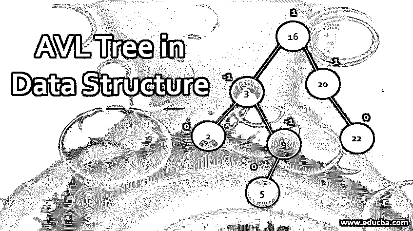
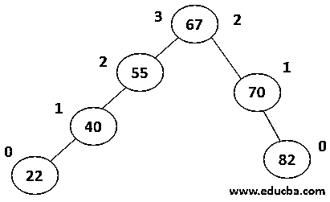
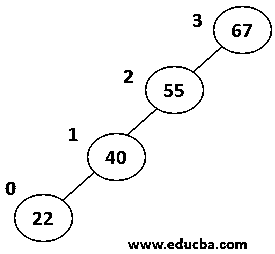
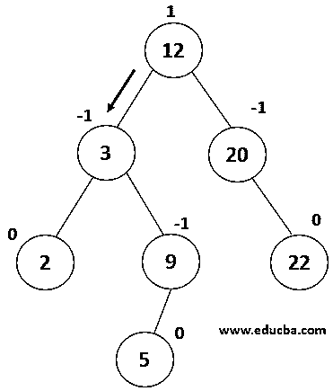
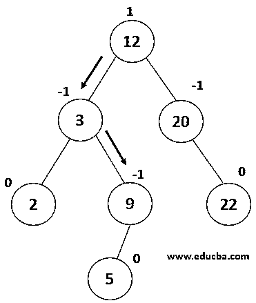
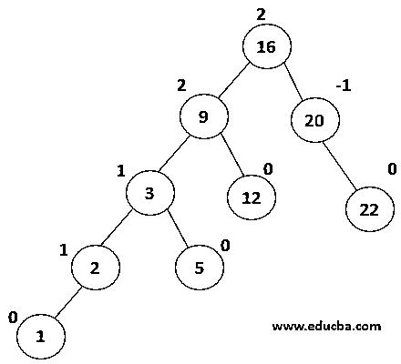
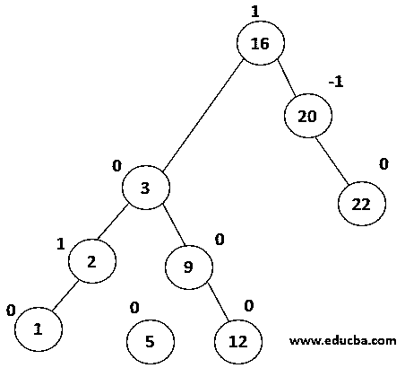
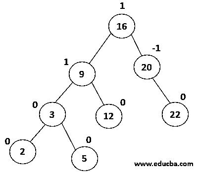
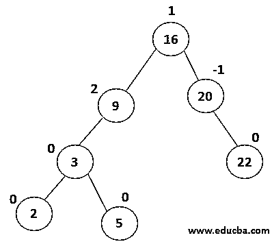
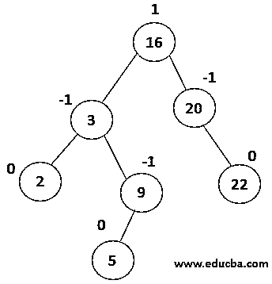

# 数据结构中的 AVL 树

> 原文：<https://www.educba.com/avl-tree-in-data-structure/>

## 数据结构中的 **AVL 树介绍**

AVL 树代表阿德尔森、维尔斯基和兰迪斯树，它可以被解释为二叉查找树数据结构的扩展。虽然它类似于二叉查找树，但有一个突出的区别是树的高度值应该< =1，与二叉查找树不同，AVL 在树的两边都有元素要平衡。表示平衡系数的公式是“平衡系数=高度(左-子树)-高度(右-子树)”。AVL 树结构是通过三种基本的数据结构操作实现的，即搜索、插入和删除。

**Balance Factor = height(left-subtree) − height(right-subtree)**

例如，考虑下面的树。

<small>Hadoop、数据科学、统计学&其他</small>

在上面的例子中，右子树的高度= 2，左子树的高度=3，因此 BF= 2，即< =1，因此树被认为是平衡的。

### 为什么我们在 DS 中需要一个 AVL 树？

在和二叉查找树一起工作时，我们遇到了一个场景，其中的元素是有序排列的。在这种情况下，所有数组元素都排列在根的一侧，这导致在数组中搜索元素的时间复杂度增加，复杂度变为- O(n)，即树的最坏情况复杂度。为了解决这些问题并减少搜索时间，阿德尔森、维尔斯基和兰迪斯发明了 AVL 树。

**举例:**

在上图中，左子树的高度= 3 为

右侧子树的高度= 0

因此平衡系数= 3-0 = 3。因此，在这样的树中搜索元素的复杂度为 O(n ),这类似于线性搜索的复杂度。为了避免复杂的搜索，引入了 AVL 树，其中树中的每个节点都需要维护

平衡系数< =1，否则将执行各种旋转技术来平衡这种树。

`Struct AVLNode
{
int data;
struct AVLNode *left, *right;
int ball factor;
};`

### 旋转类型

当树的平衡因子不满足< =1 的条件时，则需要对它们执行旋转以将其变成平衡树。

有 4 种类型的旋转:

**1。向左旋转:**如果在树的右边增加一个节点会使树不平衡，那么，在这种情况下，需要执行向左旋转。

**2。右旋转:**如果在树的左边增加一个节点会使节点不平衡，那么需要执行右旋转。换句话说，当左侧的节点数量增加时，就需要将元素移动到右侧来平衡它，这就是所谓的右旋转。

**3。左右旋转:**这种旋转是上面解释的 2 种旋转的组合。当一个元素被添加到左树的右子树时，就会发生这种类型的旋转。

在这种情况下，首先对子树执行向左旋转，然后对左树执行向右旋转。

**4。左右旋转:**这种类型的旋转也是由 2 个以上的旋转序列组成。当一个元素被添加到右边子树的左边，并且树变得不平衡时，需要这种类型的旋转。在这种情况下，我们首先在右边的子树上执行右旋转，然后在右边的树上执行左旋转。

### DS 中 AVL 树上的操作

可在 AVL 采油树上执行以下 3 种操作

#### 1.搜查

这个操作类似于在二叉查找树执行搜索。遵循的步骤如下:

*   读取用户提供的元素，比如 x。
*   比较根元素，如果相同，则退出，否则转到下一步。
*   如果 x

否则就去找合适的孩子再比较。

遵循过程 B 和 C，直到找到元素并退出。

这个过程具有 O(log n)复杂度。

**举例:**

| 

 | 考虑这棵树，我们需要搜索节点值 9。
First- let x=9，根值(12) > x 然后，值必须在根元素的左子树中。 |
| 

 | 现在将 x 与节点值 3
x > 3 进行比较，因此我们必须向右边的子树前进。 |
| 

 | 现在将 x 与节点(9)进行比较，其中 9 == 9 返回 true。因此，元素搜索在树中完成。 |

#### 2.插入

在 AVL 树中插入元素时，我们需要找到需要插入的特定元素的位置。然后，该元素与 BST 中的插入一样被附加，但是在此之后，检查树是否仍然是平衡的，即节点的平衡因子< =1。并且根据需要执行特定的旋转。

复杂度为 O(log n)。
**举例:**考虑下面这棵树，

| 

 | 每个节点都有一个平衡因子 0，-1 或 1，因此树是平衡的。现在让我们看看插入值为 1 的节点时会发生什么。
遍历第一棵树，找到需要插入的位置……
1<2 因此被写成节点(2)的左子节点。 |
| 

 | 插入后，节点(9)变得不平衡，平衡系数= 2。现在它正经历右旋。 |
| 

 | 树向右旋转后变得平衡，从而成功完成插入操作。 |

#### 3.删除

删除 AVL 树中的元素还包括搜索树中的元素，然后删除它。搜索操作与 BST 相同，在找到要删除的元素后，从树中删除元素，并调整元素使其再次成为 BST。在检查这些元素的平衡系数为 0、-1 或 1 之后，执行适当的旋转以使其平衡。

复杂度为 O(log n)。

| 

 | 考虑给定的树，它们的平衡因子都是 0，-1 或 1。现在让我们删除一个值为 16 的节点。
遍历第一棵树，找到值为 16 的节点，与搜索算法相同。 |
| 

 | 节点 16 将被替换为该节点的前一级节点，它是左子树中最大的元素，即 12
树变得不平衡，因此需要执行 LL-旋转。 |
| 

 | 现在每个节点都变得平衡了。 |

### 结论–数据结构中的 AVL 树

AVL 树是二叉查找树的后代，但是如果元素被排序，它克服了增加复杂性的缺点。它监控树的平衡因子为 0 或 1 或-1。如果采油树变得不平衡，则执行相应的旋转技术来平衡采油树。

### 推荐文章

这是一个数据结构中 AVL 树的指南。在这里，我们讨论了介绍，操作的 AVL 树在 DS 和类型的旋转。您也可以浏览我们的其他相关文章，了解更多信息——

1.  [jQuery 元素](https://www.educba.com/jquery-elements/)
2.  [什么是数据科学](https://www.educba.com/what-is-data-science/)
3.  [数据结构中树的类型](https://www.educba.com/types-of-trees-in-data-structure/)
4.  [C#数据类型](https://www.educba.com/c-sharp-data-types/)
5.  [什么是数据结构？|类型和示例](https://www.educba.com/what-is-data-structure/)
6.  [数据结构中前 17 种图形类型](https://www.educba.com/types-of-graph-in-data-structure/)
7.  [学习数据结构中的队列](https://www.educba.com/queue-in-data-structure/)

