# DFS 算法

> 原文：<https://www.educba.com/dfs-algorithm/>

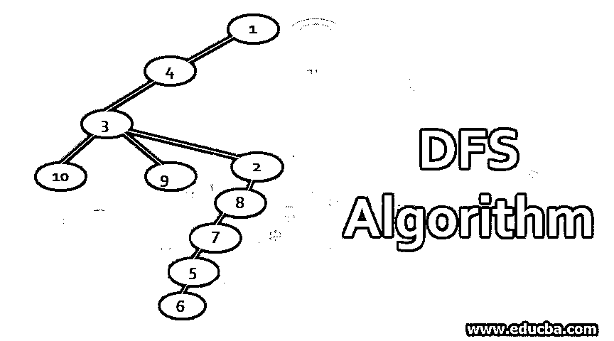

## DFS 算法简介

DFS 被称为深度优先搜索算法，它提供了遍历图的每个节点而不重复任何节点的步骤。该算法与树的深度优先遍历相同，但不同之处在于维护一个布尔值来检查节点是否已经被访问过。这对于图的遍历很重要，因为图中也存在循环。在该算法中维护一个堆栈来存储遍历时挂起的节点。这样命名是因为我们首先行进到每个相邻节点的深度，然后继续遍历另一个相邻节点。

### 解释 DFS 算法

该算法与 [BFS 算法](https://www.educba.com/bfs-algorithm/)相反，在该算法中，所有相邻节点都被相邻节点的邻居访问。它从一个节点开始探索图形，并在回溯之前探索其深度。该算法考虑了两件事:

<small>Hadoop、数据科学、统计学&其他</small>

*   **访问顶点:**选择要遍历的图的顶点或节点。
*   **探索一个顶点:**遍历与该顶点相邻的所有节点。

**深度优先搜索的伪码**:

`proc DFS_implement(G,v):
let St be a stack
St.push(v)
while St has elements
v = St.pop()
if v is not labeled as visited:
label v as visited
for all edge v to w in G.adjacentEdges(v) do
St.push(w)`

DFS 也存在线性遍历，可以通过 3 种方式实现:

*   预购
*   整齐
*   邮件订单

逆序是一种非常有用的遍历方式，用于拓扑排序和各种分析。还维护一个堆栈来存储其探索仍未完成的节点。

### DFS 中的图形遍历

在 DFS 中，按照以下步骤遍历图形。例如，给定一个图，让我们从 1:

| **堆栈** | **遍历顺序** | **生成树** |
|  | One | 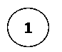

 |
| 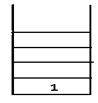

 | 1,4 | 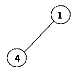

 |
| 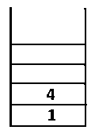

 | 1,4,3 | 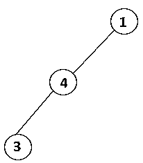

 |
| 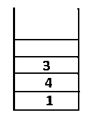

 | 1,4,3,10 | 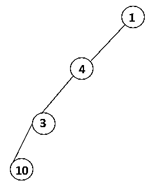

 |
| 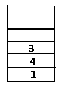

 | 1,4,3,10,9 | 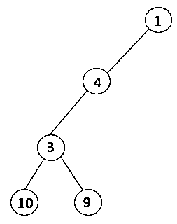

 |
| 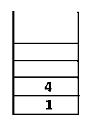

 | 1,4,3,10,9,2 | 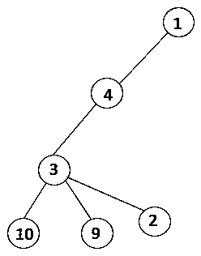

 |
| 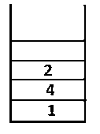

 | 1,4,3,10,9,2,8 | 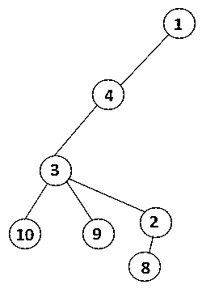

 |
| 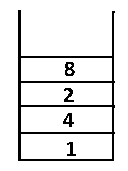

 | 1,4,3,10,9,2,8,7 | 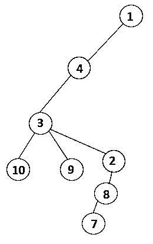

 |
| 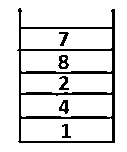

 | 1,4,3,10,9,2,8,7,5 | 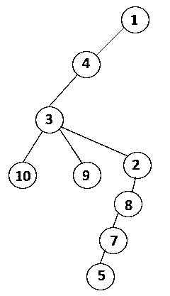

 |
| 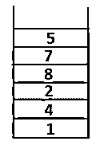

 | 1,4,3,10,9,2,8,7,5,6 | 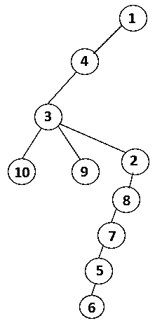

 |
| 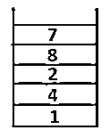

 | 1,4,3,10,9,2,8,7,5,6 | 

 |
| 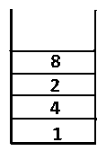

 | 1,4,3,10,9,2,8,7,5,6 | 

 |
| 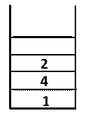

 | 1,4,3,10,9,2,8,7,5,6 | 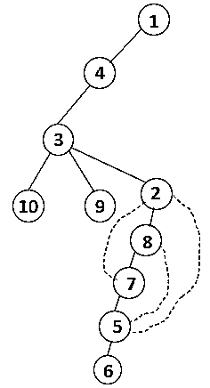

 |
| 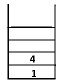

 | 1,4,3,10,9,2,8,7,5,6 | 

 |
| 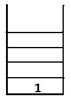

 | 1,4,3,10,9,2,8,7,5,6 | 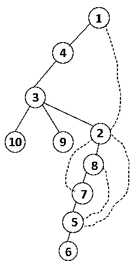

 |
| 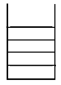

 | 1,4,3,10,9,2,8,7,5,6 | 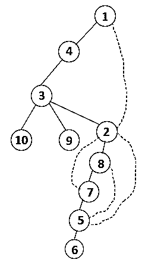

 |

### DFS 算法的解释

下面是 DFS 算法的步骤和优缺点:

**步骤 1:** 访问节点 1 并将其添加到序列和生成树中。

**步骤 2:** 探索 1 的相邻节点，即 4，因此 1 被推入堆栈，4 被推入序列和生成树。

**步骤 3:** 探索 4 的相邻节点之一，从而将 4 推入堆栈，3 进入序列和生成树。

**步骤 4:** 通过将 3 的相邻节点推到堆栈上来探索它，10 进入序列。由于没有与 10 相邻的节点，因此 3 被弹出堆栈。

**Step5:** 探索 3 的另一个相邻节点，将 3 推送到堆栈上，并访问 9。没有 9 的相邻节点，因此弹出 3，并且访问 3 的最后一个相邻节点，即 2。

对所有节点进行类似的处理，直到堆栈变空，这表示遍历算法的停止条件。—-->生成树中的虚线指的是图中出现的后边缘。

以这种方式，遍历图中的所有节点，而不重复任何节点。

#### 优点和缺点

*   **优点:**该算法的内存需求非常少。空间和时间复杂度低于 BFS。
*   **缺点:**解决方案不能保证应用。拓扑排序。寻找图的桥。

### 实现 DFS 算法的示例

下面是实现 DFS 算法的示例:

**代码:**

`import java.util.Stack;
public class DepthFirstSearch {
static void depthFirstSearch(int[][] matrix, int source){
boolean[] visited = new boolean [matrix.length];
visited[source-1] = true;
Stack<Integer> stack = new Stack<>();
stack.push(source);
int i,x;
System.out.println("Depth of first order is");
System.out.println(source);
while(!stack.isEmpty()){
x= stack.pop();
for(i=0;i<matrix.length;i++){
if(matrix[x-1][i] == 1 && visited[i] == false){
stack.push(x);
visited[i]=true;
System.out.println(i+1);
x=i+1;
i=-1;
}
}
}
}
public static void main(String[] args){
int vertices=5;
int[][] mymatrix = new int[vertices][vertices];
for(int i=0;i<vertices;i++){
for(int j=0;j<vertices;j++){
mymatrix[i][j]= i+j;
}
}
depthFirstSearch(mymatrix,5);
}
}`

**输出:**

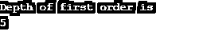

**上面程序的解释:**我们做了一个有 5 个顶点(0，1，2，3，4)的图，用一个访问过的数组来跟踪所有访问过的顶点。然后，对于存在相邻节点的每个节点，重复相同的算法，直到所有节点都被访问。然后算法返回调用 vertex 并从堆栈中弹出它。

### 结论

与 BFS 相比，此图的内存需求较少，因为只需要维护一个堆栈。结果生成了 DFS 生成树和遍历序列，但它不是恒定的。根据所选择的起始顶点和探索顶点，多个遍历序列是可能的。

### 推荐文章

这是一个 DFS 算法的指南。在这里我们讨论一步一步的解释，遍历图表的表格格式的优点和缺点。您也可以浏览我们的其他相关文章，了解更多信息——

1.  什么是 HDFS？
2.  [深度学习算法](https://www.educba.com/deep-learning-algorithms/)
3.  [HDFS 命令](https://www.educba.com/hdfs-commands/)
4.  [SHA 算法](https://www.educba.com/sha-algorithm/)

