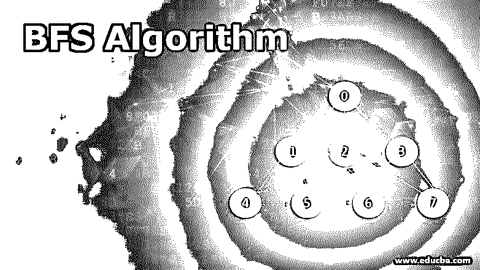
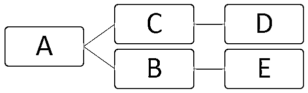
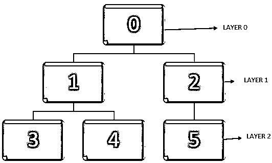
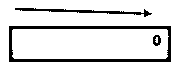
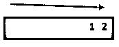
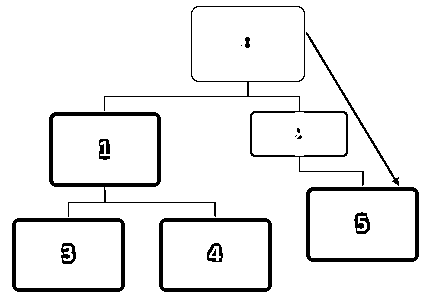
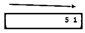
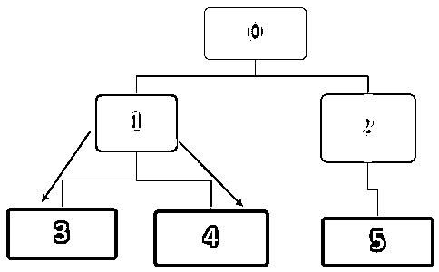
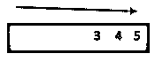

# BFS 算法

> 原文：<https://www.educba.com/bfs-algorithm/>

## BFS 算法简介

遍历图的 BFS 算法，称为(呼吸优先搜索)。这种算法有助于到达特定的节点或通过数据结构的顶点路由。BFS 算法水平地用于特定层，然后移动到下一层。该算法的主要任务是在遍历时找到图中的最短路径。在图包含循环结构的情况下，一旦遍历完成，最好添加一个布尔数组来标记节点。通过基于队列的应用程序和其他相关数据结构，BFS 算法有几种实现方式。

图中的节点也可以指数量有限的顶点，而边是任意两个节点之间的连接线。

<small>Hadoop、数据科学、统计学&其他</small>

在上图中，顶点可以表示为 V = {A，B，C，D，E}，边可以定义为

E = {AB，AC，CD，BE}

### 什么是 BFS 算法？

通常有两种算法用于图的遍历。它们是 BFS(广度优先搜索)和 DFS(深度优先搜索)算法。图的遍历是按照明确定义的顺序，对每个顶点或节点和边只访问一次。跟踪已经访问过的顶点也很重要，这样同一个顶点就不会被遍历两次。在呼吸优先搜索算法中，遍历从选择的节点或源节点开始，并且遍历继续通过直接连接到源节点的节点。更简单地说，在 BFS 算法中，在移动到下一层之后，应该首先水平移动并遍历当前层。

### BFS 算法是如何工作的？

让我们以下图为例。

当前的重要任务是在遍历节点时找到图中的最短路径。当我们遍历一个图时，顶点从未被发现的状态到被发现的状态，最后变得完全被发现。需要注意的是，在遍历一个图的时候有可能在某个点卡住，一个节点可以被访问两次。因此，我们可以在节点从未被发现的状态变为完全被发现后，采用标记节点的方法。

在下图中，我们可以看到，当节点完全被发现时，可以在图中用黑色标记它们。我们可以从源节点开始，随着遍历每个节点，可以将它们标记为待识别。

遍历从一个顶点开始，然后行进到向外的边。当一条边到达一个未发现的顶点时，它被标记为已发现。但是当一条边到了一个完全发现或者发现的顶点，就被忽略了。

对于有向图，每个边被访问一次，而对于无向图，它被访问两次，即在访问每个节点时访问一次。[要使用的算法](https://www.educba.com/what-is-an-algorithm/)是根据如何存储发现的顶点来决定的。在 BFS 算法中，使用队列，首先发现最老的顶点，然后通过起始顶点层传播。

### 为 BFS 算法执行步骤

对于 BFS 算法，执行以下步骤。

*   在给定的图中，让我们从一个顶点开始，即在上面的图中，它是节点 0。该顶点所在的级别可以表示为层 0。
*   下一步是找到与起始顶点相邻的所有其他顶点，即节点 0 或可从其直接访问的顶点。然后，我们可以将这些相邻的顶点标记为出现在第 1 层。
*   由于图中有一个环，所以有可能到达同一个顶点。因此，我们应该只旅行到那些应该出现在同一层的顶点。
*   接下来，标记当前顶点的父顶点。对第 1 层的所有顶点执行相同的操作。
*   下一步是找到所有那些离第一层所有顶点都有一条边的顶点。这组新的顶点将位于第 2 层。
*   重复上述过程，直到遍历完所有节点。

### 例子

让我们以下图为例，了解 BFS 算法是如何工作的。通常，在 BFS 算法中，队列用于在遍历节点时对节点进行排队。

**T2】**

 **在上图中，首先，要访问节点 0，并且该节点排队到下面的队列中:

在访问节点 0 之后，相邻节点 0、1 和 2 排队。队列可以表示如下:

那么将访问队列中的第一个节点，即 2。访问节点 2 后，队列可以表示如下:

在访问节点 2 之后，5 将排队，并且由于节点 5 没有未被访问的相邻节点，尽管 5 已经排队，但它将不会被访问两次。

接下来，队列中的第一个节点是 1，它将被访问。相邻节点 3 和 4 排队。队列表示如下。

接下来，队列中的第一个节点是 5，对于这个节点，没有更多未被访问的相邻节点。对于节点 3 和 4 也是如此，对于它们也不再有未被访问的相邻节点。

所以所有的节点都被遍历，最后，队列变成空的。

### 结论

广度搜索算法有一些很大的优点值得推荐。BFS 算法的众多应用之一是计算最短路径。它还用于网络中查找相邻节点，可以在社交网站、网络广播和垃圾收集中找到。用户需要理解需求和数据模式，以便使用它来获得更好的性能。

### 推荐文章

这是 BFS 算法的指南。在这里，我们讨论的基本概念，工作，随着步骤和例子的性能在 BFS 算法。您也可以浏览我们推荐的其他文章，了解更多信息——

1.  [什么是贪婪算法？](https://www.educba.com/what-is-a-greedy-algorithm/)
2.  [数字签名算法](https://www.educba.com/digital-signature-algorithm/)
3.  [什么是 Java Hibernate？](https://www.educba.com/what-is-java-hibernate/)
4.  [数字签名加密](https://www.educba.com/digital-signature-cryptography/)

**