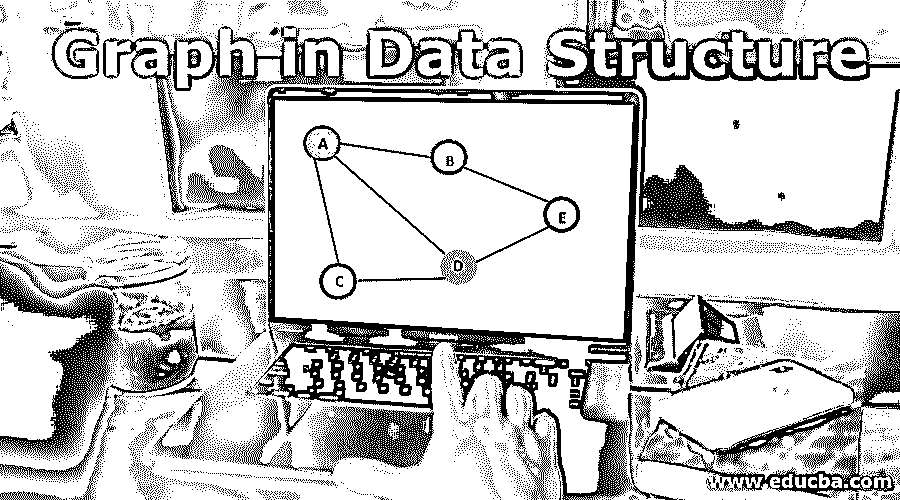
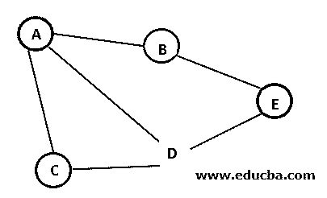
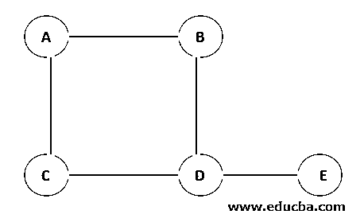
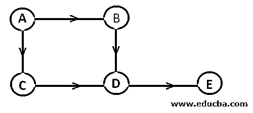
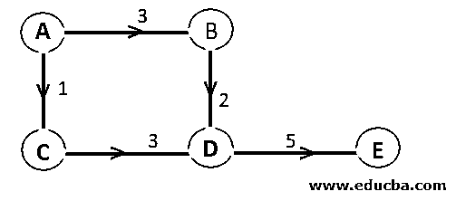
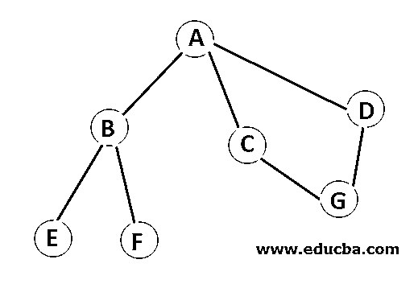
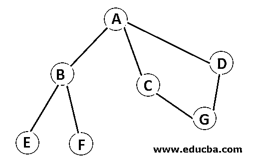

# 数据结构中的图形

> 原文：<https://www.educba.com/graph-in-data-structure/>

## 数据结构中的图形介绍

图是由有限的节点和边组成的非线性数据结构。节点是元素，边是节点之间有序的连接对。

注意非线性这个词。非线性数据结构中的元素不是按顺序排列的。例如，数组是线性数据结构，因为它是一个接一个排列的。您可以在一次运行中遍历数组的所有元素。非线性数据结构不是这种情况。非线性数据结构的元素排列在多个层次上，通常遵循分层模式。图形是非线性的。

<small>Hadoop、数据科学、统计学&其他</small>

下一个要注意的词是有限的。我们将图定义为具有有限且可计数的节点数。这是一个相当令人不愉快的术语。本质上，一个图可以有无限个节点，但仍然是有限的。例如，追溯到亚当和夏娃的家谱。这是一个相对无限的图，但仍然是可数的，因此被认为是有限的。

**现实世界的例子**

现实世界中图形的最好例子是脸书。脸书上的每个人都是一个节点，通过边连接在一起。因此，a 是 B 的朋友，B 是 C 的朋友，依此类推。

### 术语

以下是数据结构中的图形术语

**1。图的表示:**一般来说，一个图表示为一对集合(V，E)。v 是顶点或节点的集合。e 是边的集合。在上面的例子中，
V = { A，B，C，D，E }
E = { AB，AC，AD，BE，CD，DE }

**2。节点或顶点:**图的元素通过边连接。

**3。**边:图中两个顶点之间的路径或线。

**4。相邻节点:**两个节点如果通过一条边相连，称为相邻。在上面的示例中，节点 A 与节点 B、C 和 D 相邻，但不与节点 e 相邻。

**5。路径:**路径是两个节点之间的边的序列。它本质上是一个从一个节点开始到另一个节点结束的遍历。因此，在上面的例子中，从节点 A 到节点 e 有多条路径。

Path(A，E) = { AB，BE }
或
Path(A，E) = { AC，CD，DE }
或
Path(A，E) = { AD，DE }

**6。无向图:**无向图是指边不指定特定方向的图。边缘是双向的。

**例子**

因此，在这个例子中，边 AC 可以从 A 到 C 和从 C 到 A 遍历。类似于所有的边缘。从节点 B 到节点 C 的路径可能是{ BA，AC }或{ BD，DC }。

7 .**。有向图:**有向图是这样一种图，它的边只能在一个特定的方向上遍历。

**例子**

因此，在同一个例子中，现在边是有方向的。您只能沿其方向遍历边。现在没有从节点 B 到节点 C 的路径。

**8。加权图:**加权图是边与权重相关联的图。这通常是穿过边的成本。

**例子**

因此，在同一个示例中，现在边具有与其相关联的特定权重。在节点 A 到节点 E 之间有两条可能的路径。
Path1 = { AB，BD，DE }，Weight1 = 3+2+5 = 10
Path2 = { AC，CD，DE }，Weight2 = 1+3+5 = 9
显然，如果目标是以最小的成本从节点 A 到达节点 E，人们会更喜欢 Path2。

### 图形的基本操作

下面是图形提及的基本操作

#### 1.添加/移除顶点

这是图中最简单的操作。你只需在图上添加一个顶点。它不需要通过边连接到任何其他顶点。但是，在删除折点时，必须删除从已删除折点开始并在该折点处结束的所有边。

#### 2.添加/移除边缘

该操作在两个顶点之间添加或移除一条边。当从一个顶点开始并结束于该顶点的所有边都被删除时，该顶点就变成孤立的。

#### 3.广度优先搜索(BFS)

这是图中的遍历操作。BFS 水平地穿过图表。这意味着它在前进到下一个级别之前遍历单个级别的所有节点。
BFS 算法从图中第一个节点的顶部开始，然后遍历与其相邻的所有节点。一旦遍历了所有的相邻节点，该算法对子节点重复相同的过程。

**例子**

以 BFS 方式遍历上图的结果是 A -> B -> C -> D -> E -> F -> G。该算法从节点 A 开始，遍历其所有相邻节点 B、C 和 D。它将所有四个节点标记为已访问。一旦遍历了 A 的所有相邻节点，算法就移动到 A 的第一个相邻节点，并重复相同的过程。在这种情况下，节点是 B，到 B 的相邻节点是 E 和 f，接下来，遍历到 C 的相邻节点。一旦访问了所有节点，操作就结束了。

#### 4.深度优先搜索

深度优先搜索或 DFS 垂直遍历图形。它从图的根节点或第一个节点开始，在移动到相邻节点之前遍历所有子节点。

**例子**

以 BFS 方式遍历上图的结果是 A -> B -> E -> F -> C -> G -> D。该算法从节点 A 开始，遍历其所有子节点。一遇到 B，似乎就有了更进一步的子节点。因此，B 的子节点在前进到 a 的下一个子节点之前被遍历。

### 图的真实实现

*   电力传输电路设计。
*   互联计算机网络的设计。
*   对任何物质(如人类 DNA)的分子、化学和细胞结构的研究。
*   城市之间和城市内部的交通路线设计。

### 结论——数据结构中的图形

图是数据结构中一个有益的概念。它在几乎每个领域都有实际的实现。因此，了解图论的基础知识对于理解图结构的算法是必不可少的。这篇文章仅仅是对图表的介绍。它只是一块垫脚石。建议进一步深入图论的话题。

### 推荐文章

这是数据结构中的图形指南。这里我们讨论数据结构中图形的术语和基本操作。您也可以阅读以下文章，了解更多信息——

1.  [数据结构面试试题](https://www.educba.com/data-structure-interview-questions/)
2.  什么是数据集市？
3.  [什么是数据结构？|主要用途和类型](https://www.educba.com/what-is-data-structure/)
4.  [数据结构中前 17 种图形](https://www.educba.com/types-of-graph-in-data-structure/) 
5.  [数据结构队列指南](https://www.educba.com/queue-in-data-structure/)
6.  [数据结构搜索完整指南](https://www.educba.com/searching-in-data-structure/)
7.  [两种最通用的图形表示方式](https://www.educba.com/graph-representation/)

