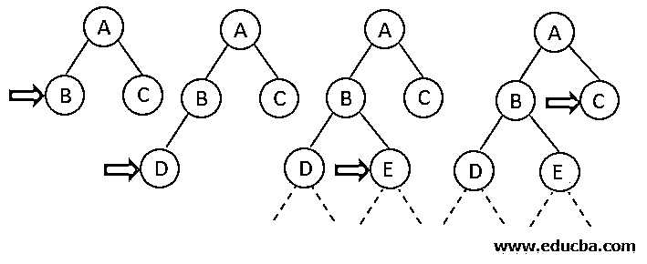
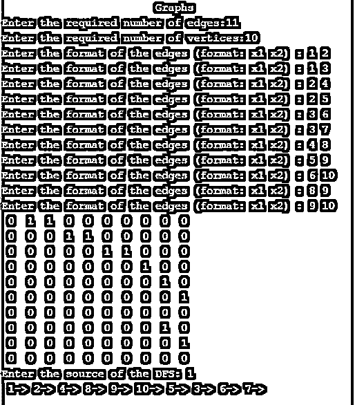

# 深度受限搜索

> 原文：<https://www.educba.com/depth-limited-search/>

## 深度受限搜索简介

深度受限搜索是一种新的搜索算法。无界树问题恰好出现在深度优先搜索算法中，它可以通过对搜索域的深度施加边界或限制来解决。我们将这种限制称为深度限制，使得 DFS 搜索策略更加精炼，并组织成一个有限循环。我们用 *l，*来表示这个限制，因此这提供了对在 DFS 算法中较早出现的无限路径问题的解决方案。因此，深度受限搜索可以被称为 DFS 算法的扩展和改进版本。简而言之，我们可以说，为了避免执行代码时的无限循环状态，深度受限搜索算法被执行到一个称为深度限制的有限深度集。

### 算法

该算法基本上遵循与 DFS 算法类似的一组步骤。

<small>Hadoop、数据科学、统计学&其他</small>

1.  开始节点或节点 1 被添加到堆栈的开头。
2.  然后它被标记为已访问，如果节点 1 不是搜索中的目标节点，那么我们将第二个节点 2 推到堆栈的顶部。
3.  接下来，我们将其标记为已访问，并检查节点 2 是否是目标节点。
4.  如果没有发现节点 2 是目标节点，那么我们将节点 4 推到栈顶。
5.  现在，我们在相同的深度限制内搜索，并沿深度方向移动以检查目标节点。
6.  如果也没有发现节点 4 是目标节点，并且发现达到了深度限制，则我们回溯到保持未访问或未探索的最近节点。
7.  然后，我们将它们放入堆栈，并标记为已访问。
8.  我们继续以迭代的方式执行这些步骤，除非到达目标节点，或者直到深度限制内的所有节点都已经为目标进行了探索。

当我们将上述步骤与 DFS 进行比较时，我们会发现 DLS 也可以使用队列数据结构来实现。此外，还需要计算节点的每一层，以检查目标节点从源节点到目标节点的有限性和可及性。

深度受限搜索被发现在这两个条款下终止:

1.  当发现目标节点存在时。
2.  当在给定的深度限制域内没有解时。

### DLS 过程的例子

如果我们将深度限制固定为 2，则可以类似于 DFS 来执行 DLS，直到发现目标节点存在于树的搜索域中。

#### 示例的算法

1.  我们从找到并固定一个开始节点开始。
2.  然后我们使用 DFS 算法沿着深度方向搜索。
3.  然后我们继续检查当前节点是否是目标节点。

如果答案是否定的，那么我们什么也不做。

如果答案是肯定的:那么我们返回。

1.  现在，我们将检查当前节点是否位于先前指定的深度限制之下。

如果答案是否定的，那么我们什么也不做。

**如果答案是肯定的，我们**将进一步探索该节点，并将它的所有后继节点保存到堆栈中。

1.  现在，我们对堆栈的所有节点迭代或递归调用 DLS 函数，并返回到步骤 2。

因此，我们已经成功地探索了给定深度限制中的所有节点，并找到了目标节点(如果它存在于指定的深度限制内)。

#### c 程序

**代码:**

`#include <stdio.h>
#include <stdlib.h>
/*ADJACENCY MATRIX*/
int source,X,Y,time,visited[20],Z[20][20];
void DFS(int p)
{
int q;
visited[p]=1;
printf(" %d->",p+1);
for(q=0;q<X;q++)
{
if(Z[p][q]==1&&visited[q]==0)
DFS(q);
}
}
int main()
{
int p,q,x1,x2;
printf("\t\t\tGraphs\n");
printf("Enter the required number of edges:");
scanf("%d",&Y);
printf("Enter the required number of vertices:");
scanf("%d",&X);
for(p=0;p<X;p++)
{
for(q=0;q<X;q++)
Z[p][q]=0;
}
/*creating edges : */
for(p=0;p<Y;p++)
{
printf("Enter the format of the edges (format: x1 x2) : ");
scanf("%d%d",&x1,&x2);
Z[x1-1][x2-1]=1;
}
for(p=0;p<X;p++)
{
for(q=0;q<X;q++)
printf(" %d ",Z[p][q]);
printf("\n");
}
printf("Enter the source of the DFS: ");
scanf("%d",&source);
DFS(source-1);
return 0;
}`

**输出:**

### 深度受限搜索的优点和缺点

下面是优点和缺点:

#### 深度受限搜索的优势

*   深度受限搜索优于 DFS，并且需要更少的时间和内存空间。
*   DFS 保证，如果无限期存在，将会找到解。
*   DLS 在图论中的应用与 DFS 特别相似。
*   为了克服 DFS 的缺点，我们增加了深度限制，并且我们的搜索策略沿着搜索树递归执行。

#### 深度受限搜索的缺点

*   深度限制对于该算法的执行是强制性的。
*   目标节点可能不存在于先前设置的深度限制中，这将促使用户进一步迭代，从而增加执行时间。
*   如果目标节点不在所需的限制范围内，将找不到它。

### 绩效指标

*   **完备性:**除了目标节点是最浅节点，且超出深度限制，即 l < d 的情况，DLS 一般是完备算法，在这种情况下，我们永远达不到目标节点。
*   **最优:**DLS 不是最优算法，因为选择的深度可以大于 d (l > d)。因此，如果 l>d，DLS 不是最优的
*   **时间复杂度表示为**:类似于 DFS，即 *O* (b l )，其中 1 为设定的深度限制。
*   **空间复杂度表示为:**类似于 DFS *e. O* (b l )，其中 1 为指定深度限制。

### 结论–深度有限的搜索

当我们知道搜索域时，使用 DLS 算法，并且存在问题及其域的先验知识，而这不是无信息搜索策略的情况。通常，我们对目标节点的深度知之甚少，除非之前有人试图解决它并找到了解决方案。

### 推荐文章

这是一个深度有限搜索的指南。这里我们讨论深度受限搜索过程的例子和算法，优点和缺点。您也可以看看以下文章，了解更多信息–

1.  [DFS 算法](https://www.educba.com/dfs-algorithm/)
2.  [HDFS 建筑](https://www.educba.com/hdfs-architecture/)
3.  [HDFS 命令](https://www.educba.com/hdfs-commands/)
4.  [人工智能中的搜索算法](https://www.educba.com/search-algorithms-in-ai/)

