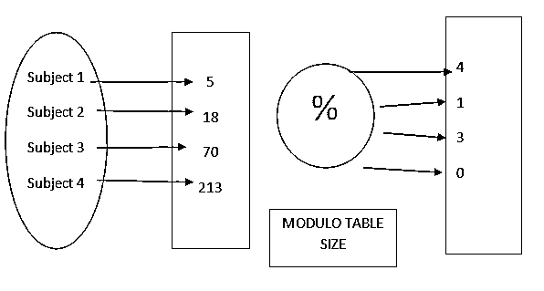
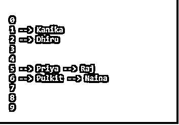

# 数据结构中的散列法

> 原文：<https://www.educba.com/hashing-in-data-structure/>

## 数据结构中散列的定义

哈希是借助哈希函数将大量信息映射到较小表格的过程。哈希算法也称为哈希算法或消息摘要函数。这是一个将关键质量范围转换为数组记录范围的过程。

哈希允许在更短的时间内刷新和恢复任何信息部分。稳定时间意味着活动不依赖于信息的大小。哈希与数据库一起使用，可以更快地恢复数据。它用于高级签名和数字签名的加密和解密。

<small>Hadoop、数据科学、统计学&其他</small>

### 哈希在数据结构中是如何工作的？

固定过程将密钥转换为哈希密钥，称为哈希函数。该函数获取一个密钥，并将其引导到一个特定长度的估计值，该值称为哈希值或哈希值。这个哈希值是真正的字符串，但它通常比原始值稍小。它移动计算机化的或数字的签名，然后，散列值和签名都被发送给受益人。接收方利用类似的散列容量来产生散列值，然后将其与消息进行对比。如果散列值相同，则消息被无误地传输。

哈希分两个阶段执行:

利用散列函数将元素转换成整数。这个元素可以用作存储实际元素的列表，它属于哈希表。该元素被存储在散列表中，在散列表中，它倾向于利用散列关键字被立即恢复。

**哈希=哈希函数(键)**

**索引=散列%数组大小**

在这种策略中，散列与数组大小无关，然后通过使用模运算符(%)将其缩减为一个列表或索引(0 和数组大小 1 之间的一个数字)。

### 哈希算法:哈希算法的核心？

正如我们所讨论的，哈希工作是哈希算法的核心。哈希值是在数据被划分到不同的块后计算的。这是因为散列函数以固定长度接收信息。这些方块被称为“数据块”下面的图片展示了这一点。

数据块大小的选择取决于需要应用该算法的场景。例如，SHA-1 以 512 位的块接收消息/信息。这样，如果消息的长度实际上是 512 位，哈希工作只运行一次(如果出现 SHA-1，则运行 80 轮)。

尽管如此，99%的情况下，信息不会出现在 512 位的产品中。对于这种情况(实际上是所有情况)，使用称为填充的程序。通过这种填充策略，整个消息被隔离成固定大小的信息方块或数据块。

根据雪崩效应，依次处理每个块。数据块的输出作为输入传递给下一个块。随后，将第二个数据块作为输入提供给随后的。这样，我们就使最后的产量成为相当数量的块数的综合产量。如果您对消息中的任何地方稍作改动，整个哈希值都会改变。

各种可用的哈希算法有:

*   消息摘要(MD)算法
*   安全哈希算法(SHA)
*   竞争完整性原语评估消息摘要(RIPEMD)
*   漩涡
*   南非共和国(Republic of South Africa)

### 散列的例子

哈希函数

从主题到整数

考虑上面的例子，我们将使用散列法根据员工 id 作为键来映射不同块分区中的不同员工。

利用散列函数存储对象的过程。

做一个大小为 S 的数组。选择一个函数 h，这些从主题映射到从 0 到 1 减去数组大小 s 的数字。现在标记数组中的这些文章，用函数 index = h(主题)计算索引。这种簇阵列被称为散列表或哈希表。

### 我们应该如何选择一个散列函数？

必须明智地选择哈希函数，以避免在向哈希表中的元素分配不同的块时发生冲突。

这种函数的一个例子是–p(k)= floor(n * k/r)

其中 n，r 可以是任意随机数，k 是函数 p 的密钥。

**举例:**

`def display_employee(data):
for i in range(len(data)):
print(i, end = " ")
for j in data[i]:
print("-->", end = " ")
print(j, end = " ")
print()
empTable = [[] for _ in range(10)] def methHashing(key):
return key % len(empTable)
# Insert Function to add
# values to the hash table
def insert(empTable, key, num):
myHashKey = methHashing(key)
empTable[myHashKey].append(num)
# Driver Code
insert(empTable, 125, 'Priya')
insert(empTable, 145, 'Raj')
insert(empTable, 101, 'Kanika')
insert(empTable, 102, 'Dhiru')
insert(empTable, 156, 'Pulkit')
insert(empTable, 136, 'Naina')
display_employee(empTable)`

**输出:**

### 结论–数据结构中的散列

全面考虑是一种有用的方法，可以检查两个资源之间的信息是否准确复制。同样，它可以在不打开和对比信息的情况下检查信息是否不可区分。您基本上使用哈希来恢复数据库中的内容，因为使用短哈希键比使用原始值更快地发现内容。

散列法保证消息在传输过程中不被更改，因此在信息安全框架中起着至关重要的作用。它还用于利用哈希码对高级标记和数字签名进行编码和解码。同样，您也可以通过对算法进行编码并将阵列用于节点存储，从数据货币化中获得巨大收益。

### 推荐文章

这是数据结构中的散列法指南。在这里，我们还将讨论散列的定义以及它在数据结构中是如何工作的？以及我们应该如何选择一个散列函数？.您也可以看看以下文章，了解更多信息–

1.  [数据库管理系统中的静态哈希](https://www.educba.com/static-hashing-in-dbms/)
2.  [PHP 中的哈希函数](https://www.educba.com/hashing-function-in-php/)
3.  [C 语言中的散列函数](https://www.educba.com/hashing-function-in-c/)
4.  [MySQL 分区](https://www.educba.com/mysql-partition/)

