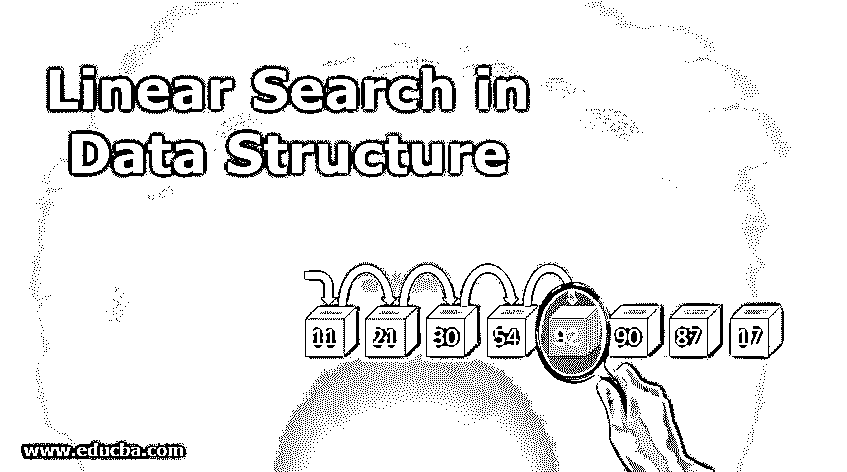
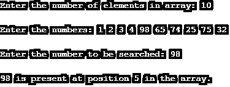
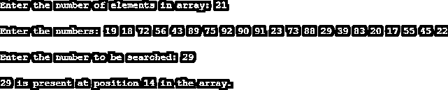
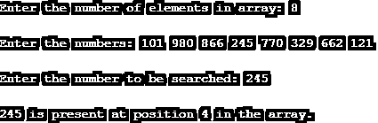
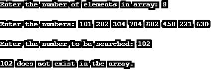
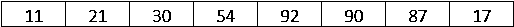
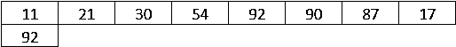
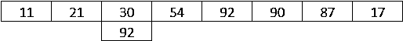
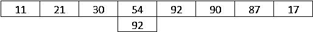
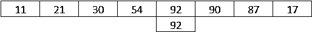

# 数据结构中的线性搜索

> 原文：<https://www.educba.com/linear-search-in-data-structure/>

## 数据结构中的线性搜索简介

在数组中搜索元素最简单的方法之一是线性搜索。这种方法使用顺序方法在列表中搜索所需的元素。如果在列表中成功找到该元素，则返回该元素的索引。搜索从第一个元素开始，按顺序向前进行。

### 数据结构中的线性搜索算法

线性搜索的算法如下所示。这是一个简单的算法。浏览并研究它，因为我们将根据算法建立一个计算机程序。

<small>Hadoop、数据科学、统计学&其他</small>

**算法:**

`function linear_search(integer array[], integer n, integer x)
{
integer k;
for (k = 0, k < n, k++)
if (array [k] = x)
return k;
return -1;
}`

### 实现线性搜索的示例

实现线性搜索的程序代码如下所示。这个程序是用 C 语言编写的。让我们通过下面的程序来理解它如何帮助我们使用线性搜索算法在列表中找到必要的元素。正确研究代码的每一个组成部分，包括语句、变量、循环等等。

**代码:**

`#include <stdio.h>
#include <conio.h>
int linear_search(int arr[], int n, int x)
{
int i;
for(i = 0; i < n; i++)
if(arr[i] == x)
return i + 1;
return -1;
}
void main()
{
int arr[50], n, i, x, res;
printf("Enter the number of elements in array: ");
scanf("%d", &n);
printf("\nEnter the numbers: ");
for(i = 0; i < n; i++)
scanf("%d", &arr[i]);
printf("\nEnter the number to be searched: ");
scanf("%d", &x);
res = linear_search(arr, n, x);
if(res == -1)
printf("\n%d does not exist in the array.", x);
else
printf("\n%d is present at position %d in the array.", x, res);
getch();
}`

**代码解释:**上面的程序首先要求用户指定数组中的元素个数以及元素。它需要多达 50 个元素。一旦指定了数组，就要求用户指定下一步需要在数组中搜索的元素。使用 loop 的程序按顺序搜索所需的元素。对于这个任务，使用了 linear_search()函数，如代码所示。

如果在数组中找到了元素，那么函数 linear_search()返回元素的位置，如果在数组中没有找到元素，那么返回-1。我们必须验证和确认所实现的程序的正确性。为此，应该通过向程序传递多个参数来检查程序。我们通过传递多个输入来验证程序。下一节讨论了通过的输入和获得的相应结果。

**输入 1**

在这种情况下，我们决定在数组中有 10 个元素，因此，当要求指定数组中元素的数量时，指定 10。接下来，我们在数组中传递了十个不同的数字元素。输入必须小心传递。传递不同数据类型的输入可能会给出不正确的结果。此外，在传递元素时，它们必须用空格隔开。一次，我们正确地传递整个数组；接下来，我们将指定要在数组中搜索的数字。在这里，我们希望搜索 98。由于 98 出现在数组中，它的位置已被程序正确返回。所以，程序工作正常。

**输入 2**

在本例中，我们向数组传递了 21 个元素。遵循这些步骤并正确传递输入。指定数组中元素的数量后，在传递元素时，确保只传递所需数量的元素。当数组中的元素数量很大时，这一点尤其重要。完成数组后，指定需要搜索的数字。这是我们经过的 29 号。29 出现在数组中，程序成功地给出了它的位置，也就是 14。浏览下面的输出，看看如何获得正确的结果。

**输入 3**

这里，我们将八个三位数传递到数组中。然后，我们在数组中指定要搜索的数字，即 245。由于数字 245 出现在列表中，所以程序正确地返回了它在数组中的位置。查看下面的程序输出。

**输入 4**

到目前为止，我们看到程序正确地返回了数组中元素的位置。但是，如果元素不存在，程序应该可以正常工作。下面的程序输出显示了这一点。如下所示，我们决定在数组中有八个元素，然后指定这八个元素。在此之后，我们指定了要搜索的号码，即 102。102 不在数组中，程序给出了正确的输出，指出数组中不存在这个数。

### 线性搜索算法如何工作

让我们考虑下面的数组来理解算法的工作原理。

现在，假设我们要在上述数组中搜索 92，线性搜索算法将遵循下述步骤。

**第一步:**算法从左手边开始，将待搜索的元素与每个元素进行匹配。在第一种情况下，匹配不会发生。

**步骤 2:** 现在，算法移动到下一个元素，比较两个元素，检查是否匹配。

**步骤 3:** 类似地，进行搜索，直到没有匹配发生。

**第四步:**最后，当匹配发生时，算法返回元素的位置。

### 结论

通过简单搜索算法的线性搜索具有广泛的应用。这在涉及许多元素的情况下是有益的。这是一种搜索必要元素的简单方法，可以使用任何编程语言轻松实现。

### 推荐文章

这是一个数据结构中线性搜索的指南。这里我们讨论数据结构中线性搜索的算法和工作原理以及代码实现。您也可以看看以下文章，了解更多信息–

1.  [数组在数据结构中是如何工作的？](https://www.educba.com/arrays-in-data-structure/)
2.  [数据分析的类型](https://www.educba.com/types-of-data-analysis/)
3.  [不同类型的数据模型](https://www.educba.com/types-of-data-model/)
4.  [顶级存储设备](https://www.educba.com/data-storage-devices/)
5.  【Works B 树在数据结构中是如何工作的？

