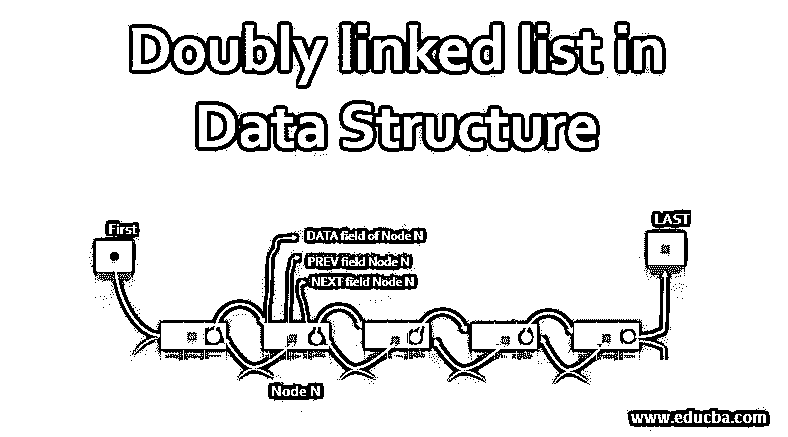
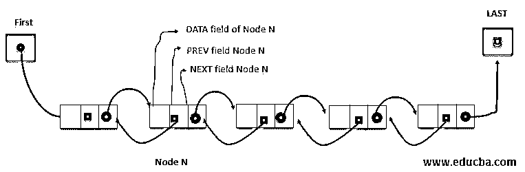
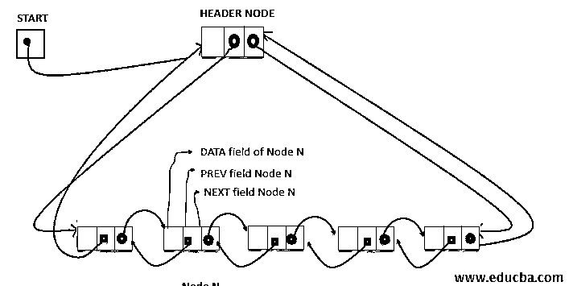

# 数据结构中的双向链表

> 原文：<https://www.educba.com/doubly-linked-list-in-data-structure/>

## 数据结构中的双向链表简介

双向链表是一个可以双向遍历的链表。这种类型的链表已经链接到下一个和上一个节点；因此，无需再次遍历整个列表就可以返回到前一个节点。因此，我们可以说，一个双向链表是被称为节点的数据元素的线性集合，其中每个节点被分成 3 个部分:-

*   **数据字段**–该字段包含存储在该链表中的值。
*   **PREV 字段**–该字段包含列表中前一个节点的位置。
*   **下一个字段**–该字段包含列表中下一个节点的位置。

### 如何在数据结构中执行双向链表？

在使用单向链表时，我们有一个保存数据节点值的数据字段，下一个字段保存列表中下一个节点的位置。但是如果不遍历列表，我们就无法访问 proceedings 节点。相比之下，双向链表由一个额外的指针组成，指向位置 LOC 处的节点之前的节点。当我们需要在第 n 个位置删除一个元素时，不需要遍历到那个位置就可以完成。

<small>Hadoop、数据科学、统计学&其他</small>

以下是节点的结构:-

`Struct Node{
int data;
Node *NEXT;
Node *PREV;
}`

上面的列表还需要第一个和最后一个指针变量，分别指向列表的第一个和最后一个节点。因此[空指针出现在列表的最后一个节点](https://www.educba.com/null-pointer-in-c/)，因为这标志着列表的结束。类似地，列表的 PREV 指针也包含一个空指针。

#### 记忆表征

使用内存中的线性数组来维护一个双向链表，就像维护一个单向链表一样，只是现在我们需要第一个和最后一个指针变量以及节点 PREV 中的一个指针字段。但是列表中可用空间的列表以相同的方式表示。

#### 双头链表

这是一种使双向链接成为具有标题节点的循环列表的方法，有助于以循环方式遍历列表。因此，只需要一个指针变量 START，而不是 FIRST 和 LAST，它将指向头部。

### 在数据结构中的双向链表中执行的操作。

让我们看看在双向链表中执行的一些操作:

#### 1.横越

这个操作是指逐个访问列表的每个节点。我们从 start 或 HEADER 节点开始，它包含了链表第一个节点的地址。

考虑节点的结构如下

`struct Node {
int data;
struct Node* NEXT; /*Pointer to the next node*/
struct Node* PREV; /*Pointer to the previous node*/
};`

*   **下一个**–这是一个指向列表中下一个节点的指针
*   **PREV**–指向列表中的前一个节点。

遍历这个算法用于遍历双向链表并将进程应用到链表中的每个节点。

1.设置 PTR =下一个[开始]

2.PTR 时重复步骤 3 和 4！=开始

3.将流程应用于数据[PTR]

4.设置 PREV[PTR] = PTR，PTR = NEXT[PTR]

5.退出。

#### 2.搜索

双向链表也支持在链表中查找元素项的搜索操作。对列表中的项目执行此操作将返回列表中项目的位置 LOC。如果项目不在列表中，则返回 NULL。

SEARCH(DATA，PREV，NEXT，START，ITEM，LOC)该算法在包含起始节点位置的双向链表中搜索条目。这将返回项目的位置 LOC。

1.设置 PTR =下一个[开始]。
2。重复 while DATA[PTR] = ITEM & PTR！=开始:

*   设置 PREV[PTR]=PTR，PTR= NEXT[PTR]

3.如果数据[PTR] =项目，则:

*   Set LOC = PTR
*   Else LOC = NULL

4.退出。

#### 3.删除

该操作指的是删除双向链表中特定位置 LOC 的项。该操作导致相邻节点的前一个和下一个指针的更新。下面是删除操作的算法。

DELETION(DATA，NEXT，PREV，START，AVAIL，LOC)该算法用于删除列表中位置为 LOC 的数据节点。

1.  设置 NEXT[PREV[LOC]] = NEXT[LOC]和 PREV[NEXT[LOC]]=PRV[LOC]
2.  设置 NEXT[LOC] = AVAIL 和 AVAIL = LOC
3.  出口

这里，在列表中组织数据的情况下，我们需要删除第 n 个位置的节点，如果我们使用单个链表，我们需要遍历 n-1 个元素。在双向链表的帮助下，这个任务可以很容易地完成，而且用的时间更少。

#### 4.插入

该操作指的是在位置 LOCA 和 LOCB 的项目之间的特定位置 LOC 插入项目。因此，在插入 LOCA 和 LOCB 项的 PREV 和 NEXT 指针时，需要更新它们。下面是在双向链表中执行插入操作的算法。

插入(数据，下一个，上一个，开始，可用，LOCA。LOCB，ITEM)此算法用于将 ITEM 作为其值的数据节点插入到列表中 LOCA 和 LOCB 处的节点之间的位置。

1.  【溢出？]如果 AVAIL = NULL，那么写:溢出&退出。
2.  设置 NEW = AVAIL，AVAIL= NEXT[AVAIL]和 DATA[NEW] = ITEM。
3.  设置 NEXT[LOCA] = NEW 和 NEXT[NEW] =LOCB，PREV[LOCB]= NEW 和 PREV[NEW] =LOCA。
4.  退出。

在上面的算法中，我们首先检查在 AVAIL 列表中是否有可用于插入节点的内存位置。

### 结论

双向链表通常并不比单向链表更好。因为有一个额外的指针用于存储前一个节点的位置，这带来了所需的存储成本和更新它所花费的时间。因此，在我们的算法中，只有当我们需要找到前一个节点的位置时，双向链表才是优选的。

### 推荐文章

这是一个数据结构中双向链表的指南。在这里我们讨论介绍和执行一个双向链表在数据结构中的各种操作。您也可以看看以下文章，了解更多信息–

1.  [DFS 算法](https://www.educba.com/dfs-algorithm/)
2.  [卡珊德拉星团](https://www.educba.com/cassandra-cluster/)
3.  [数据结构中树的类型](https://www.educba.com/types-of-trees-in-data-structure/)
4.  [数据结构中的队列](https://www.educba.com/queue-in-data-structure/)

