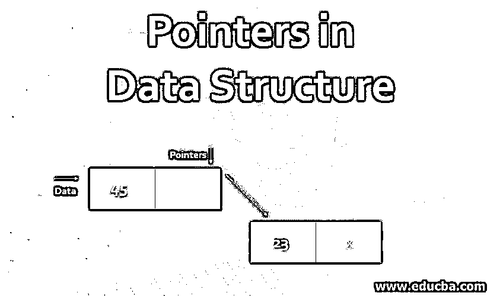
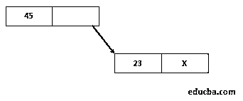
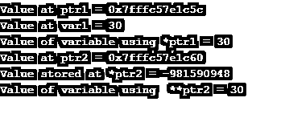

# 数据结构中的指针

> 原文：<https://www.educba.com/pointers-in-data-structure/>

## 数据结构中的指针介绍

指针是用来存储内存中值的位置的变量。指向一个位置的指针存储它的内存地址。获取存储在指针所引用的位置的值的过程称为解引用。它与教科书的索引相同，每一页都是通过索引中的页码来引用的。人们可以使用那里提到的位置很容易地找到该页面。这种指针的使用有助于各种数据结构(如堆栈或列表)的动态实现。

### 为什么数据结构中需要指针？

优化我们的代码和改进一个算法的时间复杂度。使用指针有助于减少算法将数据从一个地方复制到另一个地方所需的时间。因为它直接使用内存位置，所以对该值的任何更改都将反映在所有位置。

<small>Hadoop、数据科学、统计学&其他</small>

**举例:**

*   每次需要执行任何操作时，Call_by_value 都需要复制参数的值。
*   Call_by_reference 使用它的内存位置来更新内存位置的值，使这个任务变得更容易。

**控制程序流程:**指针的另一个用途是控制程序流程。这是通过使用这些指针的控制表来实现的。这些指针存储在一个表中，指向每个子例程的入口点，一个接一个地执行。这些指针引用各种过程的地址。这在处理递归过程或遍历算法时很有帮助，因为需要存储调用步骤的位置。

指针的下一个需求出现在各种[二级数据结构](https://www.educba.com/what-is-data-structure/)中，例如链表或指向列表中下一个存储位置的结构。

`struct Node {
int data;
struct Node* next;
};`

**举例:**

**动态内存分配:**许多编程语言使用动态内存分配来为运行时变量分配内存。对于这种类型的内存，使用分配堆而不是堆栈，堆栈使用指针。这里指针保存这些动态生成的数据块或对象数组的地址。许多结构化或 OOPs 语言使用堆或自由存储来为它们提供存储位置。链表中的最后一个节点用一个空指针表示，该指针指示链表中没有其他元素。

### 指针在数据结构中是如何工作的？

指针是一种存储变量地址的变量。

#### 定义指针

这里我们讨论在数据结构中定义一个指针。

**语法:**

`<datatype> *variable_name`

如上所述，变量名称是指向指定数据类型的变量的指针。

**举例:**

`int *ptr1 – ptr1 references to a memory location that holds data of int datatype.
int var = 30;
int *ptr1 = &var; // pointer to var
int **ptr2 = & ptr1; // pointer to pointer variable ptr1`

在上面的例子中，' & '用来表示一元运算符，它返回变量的地址。

“*”是一个一元运算符，它返回存储在指针变量指定的地址的值，因此，如果我们需要获取指针引用的变量的值，通常称为解引用，我们使用:

`print(“%d”, *ptr1) // prints 30
print(“%d”,**ptr2) // prints 30`

我们需要指定数据类型——它有助于识别存储在变量中的数据的字节数；因此。同时，我们增加一个指针变量，它只根据这个数据类型的大小增加。

### 指针上的 c 程序

下面是一个使用 C 程序创建指针的例子。

**代码:**

`#include <stdio.h>
void pointerDemo()
{
int var1 = 30;
int *ptr1;
int **ptr2;
ptr1 = &var1;
ptr2 = &ptr1;
printf("Value at ptr1 = %p \n",ptr1);
printf("Value at var1 = %d \n",var1);
printf("Value of variable using *ptr1 = %d \n", *ptr1);
printf("Value at ptr2 = %p \n",ptr2);
printf("Value stored at *ptr2 = %d \n", *ptr2);
printf("Value of variable using  **ptr2 = %d \n", **ptr2);
}
int main()
{
pointerDemo();
return 0;
}`

**输出:**

**说明:**在上面的程序中，我们已经使用了单双取值来显示变量的值。

计算机编程中使用的[指针有很多种:](https://www.educba.com/career-in-computer-programming/)

*   **空指针:**这种类型的指针用来表示这个指针指向一个无效的对象。这种类型的指针通常用于表示各种条件，例如列表的结尾。
*   **VOID 指针:**这种类型的指针可以用来指向任何类型变量的地址，唯一的限制是不能轻易解引用。
*   **野指针:**它是一种不保存任何变量地址的指针。
*   **悬空指针:**指针的类型，它不指向有效的对象，也没有被特别初始化来指向特定的内存。for ex:int * ptr 1 = malloc(sizeof(char))
*   **函数指针:**这是一种引用可执行代码的指针。它主要用于保存稍后需要执行的代码地址的递归过程。

### 指针的缺点

它会导致许多编程错误，因为它允许程序访问尚未定义的变量。它们可以很容易地按照数字进行操作，并指向一些空的位置。

因此，为了避免这种情况，许多编程语言已经开始使用构造。像 [JAVA 这样的编程语言已经用引用变量取代了](https://www.educba.com/what-is-java/)指针的概念，引用变量只能用来引用变量的地址，不能作为数字来操作。

### 结论

现在我们可以很容易地得出结论，指针是对其他内存位置的引用，用于各种数据结构的动态实现并控制其结构。指针的大小取决于计算机体系结构。每种编程语言都以这样或那样的方式使用指针，比如 C/C++等。

### 推荐文章

这是数据结构中指针的指南。这里我们讨论为什么在数据结构中需要指针，以及它在 C 指针上的工作和程序。您也可以阅读以下文章，了解更多信息——

1.  [在 C 语言中创建堆排序的步骤](https://www.educba.com/heap-sort-in-c/)
2.  [数据结构中的图形术语](https://www.educba.com/graph-in-data-structure/)
3.  [数据结构面试试题](https://www.educba.com/data-structure-interview-questions/)
4.  [用 C 语言实现 Break 语句的例子](https://www.educba.com/break-statement-in-c/)
5.  在数据结构中搜索的技术
6.  [数据结构中 B 树的完整指南](https://www.educba.com/b-tree-in-data-structure/)
7.  [了解计算机体系结构的类型](https://www.educba.com/types-of-computer-architecture/)
8.  [栈在数据结构中的应用](https://www.educba.com/stack-in-data-structure/)
9.  [c++中的堆栈|示例](https://www.educba.com/stack-in-c-plus-plus/)
10.  [PostgreSQL 过程|示例](https://www.educba.com/postgresql-procedures/)

