# 数据结构中的图形类型

> 原文：<https://www.educba.com/types-of-graph-in-data-structure/>

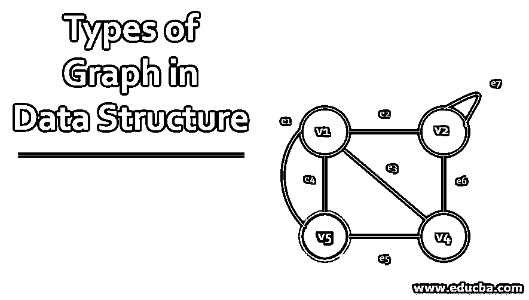

## 数据结构中的图形介绍

图(V，E)是一组顶点 V1，V2…Vn 和一组边 E = E1，E2，…en。在这里，每个不同的边可以用一对无序的顶点(Vi，Vj)来标识。如果有一条边的端点是 Vi 和 Vj，则称顶点 Vi 和 Vj 相邻。因此，我们说 E 是 Vi 和 Vj 的连接点。下面我们来讨论数据结构中各种类型的图形。

*   **图的顺序** =图中顶点的个数。
*   **图的大小** =图中的边数。
*   **一个图的顶点的度数** =与该顶点关联的边数。

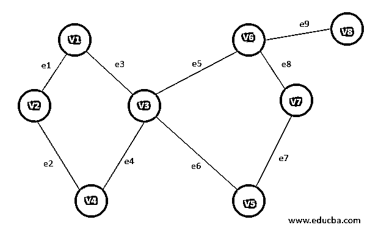

<small>Hadoop、数据科学、统计学&其他</small>

### 数据结构中不同类型的图

下面是下面解释的数据结构中的 17 种不同类型的图形。

#### 1.有限图

图 G= (V，E)的顶点数和边数都是有限的。

#### 2.无限图

如果一个图 G=(V，E)的边数和顶点数都是无穷大，则称该图为无穷大。

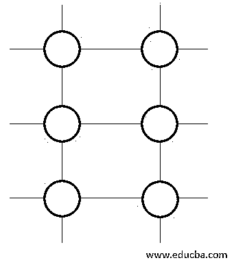

#### 3.平凡图

如果一个图 G= (V，E)只有一个顶点而没有边，则称这个图是平凡的。

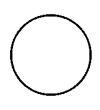

#### 4.简单图形

如果一个图 G=(V，E)的每对顶点之间有且仅有一条边，则称该图为简单图。因此，只有连接 2 个顶点的边，可以用来显示 2 个元素之间的一对一关系。

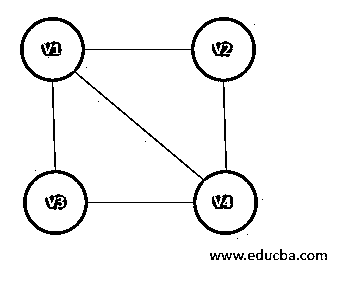

#### 5.多图

如果一个图 g= (V，E)中的一对顶点之间有多条边，则称该图为多重图。多重图不包含任何自环。例如，一张路线图。

在这种情况下存在两种优势:

*   **平行边:**从顶点 Vi 到 Vj 平行延伸的边，表示从一个起点到同一个终点的平行道路。
*   **循环:**这表示源顶点和目的顶点相同的边。

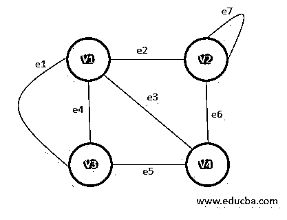

#### 6.零图

它是平凡图的修改版本。如果一个图 G= (V，E)有 n 个顶点，但没有连接它们的边，则称这个图为空图。这和从不同的城市或者更远的地方订餐是一样的。

*   G = n 的阶
*   G = 0 的大小

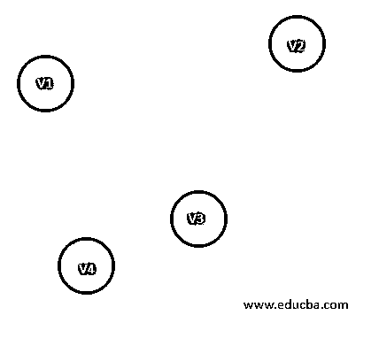

#### 7.完全图

如果一个图 G= (V，E)也是一个简单图，则称它是一个完全图。这 n 个顶点必须使用边连接到其他每个顶点。又称为全图，每个顶点的度数必须是 n-1。

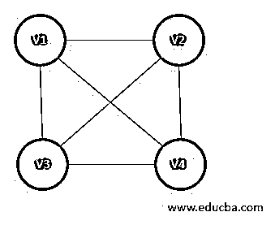

#### 8.伪图

如果一个图 G= (V，E)包含一个自环和其它边，则称它为伪图。

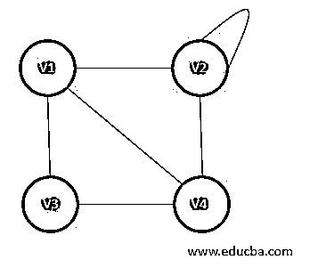

#### 9.正则图

如果一个图 G= (V，E)是一个简单图，并且图的每个顶点都具有相同的度数，则称这个图为正则图。因此，每一个完全图都是正则图。

#### 10.偶图

二部图有一组顶点，这些顶点可以分成两个非空的不相交的子集，使得该图的每条边都有来自这些子集的端点，即设 V1 和 V2 是子集，则 x 和 y 顶点之间的每条边 e 都存在，例如 x ∈ V1 和 y ∈ V2。V1 和 V2 必然是互斥的，也是不相交的。

图中这里:
V1(G)={V5，V4，V3}
V2(G)={V1，V2}

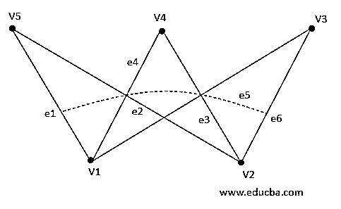

#### 11.标记图

一个图 G= (V，E)可以说是一个带标号或带权的图，因为图中的每条边都有一个值或权值来表示通过这条边的遍历代价。

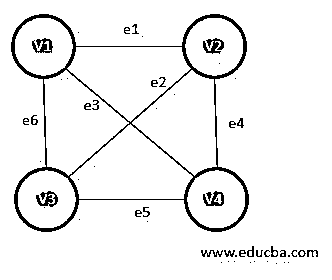

#### 12.有向图

如果一对顶点的顺序改变了一个图的意义，则称这个图为有向图或有向图。即，在情况下，G=(V，E)是图并且 Vi，Vj 是不同于 Vj，Vi 的一部分顶点。当其中一条道路是单向的或单行道时，这可以在路线图中看到。为了表示这种情况，使用了有向图。对于(Vi，Vj)之间的每个边 e，存在一个箭头来表示其方向。

图中这里:
e1 = (V1，V2)
e2 = (V2，V3)
e4 = (V2，V4)

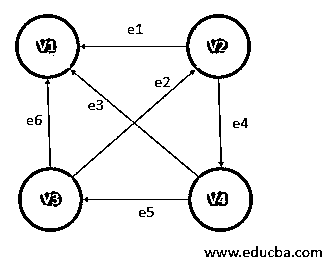

#### 13.子图

一个图 G1 =(Vx，Ex)称为 G=(V，e)的子图，如果 Vx ⊆ V 和 Ex ⊆ E

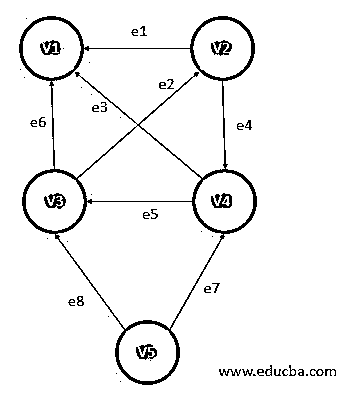

有两种类型的子图

*   **顶点不相交子图:**没有公共顶点的子图。
*   **边不相交子图:**没有公共边的子图。

**Note:** Edge disjoint subgraph is always a vertex disjoint subgraph, but vice versa is not true.

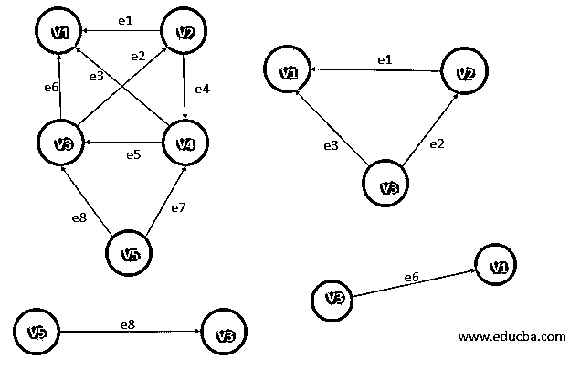

#### 14.连通或不连通图

如果能找到一条从图的一个顶点到另一个顶点的路，那么这个图就是连通图。因此，空图被称为不连通图，因为没有连接顶点的边。

(A)-连通图

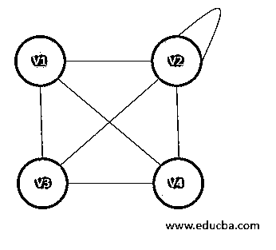

(B)-不连通图

#### 15.循环图

当一个图 G= (V，E)可以遍历到它自己的边时，称它是一个循环图。也就是说，如果 V1，V2 和 V3 是图中的顶点，那么总是存在连接(V1，V2)和(V2，V3)和(V3，V1)的边。

#### 16.顶点标记图

在其顶点保存一些数据的图，例如它可以帮助确定边数据，如(键，值)对映射。

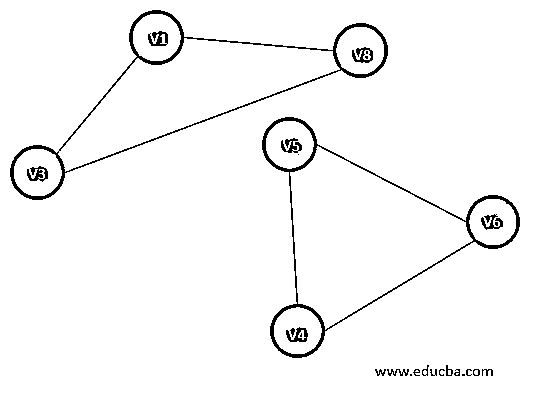

#### 17.有向无环图

它也被称为 DAG，这些是有向边的图，但是它们不包含任何圈。顶点也保存一些数据，并且当它被定向时；因此，使用有序的顶点对来表示边。

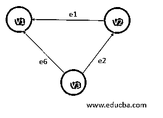

### 结论

图是一种重要的数据结构，在许多算法中用于提高应用程序的效率。有许多类型的图形，它们的使用取决于应用程序的要求。在每一步，都要对数据进行分析，应用程序需要如何工作有助于确定运行算法的合适图表。这大大提高了系统的效率。

### 推荐文章

这是数据结构中图形类型的指南。在这里，我们讨论了数据结构中 17 种图形的基本概念。你也可以看看下面的文章来了解更多-

1.  [数据结构中树的前 6 种类型](https://www.educba.com/types-of-trees-in-data-structure/)
2.  [带示例的 R 中的前 5 个图](https://www.educba.com/graphs-in-r/)
3.  [如何在数据结构中创建队列？](https://www.educba.com/queue-in-data-structure/)
4.  [数据结构搜索指南](https://www.educba.com/searching-in-data-structure/)

