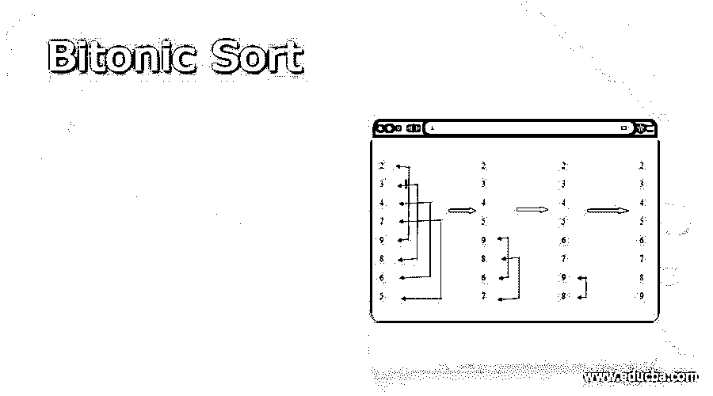
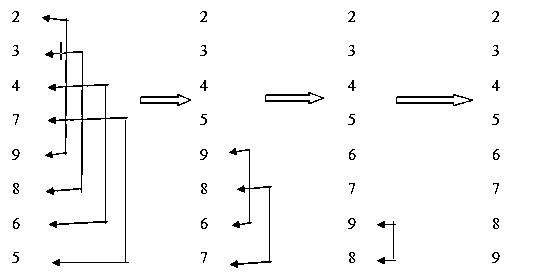

# 双音排序

> 原文：<https://www.educba.com/bitonic-sort/>

## 双调排序简介

二进制排序是执行比较的并行排序算法。与其他流行的排序算法相比，双调排序的比较次数更多。这种排序更适合并行实现，因为用户总是以预定义的顺序比较元素，并且这种比较顺序实际上并不依赖于数据。因此这种双音排序基本上适合于硬件实现。在理解什么是双调排序之前，我们需要理解双调序列是什么意思，以及一个序列是如何变成双调的。让我们通过几个例子更深入地理解双调排序。

### 双音序列

双音序列是一个数组，如 arr[0，1，…..(n-1)]这表示如下，

<small>Hadoop、数据科学、统计学&其他</small>

`arr[0] <= arr[1], arr[1] <= arr[2],…… & arr[i] >= arr[i+1], arr[i+1] >= arr[i+2]…… >= arr[n-1]`

如果一个数列是先增后减的，那么这个数列叫做双音数列。按升序排序的序列被认为是双音的，降序为空。类似地，降序被认为是双调的，升序为空。

双音序列的旋转也称为双音。具体来说，双调排序也可以被建模为排序网络的类型之一。

双调排序算法由 Ken Batcher 于 1968 年创建，由两部分组成。

1.  未排序的序列被嵌入到双音序列中。
2.  序列被多次分割成更小的序列，直到并且除非提供的输入是有序的。

### 双音序列的例子

双音序列可以以这样的方式旋转，它可以保留它的双音序列。元素按升序或降序排列的序列是双音序列。

让我们考虑一个创建双音序列的例子，

`Array[] = {2, 3, 4, 7, 5, 6, 8, 9}`

*   **步骤 1:** 要创建一个双音调序列，我们需要首先创建 2 个子序列，一个按升序，另一个按降序。
*   第二步:创建元素对。

`Array[] = {(2, 3), (4, 7), (5, 6), (8,9)}
Array[] ={(2, 3), (7, 4), (5, 6), (9, 8)}`

*   **步骤 3:** 然后在双音序列中的 4 个元素中创建这些对的对，并比较这些距离为 2 的元素，即 I 和 i+2

`Array[] = {(2, 3, 7, 4), (5, 6, 9, 8)}`

*   步骤 4:升序双音序列在第一组中，

`(2, 3, 7, 4), compare two distant elements and checking adjacent elements.
(2, 3, 4, 7), this is the ascending bitonic sequence.`

*   步骤 5:在第二组中递减双音序列，

`(5, 6, 9, 8), compare two distant elements and checking adjacent elements.
(9, 8, 6, 5)`

*   步骤 6:创建大小为 8 的双音调序列，

`2, 3, 4, 7, 9, 8, 6, 5`

### 双调排序算法

双调排序包括以下步骤，

*   **第一步:**首先，我们需要对给定的随机序列数组形成一个双调序列。由于我们在上面的例子中已经形成了一个双音调序列，我们将考虑双音调排序。
*   **步骤 2** :我们需要将前半部分的第一个元素与后半部分的第一个元素进行比较，将前半部分的第二个元素与后半部分的第二个元素进行比较，这样一直持续到前半部分的最后一个元素与后半部分的最后一个元素进行比较。如果后半部分的元件相对小于前半部分的元件，则交换元件。
*   **步骤 3:** 因此，所有的前半个元素现在将小于后半个元素。这将比较和交换两个 n/2 长度序列的结果。以递归方式对每个序列重复步骤 2，直到有一个长度为 n 的排序序列。

让我们看看实际上是如何按照上述算法进行双调排序的，

双音序列:2，3，4，7，9，8，6，5

这样，双调排序就完成了。

随机序列应用于上面的双音调序列，然后双音调序列作为双音调排序的输入。

上半场的第一个元素——下半场的第一个元素

2 < 9，因此没有变化

上半场的第二个元素——下半场的第二个元素

3 < 8，因此没有变化

上半场的第三要素——下半场的第三要素

4 < 6，因此没有变化

前半部分的最后一个元素——后半部分的最后一个元素

7 > 5，因此 5 和 7 被交换。

现在，前半部分的所有元素都比后半部分的少，并且已经正确地按升序排序。

现在只考虑排序序列的后半部分，

上半场的第一个元素——下半场的第一个元素

9 > 6，因此两者都被交换。

前半部分的第二要素——后半部分的第二要素

8 > 7，因此两者都被交换。

正如您在上面看到的，现在只剩下一组元素用于比较，

9> 8，因此交换。

所以最终的双音排序输出是，

2, 3, 4, 5, 6, 7, 8, 9

### 双调排序的时间复杂度

当双调排序并行运行时，双调排序在 O(n log 2 n)的空间复杂度比较中完成，这也是最坏的情况。sort 的并行版本可以根据实现提高速度。

对于时间复杂度，所有情况下都是 O(n log 2 n)。

至此，我们将结束“双调排序”这个主题。我们已经看到了双调排序含义以及它是如何依赖于双调序列的。我们还看到了一个实现双调排序的例子，首先应用双调序列，然后双调序列的输出作为双调排序的输入。我们还看到了实现双字节排序和双字节序列的算法。在所有情况下，双调排序的时间复杂度为 O(n log 2 n)。

### 推荐文章

这是一个双调排序的指南。在这里，我们还讨论了双调序列的介绍和例子，以及双调排序的时间复杂度。您也可以看看以下文章，了解更多信息–

1.  [Python 中的排序算法](https://www.educba.com/sorting-algorithms-in-python/)
2.  [JavaScript 中的排序算法](https://www.educba.com/sorting-algorithms-in-javascript/)
3.  [Java 中的快速排序算法](https://www.educba.com/quick-sorting-algorithms-in-java/)
4.  [Java 中的归并排序算法](https://www.educba.com/merge-sorting-algorithms-in-java/)

