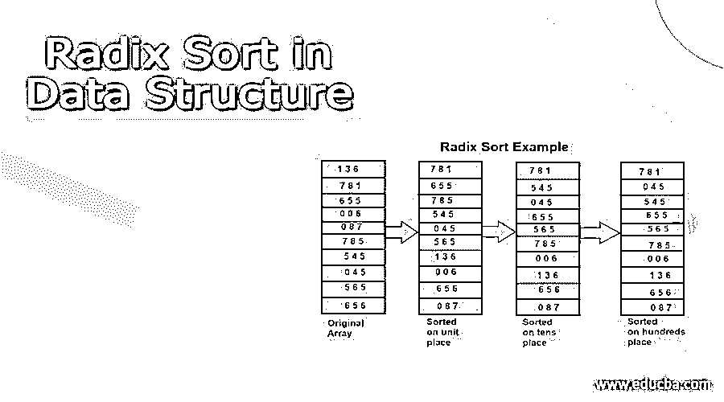
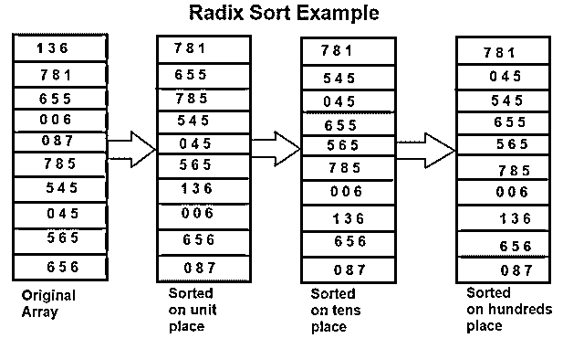
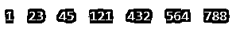

# 数据结构中的基数排序

> 原文：<https://www.educba.com/radix-sort-in-data-structure/>

## 数据结构中基数排序的介绍

基数排序是一种算法，通过对相同位置的单个字符或数字进行分组来对特定的值集或列表进行排序，然后根据需要按升序或降序对每个选定的字符或元素进行排序。基数排序在内部使用计数排序对特定位置的所有单个字符或数字进行排序，并进一步收集结果以获得最终的排序输出。在本文中，我们将了解基数排序的用法和实现，并讨论它的优点和缺点，然后进行复杂性分析。

### 数据结构中基数排序的实现

假设我们有一个包含 10 个元素的数组，这些元素是最多 3 位数的数字。基数算法将首先在个位对所有元素进行排序，然后在十位，并进一步继续这个过程，直到最后一个有效位，在我们的例子中直到数百位。假设我们有一组值[136，781，655，6，87，785，545，45，565，656]。

<small>Hadoop、数据科学、统计学&其他</small>

在这种情况下，基数排序将以如下方式工作。对数据排序三次，得到最终排序后的数组。在第一轮中，单位位上的所有数字，然后在第二轮中，同一单位位的同一桶中的所有数字将在十位上排序。此外，将对相同的十位数和单位位进行第三轮排序，并对百位进行排序。参考下图，观察基数排序是如何执行的。

### 例子

让我们考虑一个例子，其中我们将使用基数排序对 C 编程语言中的特定数组进行排序。

`// Implementation of radix sort using C programming language
#include <stdio.h>
// Retrieve the biggest number from all the elements of the radixArr
int retrieveLargest(int radixArr[], int n) {
int largestNo= radixArr[0];
for (int i = 1; i < n; i++)
if (radixArr[i] > largestNo)
largestNo= radixArr[i];
return largestNo;
}
// Take all the significant places and for each of them use the counting sort
void countingSort(int radixArr[], int size, int place) {
int finalResult[size + 1];
int largestNo= (radixArr[0] / place) % 10;
for (int i = 1; i < size; i++) {
if (((radixArr[i] / place) % 10) > largestNo)
largestNo= radixArr[i];
}
int count[largestNo+ 1];
for (int i = 0; i < largestNo; ++i)
count[i] = 0;
// Get the number of total elements
for (int i = 0; i < size; i++)
count[(radixArr[i] / place) % 10]++;
// Get the cumulative sum of all the totals calculated above
for (int i = 1; i < 10; i++)
count[i] += count[i - 1];
// Arrange all the elements in the sorted order in the final radixArr
for (int i = size - 1; i >= 0; i--) {
finalResult[count[(radixArr[i] / place) % 10] - 1] = radixArr[i];
count[(radixArr[i] / place) % 10]--;
}
for (int i = 0; i < size; i++)
radixArr[i] = finalResult[i];
}
// Radix sort which in turn uses the cunting sort for all the individual elements
void radixsort(int radixArr[], int size) {
// Get largestNo element
int largestNo= retrieveLargest(radixArr, size);
// Depending on the place value and using the counting sort sort the radixArr
for (int place = 1; largestNo/ place > 0; place *= 10)
countingSort(radixArr, size, place);
}
// Display the final sorted radixArr in the output
void displayradixArr(int radixArr[], int size) {
for (int i = 0; i < size; ++i) {
printf("%d ", radixArr[i]);
}
printf("\n");
}
// Controller for the radix sort which uses all the other fuctions
int main() {
int radixArr[] = {121, 432, 564, 23, 1, 45, 788};
int n = sizeof(radixArr) / sizeof(radixArr[0]);
radixsort(radixArr, n);
displayradixArr(radixArr, n);
}`

上述程序执行的输出如下所示-

**复杂性分析**

基数排序的时间复杂度是 O((n+b)*logb(max))，其中 max 是作为输入提供的数组的最大元素，b 是数字表示的基数。这意味着我们需要在基数排序中进行 n+b 次迭代 log(max)次。

### 优势

基数算法的优点是，当数组元素可以拥有的值的范围较小时，它可以快速工作，这导致密钥较短。

基数算法用于 DC3 算法，曼伯算法用于后缀数组构造算法。

### 不足之处

*   基数排序需要为每种数据类型重写，因为它涉及基于字母或数字的排序。
*   与数据结构中使用的其他排序算法相比，基数排序的常量值更大。
*   快速排序利用就地存储，因此与快速排序相比，基数排序算法需要更多的空间。

### 结论

基数排序是数据结构中使用的一种排序算法或技术，它通过获取元素中最大数量的有效位来对所有结果集进行排序，然后根据元素的位置值对每个有效位进行排序。对于每个单独的排序，基数排序在内部使用计数排序，最后累加结果以获得排序的输出。

### 推荐文章

这是一个数据结构中基数排序的指南。在这里，我们讨论介绍，基数排序在数据结构中的工作，优点和缺点。您也可以看看以下文章，了解更多信息–

1.  [堆数据结构](https://www.educba.com/heap-data-structure/)
2.  [数据结构中的散列](https://www.educba.com/hashing-in-data-structure/)
3.  [数据结构中的 B+树](https://www.educba.com/b-plus-tree-in-data-structure/)
4.  [数据结构中循环链表](https://www.educba.com/circular-linked-list-in-data-structure/)

