# 数据结构中的堆栈

> 原文：<https://www.educba.com/stack-in-data-structure/>

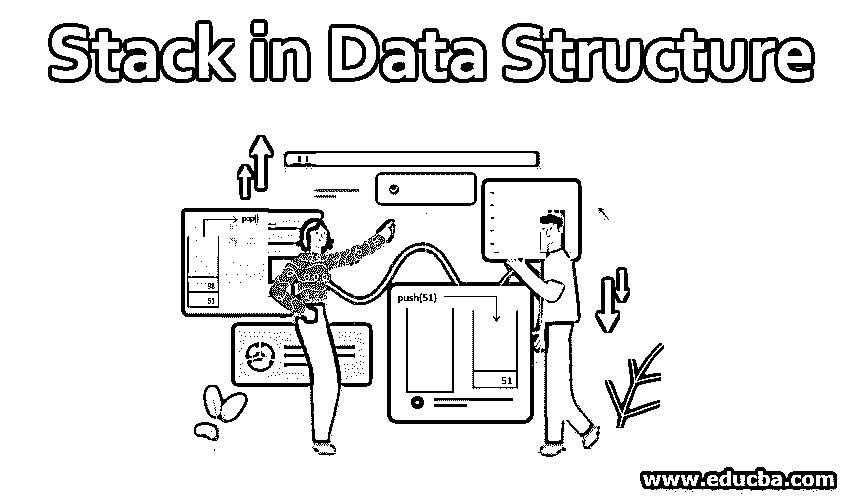

## 数据结构中的堆栈介绍

堆栈是一种允许以后进先出方式进行插入和删除操作的数据结构。因此，存储器操作以特定的方式被调节。当一个元素被添加到堆栈中时，它会占据顶部位置。当进行移出操作时，就插入堆栈而言，最近的元素首先被移出，这就是 LIFO 特性。这类似于一叠碟子或瓷砖，一个放在另一个上面。我们不断地把碟子放在另一个上面，在移走的时候，最近放进去的会先被移走。

### 堆栈的特征

一些功能如下:

<small>Hadoop、数据科学、统计学&其他</small>

*   堆栈是相似类型元素的有序列表。例如存储数字的堆栈或字符串的堆栈。
*   它本质上是基于 LIFO(后进先出)特征或 FILO(先入后出)特征。
*   当一个栈满了，它被称为处于溢出状态，当它是空的，它被称为处于下溢状态。

### 堆栈在数据结构中是如何工作的？

堆栈是一种非常简单的数据结构，必然有两种操作与堆栈相关联，它们是 Push 和 Pop。通过这些操作可以理解堆栈作为数据结构的工作方式。下面我们逐一了解一下，如下所述。让我们来理解堆栈中的插入和删除(移除)操作，如下所述。

#### 1.插入操作

在数据结构中插入元素的操作称为推送操作。当我们将一个元素插入堆栈时，它占据了最底部的位置，就像一个对象被推入了一个坑中。插入的下一个元素覆盖上一个元素的顶部，同样地，插入所有的元素。每次插入操作都类似于将一个元素推入堆栈，这种操作被称为“posh 操作”。我们将通过以下步骤来理解推送操作的工作原理。

假设我们有五个数字元素，分别是 51、98、24、76 和 38。我们打算使用堆栈数据结构将这些元素保存到内存中。元素必须按上述顺序插入堆栈中。这种情况下的推送操作将如下所述发生。

1.开始时，堆栈是空的，如下所示。使用 push 操作，我们将把每个元素插入到这个堆栈中。
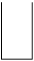

2.开始时，使用 push 操作将 51 插入堆栈，它占据了最底部的位置，如下所示。

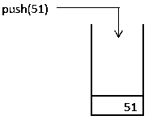

3.要插入堆栈的下一个元素是 98，它是使用 push()操作插入的，如下所示。

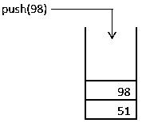

4.同样，接下来的两个元素，即。24 和 76 使用 push()操作插入到堆栈中。如下图所示。

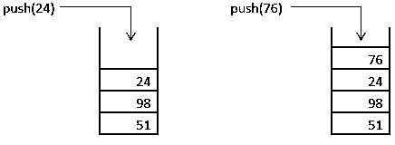

5.最后，我们有 38 个通过推送操作进入堆栈。当最后一个元素被压入堆栈时，堆栈就满了。如下图所示。

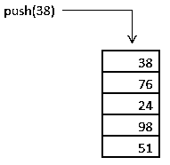

堆栈中的推送操作是有效的，正如上一节所提到的。我们现在来看看从堆栈中移除一个元素是如何发生的，如下面的章节所述。

#### 2.删除或移除操作

我们将通过插入操作一节中讨论的例子来理解栈中的删除操作。让我们从上一节的最后一步开始。现在，我们知道堆栈已满。我们将移除堆栈中的每个元素。从堆栈中删除元素的操作称为“弹出”操作。pop 操作首先删除最近添加的元素。由弹出操作促进的堆栈中的移除操作将如下所述工作。

1.最初，堆栈是满的。如下图所示。

2.在堆栈中占据顶部位置的元素是 38。它是最近添加到堆栈中的元素。pop 操作首先删除该元素。如下图所示。

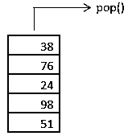

3.要从堆栈中移除的下一个元素是 76。弹出操作将其从堆栈中移除。如下图所示。

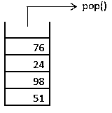

4.类似地，76 和 24 按照该顺序从堆栈中移除，这是通过弹出操作实现的，如下所示。

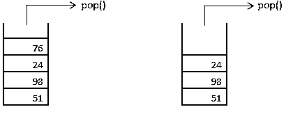

5.接下来，倒数第二个元素，即 98，通过弹出操作从堆栈中移除，如下所示。

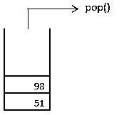

6.因此，堆栈中的每个元素都通过弹出操作一个接一个地删除。最后，我们的筹码只剩下 51 了。正如我们所知，51 是第一个进入的元素，但当它被移除时，它变成了最后一个从堆栈中移除的元素，这是因为，要移除它，我们首先需要移除位于它上面的元素。因此，对于插入和删除操作，堆栈遵循 LIFO(后进先出)特性。最后一个元素被删除，如下所示。

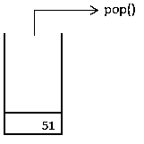

7.最后，堆栈变空。如下图所示。

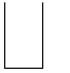

#### 3.顶层和搜索操作

顾名思义，栈顶操作返回栈顶元素。类似地，搜索操作允许搜索整个数据结构。

### 堆栈在数据结构中的应用

*   堆栈是反转字符串最方便的数据结构。堆栈的后进先出(LIFO)特性有助于实现这一点。
*   对于解析操作来说，栈是一种非常有效的数据结构。
*   它还用于表达式转换，即将中缀表达式转换为后缀表达式，或将后缀表达式转换为前缀表达式。
*   事实证明，它在执行回溯时非常有效。

### 结论

栈虽然是一个简单的数据结构，但却是以所需方式存储和管理数据的强大工具。可以认为是有入口的路径，方便插入和取出操作。由于堆栈的这种性质，插入和删除操作是基于后进先出的。

### 推荐文章

这是一个数据结构中堆栈的指南。这里我们讨论数据结构中堆栈的特点、工作原理及其应用。您也可以浏览我们的其他相关文章，了解更多信息——

1.  [应用堆栈属性](https://www.educba.com/what-is-app-stack/)
2.  [数据结构中的数组](https://www.educba.com/arrays-in-data-structure/)
3.  [数据结构中的冒泡排序](https://www.educba.com/bubble-sort-in-data-structure/)
4.  [数据结构中的指针](https://www.educba.com/pointers-in-data-structure/)

