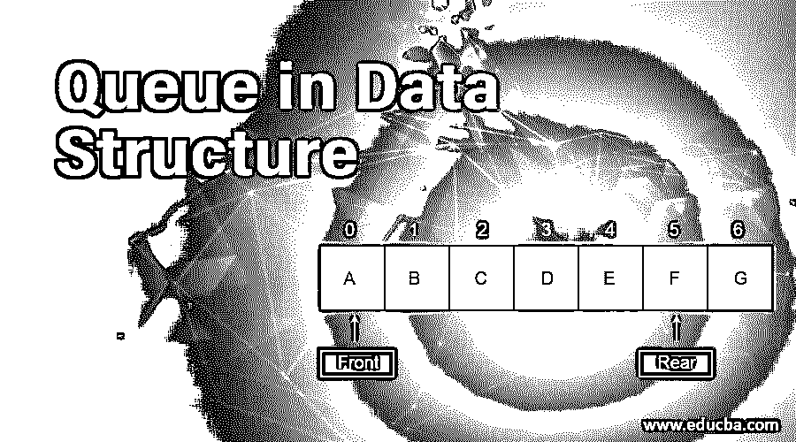
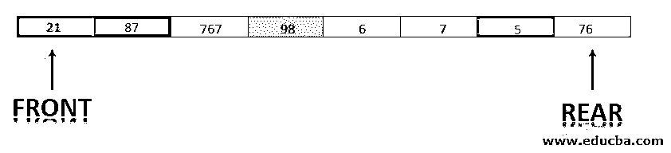
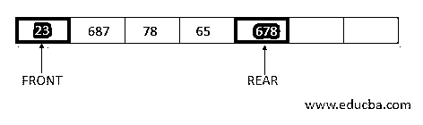
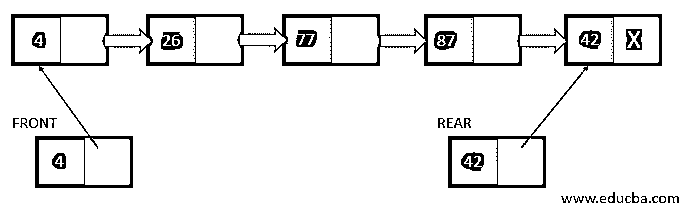
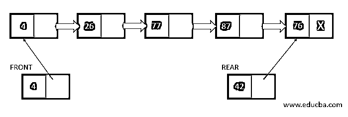

# 数据结构中的队列

> 原文：<https://www.educba.com/queue-in-data-structure/>

## 数据结构中的队列介绍

它是一种遵循先入先出(FIFO)方法的线性数据结构。这意味着首先插入的元素将首先被删除。据说队列有两端，插入元素的一端称为后端，删除元素的一端称为前端。在队列中，一端(后端)总是用于入队，另一端(前端)用于出队。队列数据结构类似于公共汽车站的队列，先到的乘客先上车。

<small>Hadoop、数据科学、统计学&其他</small>

### 如何在数据结构中创建队列？

可以使用以下两种数据结构创建队列。:

#### 1.使用数组

在这个表示中，声明了一个具有 N 个元素容量的数组，并且维护了前后两个索引。在队列中插入和删除元素的情况下，索引会相应地更新。

**例:**让队列中的 7 个元素

这里前=0，后=4。在插入元素的情况下，后变为后+1，即 5，并且元素被插入到队列[5]位置。

#### 2.使用链接列表

有时队列中的元素数量在开始时没有指定；因此，一个链表代表一个元素队列。在这种情况下，将创建一个以整数键和指针为元素的结构。创建 2 个这样的结构变量来指向数组的前端和队列元素。

在队列中插入新元素的情况下，队列的后端被更新以指向新的位置。

**链表节点结构:**

`Struct QNode
{ int key;
QNode* next;
}
QNode *FRONT * REAR;`

这里，key 由队列中的元素组成，next 代表指向该元素的指针。

### 如何在队列中插入元素？

队列中的插入发生在队列的后端。这个过程也称为入队。

**算法:**下面是在队列中插入元素的算法。

1.  检查队列是否已满，前端=后端+1。或者(后=队列的最大大小，前=0)，则存在溢出，因此退出。
2.  否则，如果 FRONT =REAR =-1，则 REAR=FRONT=0。
3.  Else REAR = REAR +1，QUEUE[REAR] = Item。

**解释:**在上面的算法中，通过检查 FRONT =REAR +1 或者 FRONT =0 且 REAR = MAX 来检查队列是否已满。在这种情况下，不能将该项目插入队列。否则，如果队列中没有元素，则前端和后端都递增到 0，并在后端插入该项。

### 如何删除队列中的元素？

队列中的删除发生在前端。因此，如果 FRONT < 0，表示队列中没有元素。这种情况称为下溢。要从队列中删除一个元素，还应该看到队列前面有一个值，该值必须包含该值。如果不是，那么从前面读取值后需要更新，需要更新。在排队的情况下，有 3 种可能的情况。

*   前==后！=0:这表示数组中只有一个元素。因此，在执行删除后，FRONT 将变为 0。
*   FRONT = MAX(Queue):如果执行删除，那么 FRONT 将等于 1。
*   正面=正面+1。

**算法:**以下是队列中删除的算法。

1.  检查 FRONT 是否< 0，如果队列中存在下溢情况，则退出。
2.  Item := Queue[FRONT]。
3.  如果前=后，则设置前=后=空。否则，如果 FRONT = MAXSIZE(QUEUE ),则设置 FRONT = 0；
4.  设置正面=正面+1。
5.  退出。

**说明:**首先检查下溢情况，然后检查变量项成为队列的前部元素。现在，如果前面=队列的后面，在删除元素后，两者都将变为 NULL。否则，如果 FRONT =队列的最大容量，那么 FRONT 被更新为 0。否则，FRONT 更新为 FRONT+1。

### 队列在数据结构中的应用

队列用于我们需要一个进程以先进先出的顺序运行的情况。在数据不需要同步传输的情况下，应用队列数据结构是有益的。

**广度优先搜索:**这是用来遍历树的节点的遍历方法之一。这里维护了当前节点的相邻节点的队列，在进入下一个深度级别之前需要遍历该队列。

**单个共享资源:**队列用于维护单个资源需要提供给各种请求进程的顺序。操作系统还使用队列来维护需要从等待状态中取出来执行的进程，例如优先级队列。

**MM1 队列:**这是一个排队模型，用于模拟各种现实情况。以下是对其用法进行分类的方法:

*   只有一台服务器可用。
*   非空队列的服务时间以每分钟μ的速率呈指数分布。
*   具有到达间隔时间的队列也具有每分钟λ的指数分布。

### 结论

队列数据结构是用于存储元素的线性类型的数据结构。在这个[数据结构中](https://www.educba.com/what-is-data-structure/)元素存储在 FIFO 技术中。队列数据结构在其实现过程中使用了数组或链表。队列中的插入发生在后端，从队列中的删除发生在前端。这种类型的数据结构用于为单个共享资源的各种请求提供服务。

### 推荐文章

这是一个数据结构中的队列指南。这里我们讨论如何在数据结构中创建一个队列以及插入、删除队列中的一个元素及其应用等。你也可以看看下面的文章来了解更多-

1.  [数据结构中的数组](https://www.educba.com/arrays-in-data-structure/)
2.  [数据结构面试试题](https://www.educba.com/data-structure-interview-questions/)
3.  [R 中的 Else if 语句](https://www.educba.com/else-if-in-r/)
4.  [c#中的队列指南](https://www.educba.com/queue-in-c-sharp/)

