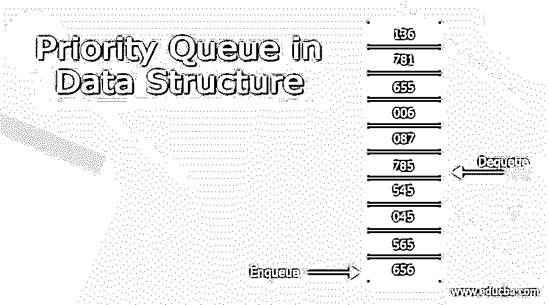
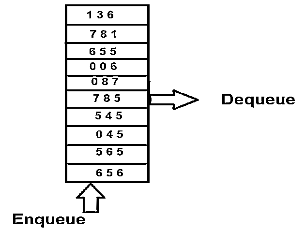
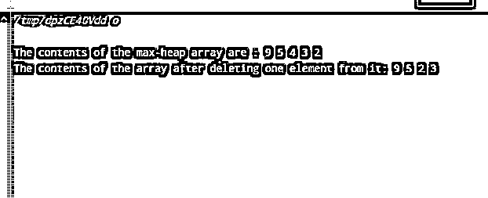

# 数据结构中的优先级队列

> 原文：<https://www.educba.com/priority-queue-in-data-structure/>

## 优先级队列介绍

优先级队列是队列的一种特殊情况，其中根据要求为元素分配优先级，并且根据特定元素的优先级进一步执行操作。如果队列中不止一个元素具有相同的优先级，那么服务或操作将根据它们在队列中的排列顺序来执行。

在大多数情况下，优先级队列是以这样的方式实现的，即特定元素本身的值充当它的优先级参数，或者被进一步操纵以分配优先级。在本文中，我们将研究优先级队列的工作原理，如何使用 C 语言实现优先级队列，并讨论实现优先级队列所需的时间复杂度。

<small>Hadoop、数据科学、统计学&其他</small>

### 优先级队列的功能

优先级队列的工作方式与普通队列相同，我们在普通队列中执行搜索(peek)、插入和删除一些元素等操作。唯一的区别是在删除时选择元素。选择删除优先级最高的元素，而不是插入的第一个元素。考虑下图所示的队列——

我们可以观察到，从一端开始，值被插入到由 enqueue 指向的队列中，但是出列操作将在最高优先级的元素上执行。在上图中，具有最大值的元素具有最高优先级，因此，785 个元素将首先从优先级队列中删除。使用二进制堆、二叉查找树和链表可以计算出优先级队列。每种情况下每个操作的时间复杂度如下表所示。根据您的需求，在队列上最频繁地执行哪种操作，您可以在此基础上决定使用哪种数据结构来实现优先级队列-

| **操作** | **二进制堆** | **链表** | **二叉查找树** |
| 插入 | o(登录号) | O (n) | o(登录号) |
| 偷看 | O (1) | O (1) | O (1) |
| 删除 | o(登录号) | O (1) | o(登录号) |

**用 C 编程语言实现优先级队列:**

下面的 C 程序通过使用 max-heap 数据结构和数组来实现优先级队列。

`// C program for implementing priority queue
#include <stdio.h>
int length = 0;
void swapTwoValues(int *item1, int *item2) {
int dummyItem = *item2;
*item2 = *item1;
*item1 = dummyItem;
}
// Prepare the heap for rerrangement of elements to carry out prepareHeap process
void prepareHeap(int array[], int length, int i) {
if (length == 1) {
printf("There is only one element in the Queue.");
} else {
// Detect the nodes which have the biggest value and its left and right child nodes.
int biggest = i;
int l = 2 * i + 1;
int r = 2 * i + 2;
if (l < length && array[l] > array[biggest])
biggest = l;
if (r < length && array[r] > array[biggest])
biggest = r;
// swapTwoValues and continue prepareHeaping if root is not biggest
if (biggest != i) {
swapTwoValues(&array[i], &array[biggest]);
prepareHeap(array, length, biggest);
}
}
}
// Function to addElement an element into the tree
void addElement(int array[], int newNumber) {
if (length == 0) {
array[0] = newNumber;
length += 1;
} else {
array[length] = newNumber;
length += 1;
for (int i = length / 2 - 1; i >= 0; i--) {
prepareHeap(array, length, i);
}
}
}
// Deletion of a particlar element from the array of max-heap tree
void rootDeletion(int array[], int number) {
int j;
for (j = 0; j < length; j++) {
if (number == array[j])
break;
}
swapTwoValues(&array[j], &array[length - 1]);
length -= 1;
for (int i = length / 2 - 1; i >= 0; i--) {
prepareHeap(array, length, i);
}
}
// Display the contents of array
void displayArray(int array[], int length) {
for (int i = 0; i < length; ++i)
printf("%d ", array[i]);
printf("\n");
}
// Controller of the program which calls different functions for manipulation
int main() {
int array[10];
addElement(array, 3);
addElement(array, 4);
addElement(array, 9);
addElement(array, 5);
addElement(array, 2);
printf("The contents of the max-heap array are : ");
displayArray(array, length);
rootDeletion(array, 4);
printf("The contents of the array after deleting one element from it: ");
displayArray(array, length);
}`

上述 C 程序的输出如下所示，显示了 max -heap 的所有内容以及删除其中一个元素后更新的内容。上面的程序演示了优先级队列上所有三个操作的实现，即插入、搜索和删除。我们可以观察到，当从优先级队列中删除元素时，具有最高优先级的元素被删除，在这种情况下是最大值的元素。而在 m =正常队列中，在优先级队列的情况下，不遵循 FIFO 模式，即第一个插入的元素应该是第一个移除的元素。

**时间复杂度**

当通过使用上述使用最大堆和数组的堆树的方式实现时，优先级队列的时间复杂度为 O(n ),其中 n 是元素的数量。在上面的例子中，n 的值是 5，因此，时间复杂度是 O(5)。所需的辅助空间是 O(1)。

### 结论

优先级队列就像执行入队和出队操作以执行元素的插入或删除的普通队列一样，只是改变的是选择删除值的方式。在正常队列的情况下，删除时遵循 FIFO 模式，它代表先进先出格式中的第一个。在优先级队列中，根据要求为元素提供优先级，例如最小的元素可以被给予最高优先级，或者最大的元素可以被给予最高优先级。具有最高优先级的元素是第一个被选择删除的元素，然后是下一个最高优先级的元素，依此类推。

### 推荐文章

这是一个数据结构中优先级队列的指南。在这里我们讨论的介绍，功能的优先队列的例子与代码实现。您也可以看看以下文章，了解更多信息–

1.  [堆数据结构](https://www.educba.com/heap-data-structure/)
2.  [数据结构中的散列](https://www.educba.com/hashing-in-data-structure/)
3.  [数据结构中的堆栈](https://www.educba.com/stack-in-data-structure/)
4.  [数据结构中的 B+树](https://www.educba.com/b-plus-tree-in-data-structure/)

