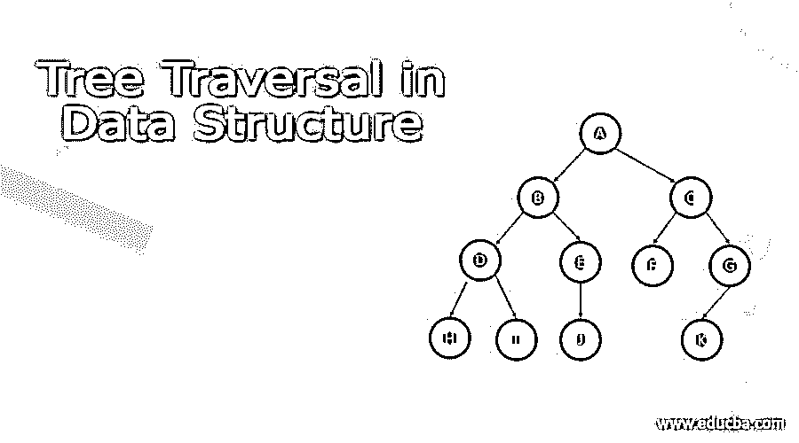
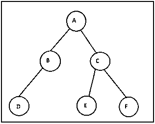

# 数据结构中的树遍历

> 原文：<https://www.educba.com/tree-traversal-in-data-structure/>

## 数据中树遍历的定义

遍历是指访问树的所有节点并使用相同的数据执行操作的过程。因为所有的节点都是通过边连接的，因此是随机链接的，所以访问任何节点都是不可能的。我们需要从树根开始，也就是树的头节点。因此，只有三种方法

1.顺序遍历
2。前序遍历
3。后序遍历

<small>Hadoop、数据科学、统计学&其他</small>

**语法:**

1.顺序遍历–左子->根->右子

2.前序遍历–根->左子->右子

3.后序遍历–左孩子->右孩子->根

### 树遍历在数据结构中是如何表现的？

遍历的不同之处在于访问节点的顺序，因此所有三个遍历都具有相同的复杂性。尽管如此，不同的遍历有不同的应用。让我们讨论每种类型的遍历的算法。我们必须记住，树中的每个节点都代表一个独立的子树。

**顺序遍历**

在这种类型的遍历中，必须首先遍历树的最左边的节点，将下一个指针指向该节点的左边的子节点。

While(节点->左！=null)
节点- >下一个=节点- >左

然后，我们可以从节点中读取数据，并为当前节点的父节点分配一个指针。从父节点读取数据后，我们可以开始以左->根->右的方式遍历右边的子树。

因为节点的根在子树的左子树之后和右子树之前被遍历，因此被命名为在左子树和右子树之间的有序遍历。

直到遍历完所有节点

步骤 1-遍历左子树的最左边的节点。

步骤 2–遍历根节点。

步骤 3–然后递归遍历右边的子树。

**前序遍历**

在这种类型的遍历中，必须首先遍历树的根节点，然后是左子树，最后是右子树。由于节点的根在子树的左右子树之前被遍历，因此被命名为前序遍历。

直到遍历完所有节点

步骤 1-读取树的根节点。

第二步-移动到树的左边的孩子并阅读它。

步骤 3–然后检查它是否有一个左子节点，然后移动到左子节点，否则移动到节点的右子节点。

第 4 步-按照第 1，2 和 3 步进一步的子树。

**后序遍历**

在这种类型的遍历中，必须首先遍历树的最左边的节点，然后遍历直接父节点的右边的子树，然后遍历子树的根。

因为节点的根是在子树的左右子树之后被遍历的，所以被称为后序遍历。
直到遍历完所有节点

步骤 1 递归遍历左子树最左边的子树。

步骤 2-读取节点数据，然后移动到直接父节点的右边子树，重复步骤 1。

第 3 步-从正确的子节点读取数据后，读取直接的父节点并移动到其父节点。

### 例子

考虑下面的树，它有 6 个节点，以 A 作为根节点。

让我们应用这三种遍历技术来打印树中的所有节点，并观察结果。

**顺序遍历**

步骤 1-检查节点 A(根节点)是否有一个左子节点。在这种情况下，是的，移动到左边的子节点 b。

步骤 2-检查节点 B 是否有任何左子节点。如果是，则移至节点 d。

步骤 3-现在再次检查节点 D 是否已经离开子节点。在这种情况下，没有，因此我们已经达到了树的最左边的孩子。打印节点 d。

第四步。打印节点 B(D 的父节点)。然后移动到 B 的右子节点，因为没有右子节点移动到节点 a。

第 5 步-移动到一个 i.e C .的右边子节点，检查它是否有一个左边的子节点。然后移动到左边的孩子，即移动到 E 并检查 E 是否有左边的孩子。

第 6 步——因为 E 没有左子节点，所以打印 E 并移动到它的父节点 C 并打印 C。

步骤 7-现在检查 C 是否有一个右孩子，即 F，然后检查 F 是否有一个左孩子，即没有。因此打印 f。

结果–迪拜国际机场

**前序遍历**

步骤 1-访问根节点并打印 a。然后移动到左边的子节点 B 并打印 B。

步骤 2-检查节点 B 是否有任何左子节点。如果是，转到节点 D。打印 D

步骤 3-现在检查 B 是否有正确的孩子，否则移动到 A 的正确的孩子。

第四步。打印 C .检查 C 是否留下子 e .打印 e。

步骤 5-检查 E 是否离开了孩子。因为没有左孩子移动到直接父母的右孩子

第 6 步-打印 f。

结果-A B D C E F

**后序遍历**

步骤 1-递归遍历到树的最左边的子节点，即 D

步骤 2-打印 d。然后检查直接父节点的右子节点(即 b)是否打印直接父节点 b。

步骤 3-现在检查 B 的父节点是否有正确的子节点。移动到 C，然后移动到该子树中最左边的节点，即打印 e。

第四步。移动到 C i.e F 的右边子节点，打印 F，然后打印 C，然后打印根节点 A

### 结论

遍历一棵树可以有三种方式:顺序、前序和后序，这取决于被遍历的节点根的位置。每种类型的遍历都有自己的应用。下面是它的应用。

有序遍历–它用在 BST 中，因为值以特定的顺序返回，并可用于设置比较器。

前序遍历——这可以用来提供树的波兰符号或表达式。

后序遍历——用于生成二叉树的前缀符号。

### 推荐文章

这是一个数据结构中树遍历的指南。这里我们讨论定义，语法，如何执行树遍历？例子。您也可以看看以下文章，了解更多信息–

1.  [堆数据结构](https://www.educba.com/heap-data-structure/)
2.  [数据结构中的散列](https://www.educba.com/hashing-in-data-structure/)
3.  [数据结构中的堆栈](https://www.educba.com/stack-in-data-structure/)
4.  数据结构中的 B 树

