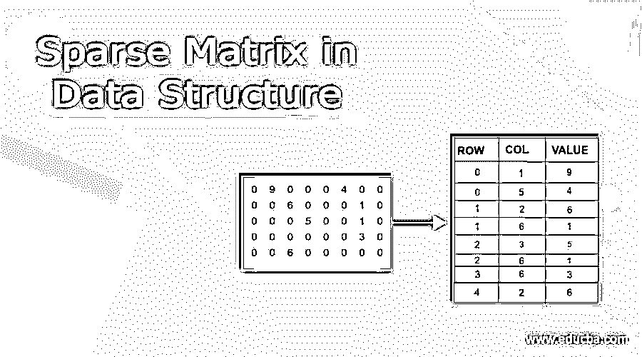
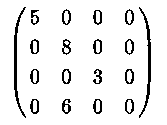
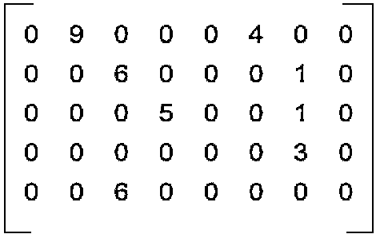
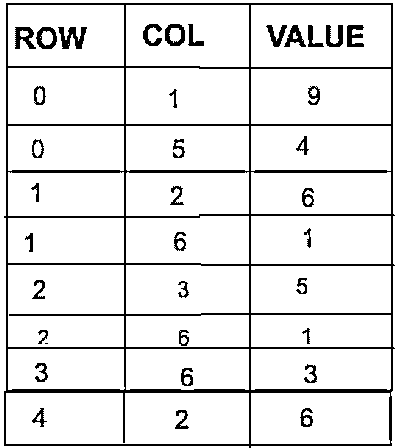
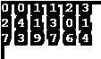
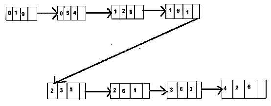

# 数据结构中的稀疏矩阵

> 原文：<https://www.educba.com/sparse-matrix-in-data-structure/>

## 稀疏矩阵的定义

稀疏矩阵是包含少量非零元素的矩阵。几乎所有的地方都填零。m*n 维矩阵指的是具有 m 行 n 列的二维阵列。如果矩阵中的非零元素多于零元素，则称为稀疏矩阵。并且在矩阵的大小很大的情况下，大量空间被浪费来表示如此少量的非零元素。类似地，扫描相同的非零值将花费更多时间。

<small>Hadoop、数据科学、统计学&其他</small>

**语法:**

因此，为了限制处理时间和空间的使用，而不是在矩阵中存储较少数量的非零元素，我们使用下面的 2 表示:

**1。数组表示法**

2D 数组转换为一维数组，其中 3 列表示:

形容词（adjective 的缩写）Row–非零元素的行索引
b . Column–非零元素的列索引
c . Value–同一行的值，2D 矩阵中的列索引

**2。链接列表表示:**

在链表表示中，每个节点有四个字段，如下所示:

*   row:矩阵中非零 lemon 的行索引。
*   列:矩阵中非零 lemon 的列索引。
*   值:矩阵中位于(行，列)位置的非零元素的值
*   下一个节点:对下一个节点的引用。

### 稀疏矩阵在数据结构中是如何工作的？

稀疏矩阵是一种二维矩阵，其中零元素的数量比非零元素的数量大。将这种矩阵存储在存储器中会产生许多空间问题，因为存储这种零会浪费大量空间。此外，在许多零的池中寻找非零元素会浪费大量时间。

稀疏矩阵表示存储二维矩阵的非零元素。从而避免在存储这种矩阵中存在的零时浪费空间。此外，在这种维数很大的矩阵中寻找非零元素可以节省时间。

我们可以使用以下任何一种表示法来存储它们:

I 数组表示法- 这种表示法适用于我们需要经常访问元素的场景。由于数组存储，因此基于索引的元素非常有用。

**II–链表表示–**这种表示适用于矩阵中插入和删除操作频率较高的情况，因为与数组相比，在链表中删除和插入元素更容易。

### 例子

让我们用一个例子来说明稀疏矩阵的概念。考虑下面 5 行 8 列的二维矩阵。

正如我们可以看到的，矩阵中 8 * 5 = 40 个元素中只有 8 个元素是非零的。这表明我们只需要将这 8 个元素存储在内存中。因为其余的是零元素，因此可以忽略。

有两种方式来表示存储器中的这些元素:

**一、数组表示:**

**步骤 1:** 列出矩阵中的非零元素及其行列索引。

**步骤 2:** 创建一个新数组，其维数如下:

*   Rows =矩阵中非零元素的数量。
*   列= 3(行、列和值)

**第三步:**用非零元素填充数组。

由于元素 9 位于位置(0，1)，因此用 row =0 col =1 和值 9 填充数组。

类似地，元素 4 位于位置(0，5)，因此用 row = 0，col =5，value = 4 填充数组。

### 数组列表表示的优点

当访问操作比较频繁时，ArrayList 表示很有帮助，因为数组列表中的元素可以根据它们的索引来访问。因此，与链表相比，访问数组列表中的元素更容易。

**实施:**

`public class HelloWorld{
public static void main(String[] args)
{
int mySparseMatrix[][] = {
{0, 0, 7, 0, 3},
{0, 9, 0, 7, 0},
{6, 0, 0, 0, 0},
{0, 4, 0, 0, 0}
};
int size = 0;
for (int i = 0; i < 4; i++)
{
for (int j = 0; j < 5; j++)
{
if (mySparseMatrix[i][j] != 0)
{
size++;
}
}
}
int resMatrix[][] = new int[3][size];
// Making of new matrix
int k = 0;
for (int i = 0; i < 4; i++)
{
for (int j = 0; j < 5; j++)
{
if (mySparseMatrix[i][j] != 0)
{
resMatrix[0][k] = i;
resMatrix[1][k] = j;
resMatrix[2][k] = mySparseMatrix[i][j];
k++;
}
}
}
for (int i = 0; i < 3; i++)
{
for (int j = 0; j < size; j++)
{
System.out.printf("%d ", resMatrix[i][j]);
}
System.out.printf("\n");
}
}
}`

**输出:**

**二。LinkedList 表示:**这种类型的表示在存储行、列索引和非零元素的值方面类似于数组表示。然而，我们不是创建一个大小等于矩阵中非零元素数量的数组，而是创建上述语法的链表节点。

**步骤 1:** 列出矩阵中的非零元素及其行列索引。

**步骤 2:** 用上面给定的结构创建新的节点，并放置行和列索引的值以及非零元素的值。

**第三步:**将元素的下一个指针指向下一个元素，形成链表。

**链表表示的优势:**

当插入和删除操作比较频繁时，链表表示是很有帮助的，因为在链表中插入和删除一个节点的复杂度远远小于 arraylist。

**实施:**

`class Node {
int row;
int col;
int value;
Node next;
Node(int r,int c, int val) { row =r;col=c;this.value =val; }
}
public class HelloWorld{
public static void main(String[] args)
{
int mySparseMatrix[][] = {
{0, 0, 7, 0, 3},
{0, 9, 0, 7, 0},
{6, 0, 0, 0, 0},
{0, 4, 0, 0, 0}
};
Node start=null;
Node tail =null;
int k = 0;
for (int i = 0; i < 4; i++)
{
for (int j = 0; j < 5; j++)
{
if (mySparseMatrix[i][j] != 0)
{
Node temp = new Node(i,j,mySparseMatrix[i][j]);
temp.next = null;
if(start == null){
start = temp;
tail=temp;
}
else{
tail.next = temp;
tail = tail.next;
}
}
}
}
Node itr = start;
while(start !=null){
System.out.println(start.row +" "+start.col+" " +start.value);
start = start.next;
}
}
}`

**输出:**

### 结论

稀疏矩阵被认为是用大部分零元素来表示二维矩阵的问题的解决方案。我们可以用数组表示法或链表表示法来存储这种矩阵的元素，增加了程序的时间复杂度。我们也可以节省大量的空间来存储 0 个元素。

### 推荐文章

这是一个数据结构中稀疏矩阵的指南。这里我们讨论一下定义，稀疏矩阵在数据结构中是如何工作的？代码实现示例。您也可以看看以下文章，了解更多信息–

1.  [堆数据结构](https://www.educba.com/heap-data-structure/)
2.  [数据结构中的散列](https://www.educba.com/hashing-in-data-structure/)
3.  [数据结构中的链表](https://www.educba.com/linked-list-in-data-structure/)
4.  [数据结构中的快速排序](https://www.educba.com/quick-sort-in-data-structure/)

