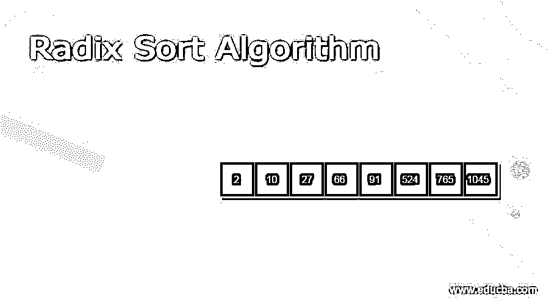
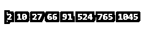
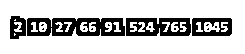
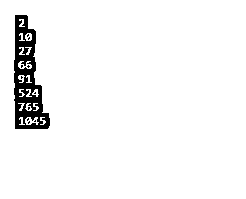

# 基数排序算法

> 原文：<https://www.educba.com/radix-sort-algorithm/>

## 基数排序算法的定义

基数排序算法是一种使用较小的数字对数字列表进行排序的排序算法。基数排序算法是一种非比较算法，用于对一组数字进行排序，这些数字之间没有比较数字。基数排序算法是一种在 java、python、PHP、C++语言中用来对数组编号进行排序的算法。基数排序算法是根据最低有效数对输入数组编号进行排序，并对编号逐一排序。基数排序类似于桶列表，以克服排序算法的缺点，并在没有比较的情况下对多个数字进行排序。基数或基数指定了一位数的位置，对多个数字进行排序称为基数排序算法。基数排序是从最低有效值到最高有效值对一个数的列表进行计数排序。

### 基数排序算法

基数排序基于从最少位数到最多位数。该数字根据数字的位置进行排序。基数排序算法的步骤如下。

<small>Hadoop、数据科学、统计学&其他</small>

第一步:设置数组的编号，找到编号的位置。

第二步:设置几个位置和几个数字。设置数组列表的最大数量。

第 3 步:设置 SORT = 0 位置。

第四步:转到数字的第一位。

第五步:找出最低有效数字到最高有效数字。

第六步:根据数字改变数组编号的位置。

第七步:逐个数字和位置的桶数。

第八步:重复第四步，直到最后一个位置满足条件。

步骤 9:重复第六步，直到数字的位置满足条件。

步骤 10:结束排序数组编号的循环。

步骤 11:结束基数排序算法的过程。

### 基数排序算法的工作过程

数组形式中包含的列表的编号。给定的数组如下所示。

Array = {943，36，4，2015，300，452}

按位置的 0 位进行数字排序。

Array = {300，452，943，4，2015，36}

位置为 10 位的数字排序。

Array = {300，04，2015，36，943，452}

位数排序为 100 位。

Array = {04，2015，36，300，452，943}

位数排序为 1000 位。

Array = {04，36，300，452，943，2015}

### 优点和缺点

基数排序算法的优点

1.  基数排序比快速排序执行得更好更快。
2.  基数排序是对数字进行分类的稳定排序。
3.  基数排序保持相等的值。
4.  基数排序提供了一个简单易行的算法。
5.  该算法不适用于数字列表的比较操作。

基数排序算法的缺点

1.  基数排序包含一个很大的空间来对数字进行排序。
2.  基数排序不适用于所有数据类型的值。您只应用整数值。
3.  基数排序算法没有提供更好的效率。
4.  此算法不适用于紧密聚集的值。

### 例子

让我们讨论基数排序算法的例子。

#### 示例 1:使用 java 语言的基数排序算法示例和输出如下。

`import java.io.*;
import java.util.*;
public class Radixsortalgorithm {
static int getMax(int array_sory[], int arr_lenth)
{
int max_num = array_sory[0];
for (int a = 1; a < arr_lenth; a ++)
if (array_sory[a] > max_num)
max_num = array_sory[a];
return max_num;
}
public static void main(String[] args)
{
int array_sory[] = { 10,1045, 765, 91, 02, 524, 66, 27 };
int arr_lenth = array_sory.length;
radixSortalgorithm(array_sory, arr_lenth);
display(array_sory, arr_lenth);
}
static void numberSort(int array_sory[], int arr_lenth, int e)
{
int output[] = new int[arr_lenth];
int a;
int count[] = new int[10];
Arrays.fill(count, 0);
for (a = 0; a < arr_lenth; a++)
count[(array_sory[a] / e) % 10]++;
for (a = 1; a < 10; a ++)
count[a] += count[a - 1];
for (a = arr_lenth - 1; a >= 0; a --) {
output[count[(array_sory[a] / e) % 10] - 1] = array_sory[a];
count[(array_sory[a] / e) % 10]--;
}
for (a = 0; a < arr_lenth; a++)
array_sory[a] = output[a];
}
public static void radixSortalgorithm(int array_sory[], int arr_lenth)
{
int mg = getMax(array_sory, arr_lenth);
for (int e = 1; mg / e > 0; e*= 10)
numberSort(array_sory, arr_lenth, e);
}
public static void display(int array_sory[], int arr_lenth)
{
for (int a = 0; a < arr_lenth; a++)
System.out.print(array_sory[a] + " ");
}
}`

**输出:**

#### 示例 2:使用 PHP 语言的基数排序算法示例和输出如下。

`<?php
function numberSort(&$arr_number, $length, $e)
{
$output_number = array_fill(0, $length, 0);
$count_number = array_fill(0, 10, 0);
for ($a = 0; $a < $length; $a++)
$count_number[ ($arr_number[$a] / $e) % 10 ]++;
for ($a = 1; $a < 10; $a++)
$count_number[$a] += $count_number[$a - 1];
for ($a = $length - 1; $a >= 0; $a--)
{
$output_number[$count_number[ ($arr_number[$a] /
$e) % 10 ] - 1] = $arr_number[$a];
$count_number[ ($arr_number[$a] / $e) % 10 ]--;
}
for ($a = 0; $a < $length; $a++)
$arr_number[$a] = $output_number[$a];
}
function radixsortalgorithm(&$arr_number, $length)
{
$m = max($arr_number);
for ($e = 1; $m / $e > 0; $e *= 10)
numberSort($arr_number, $length, $e);
}
function PrintSortedArray(&$arr_number,$length)
{
for ($a = 0; $a < $length; $a++)
echo $arr_number[$a] . " ";
}
$arr_number = array(10, 1045, 765, 91, 02, 524, 66, 27);
$length = count($arr_number);
radixsortalgorithm ($arr_number, $length);
PrintSortedArray($arr_number, $length);
?>`

**输出:**

#### 示例 3:使用 python 语言的基数排序算法示例和输出如下。

`def count_numberingSort(array_number, e1):
arr_length = len(array_number)
output_number = [0] * (arr_length)
count_number = [0] * (10)
for a in range(0, arr_length):
index_number = (array_number[a] / e1)
count_number[int(index_number % 10)] += 1
for a in range(1, 10):
count_number[a] += count_number[a - 1] a = arr_length - 1
while a >= 0:
index_number = (array_number[a] / e1)
output_number[count_number[int(index_number % 10)] - 1] = array_number[a] count_number[int(index_number % 10)] -= 1
a -= 1
a = 0
for a in range(0, len(array_number)):
array_number[a] = output_number[a] def radixSort(array_number):
max_number = max(array_number)
e = 1
while max_number / e > 0:
count_numberingSort(array_number, e)
e *= 10
array_number = [10, 1045, 765, 91, 2, 524, 66, 27] radixSort(array_number)
for a in range(len(array_number)):
print(array_number[a])`

**输出:**

### 结论

*   基数排序算法去除了比较操作，并对数字列表逐一排序。
*   这种算法有助于简单而不复杂地对数字进行排序。
*   基数排序算法为处理数组编号提供了稳定性。

### 推荐文章

这是一个基数排序算法的指南。这里我们讨论基数排序算法的定义，工作过程，代码实现的例子。您也可以看看以下文章，了解更多信息–

1.  [生成树算法](https://www.educba.com/spanning-tree-algorithm/)
2.  [链表算法](https://www.educba.com/linked-list-algorithm/)
3.  [C 语言中的 DFS 算法](https://www.educba.com/dfs-algorithm-in-c/)
4.  [伪代码算法](https://www.educba.com/pseudocode-algorithm/)

