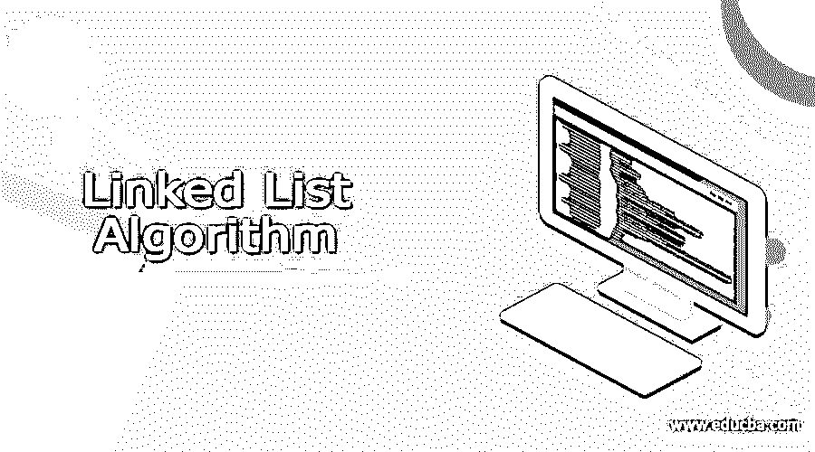
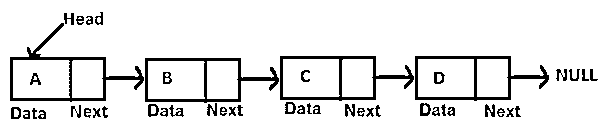
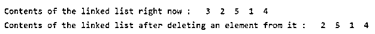

# 链表算法

> 原文：<https://www.educba.com/linked-list-algorithm/>

## 链表算法简介

链表算法是一种数据结构算法，本质上是线性的，并且不将数据存储在顺序存储器位置中。相反，链表的数据可以以完全分散的格式存在于存储器中。在链表中，每个节点由两部分组成——一部分是需要存储在链表元素中的数据，另一部分是链接到当前节点的下一个节点的地址。有两个指针可以帮助我们维护事务，并指向我们希望指向的确切元素。数组后。链表是在很大程度上使用第二多的数据结构。

在这篇文章中，我们将研究链表结构的一般可视化表示，以了解其内部存储机制和算法工作，对它的操作，以及借助于一个示例的实现，该示例将演示在 C 编程语言中的用法。

<small>Hadoop、数据科学、统计学&其他</small>

### 链表的结构

链表由一个或多个节点组成，也称为链接。每个链接由两部分组成，一部分是数据部分，它保存需要存储在链表中的元素的值，而第二部分是下一部分，它存储它所指向的下一个链接或节点的地址。起始节点或链路被称为头部。最后一个节点的下一部分指向空值，因为没有其他节点可以指向，这标志着链表的结束，如下图所示。

如上所示，每个节点都包含数据字段和引用字段。一个链表可以包含任意数量的节点，这取决于我们需要存储的数据和可用的内存容量。链表结构的一个优点是，它不需要像数组那样需要内存中连续的空闲空间。链表的节点可以存储在内存中任何有空闲空间的地方。

**链表算法要进行的操作**

我们可以对链表算法执行以下操作:

插入–我们可以在列表的开头添加新元素来存储列表中的附加数据。删除——我们可以删除链表中开始存在的元素。
Show–我们可以一次检索链表的所有数据，观察链表的当前状态和内容。
在进行上述任何一个操作时，都涉及到操作所有的引用以及开始和下一个的指针，因为数据节点需要从链表的链接框架中移除。通过学习下面的 C 语言程序，您可以理解每个单独操作的实际操作。

**链表算法的实现**

通过遵循用于操纵指针的特定逻辑和操作，以编程方式使用链表算法。为了理解这一点，让我们以 C 编程语言中的链表算法为例，该算法允许使用指针来引用存储单元的地址。注释中提到了链表算法中每个过程所执行的步骤和动作。

`#include <stdio.h>
#include <stdlib.h>
struct DataNode {
int item;
struct DataNode* next;
};
void insertFromStart(struct DataNode** reference, int data) {
// Memory allocation of the data node of the linked list
struct DataNode* new_DataNode = (struct DataNode*)malloc(sizeof(struct DataNode));
// Add a new element in the linked list
new_DataNode->item = data;
new_DataNode->next = (*reference);
// Change the head referenceerence to new data node in the linked list
(*reference) = new_DataNode;
}
// Add a new data node after the other
void insertAfterCurrentDataNode(struct DataNode* DataNode, int data) {
if (DataNode == NULL) {
printf("the given previousious DataNode cannot be NULL");
return;
}
struct DataNode* new_DataNode = (struct DataNode*)malloc(sizeof(struct DataNode));
new_DataNode->item = data;
new_DataNode->next = DataNode->next;
DataNode->next = new_DataNode;
}
void insertFromLast(struct DataNode** reference, int data) {
struct DataNode* new_DataNode = (struct DataNode*)malloc(sizeof(struct DataNode));
struct DataNode* last = *reference;
new_DataNode->item = data;
new_DataNode->next = NULL;
if (*reference == NULL) {
*reference = new_DataNode;
return;
}
while (last->next != NULL)
last = last->next;
last->next = new_DataNode;
return;
}
void deleteDataNode(struct DataNode** reference, int key) {
struct DataNode *temporary = *reference, *previous;
if (temporary != NULL && temporary->item == key) {
*reference = temporary->next;
free(temporary);
return;
}
// Search for the key of the element which is to be removed
while (temporary != NULL && temporary->item != key) {
previous = temporary;
temporary = temporary->next;
}
// if the key of element is not present
if (temporary == NULL) return;
// remove the linkage of the data node from the list
previous->next = temporary->next;
free(temporary);
}
// Display the contents of the linked list
void showData(struct DataNode* DataNode) {
while (DataNode != NULL) {
printf(" %d ", DataNode->item);
DataNode = DataNode->next;
}
}
// The main controller of the program
int main() {
struct DataNode* head = NULL;
insertFromLast(&head, 1);
insertFromStart(&head, 2);
insertFromStart(&head, 3);
insertFromLast(&head, 4);
insertAfterCurrentDataNode(head->next, 5);
printf("Contents of the linked list right now : ");
showData(head);
printf("\nContents of the linked list after deleting an element from it : ");
deleteDataNode(&head, 3);
showData(head);
}`

上述程序的输出如下所示

### 链表算法的优缺点

| **优势** | **缺点** |
| 内存的运行时分配有助于轻松地增加和减少数据结构的大小，从而形成动态数据结构。 | 这涉及到额外的内存使用，因为除了数据字段之外，还需要存储引用，这增加了消耗。 |
| 从列表中添加和删除项目非常容易，因为它只涉及更改引用。 | 遍历节点变得非常耗时。 |
| 因为没有为数据结构保留连续的存储器位置，所以根本没有浪费存储器。每个元素可以存储在任何位置。 | 在双向链表中，反向遍历很容易，因为对先前数据节点的引用也已经完成。但是在单链表的情况下，反向遍历是非常困难的，尤其是当链表中存储的节点数量非常大的时候。 |
| 通过使用堆栈和队列可以很容易地实现链表。 |  |

### 结论

链表是用来存储数据的，是一种线性数据结构。它维护下一个数据节点上的引用，在双向链表的情况下，还可以包含前一个数据节点的引用。链表是仅次于数组的第二大数据结构。

### 推荐文章

这是一个链表算法的指南。这里我们讨论链表算法的介绍、结构、操作、优点和缺点。您也可以看看以下文章，了解更多信息–

1.  [伪代码算法](https://www.educba.com/pseudocode-algorithm/)
2.  [模式识别算法](https://www.educba.com/pattern-recognition-algorithms/)
3.  [页面替换算法](https://www.educba.com/page-replacement-algorithms/)
4.  [冒泡排序算法](https://www.educba.com/bubble-sort-algorithm/)

