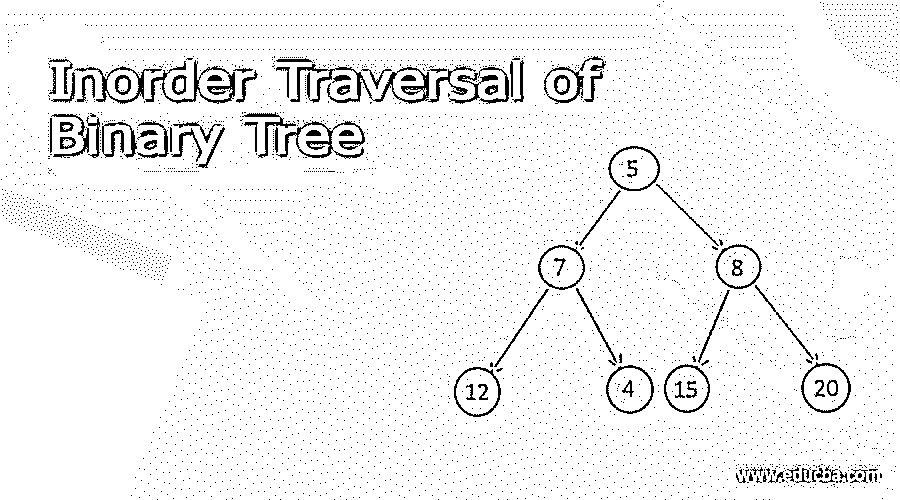
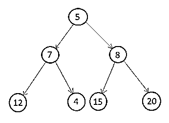
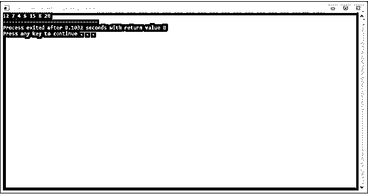
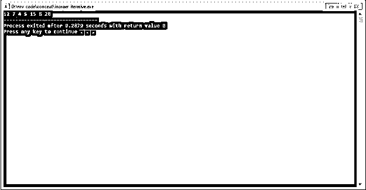

# 二叉树的有序遍历

> 原文：<https://www.educba.com/inorder-traversal-of-binary-tree/>

## 二叉树的有序遍历介绍

在二叉树中，我们可以执行许多操作，其中一个主要的操作是遍历树。获取、修改、检查树中所有节点的数据的过程称为树遍历。使用树的遍历，我们可以得到所有节点的数据或更新，搜索任何节点。众所周知，在线性数据结构中，如数组、链表、栈，我们执行顺序遍历。但是，二叉树可以用许多不同的方式遍历。二叉树中所有节点的处理顺序区分了遍历二叉树的类型。主要的分类是基于根节点、左侧子树或左侧子节点和右侧子节点的顺序。

主要有三种类型的遍历:

<small>Hadoop、数据科学、统计学&其他</small>

形容词（adjective 的缩写）顺序遍历
b .前序遍历
c .后序遍历

**语法:**

1.在有序遍历中，遍历从二叉树最左边的节点开始，到二叉树最右边的节点结束。Inorder 遍历中的根节点总是在左子树和右子树之间调用。有两种方法可以执行有序遍历:

**2。递归方法**

在递归方法中，从根节点开始，首先递归调用左边的子节点，直到得到 NULL，然后得到当前数据，然后调用右边的子树，直到得到 NULL。

**3。迭代方法**

在迭代方法中，创建一个堆栈并推送节点，直到我们在左边的子节点中找到 NULL，然后相应地弹出堆栈。

### 二叉树的有序遍历是如何工作的？

*   有序遍历是获取二叉树所有节点的遍历技术之一，在有序遍历中，左子树在当前节点之前处理，右子树在当前节点之后处理。
*   若要执行有序遍历，请遍历左侧子树，直到获得最左侧的节点。然后访问根节点，然后遍历每个节点的右子树。
*   在递归方法中，遍历节点存储在机器的堆栈存储器中，而在迭代方法中，堆栈数据结构用于存储遍历节点。

现在让我们通过一个例子来理解这两种方法。

### 例子

让我们以下面的二叉树为例，用递归和迭代的方法依次遍历所有的节点。

#### 1.递归方法

在我们上面讨论的递归方法中，首先递归调用左边的子节点，直到得到空值，然后得到节点值，然后递归调用右边的子节点，直到得到空值。现在打印所有节点的值，以便遍历。

第一步。使用 GenerateBTNode 函数如上构建一个二叉树。
第二步。调用 displayTreeInorder 并传递根节点。
第三步。首先，调用 displayTreeInorder 并递归地传递当前节点的左子节点，直到我们得到 NULL。
第四步。之后打印当前节点的值。
第五步。调用同一个 displayTreeInorder，递归传递当前节点的右子节点，直到得到 NULL。
第六步。当所有递归函数完成后，二叉树的有序遍历就完成了。

`struct BTNode
{
int value; // element value
struct BTNode * left; // To store address of left child
struct BTNode * right; // To store address of right child
};
struct BTNode *GenerateBTNode (int data) {
struct BTNode *node = new BTNode;
node->value = data;
node->right = NULL;
node->left = NULL;
return node;
}
void displayTreeInorder (struct BTNode *root) {
if(root != NULL) {
displayTreeInorder(root->left);
cout << root->value << " ";
displayTreeInorder(root->right);
}
}
int main() {
BTNode *root = NULL;
root = GenerateBTNode(5);
root->left = GenerateBTNode(7);
root->right = GenerateBTNode(8);
root->left->left = GenerateBTNode(12);
root->left->right = GenerateBTNode(4);
root->right->left = GenerateBTNode(15);
root->right->right = GenerateBTNode(20);
displayTreeInorder(root);
}`

**输出:**

#### 2.迭代方法

在迭代方法中，使用堆栈数据结构。我们需要存储当前节点或父节点，以便在处理完左子树后，我们可以处理该节点，因此我们将该节点放入堆栈数据结构中。处理完节点后，我们弹出相应的节点。

第一步。使用 GenerateBTNode 函数如上构建一个二叉树。

第二步。调用 displayTreeInorderIterative 函数并传递根节点。

第三步。创建虚拟节点作为临时节点，最初将临时节点设置为根节点。

第四步。创建 BTNode 类型的堆栈。

第五步。推送临时节点，并将临时节点更新到该节点的左侧子节点。

第六步。执行步骤 5，直到我们得到空值。

第七步。如果我们到达了 NULL，那么这意味着我们到达了树的最左边的节点。

第八步。然后，我们简单地打印节点的值，将 temp 更新到 node 的右边子节点，弹出堆栈，再次执行第 5 步。

第九步。当堆栈为空，临时节点为空时，我们就完全遍历了二叉树。

`struct BTNode
{
int value; // element value
struct BTNode * left; //To store address of left child
struct BTNode * right; //To store address of right child
};
struct BTNode *GenerateBTNode(int data) {
struct BTNode *node = new BTNode;
node->value = data;
node->right = NULL;
node->left = NULL;
return node;
}
void displayTreeInorderIterative (struct BTNode *root) {
stack <BTNode* > S;
BTNode *temp = root;
while (temp != NULL || !S.empty() ) {
if( temp != NULL) {
S.push(temp);
temp = temp->left;
}
else {
temp = S.top();
S.pop();
cout << temp->value << " ";
temp = temp->right;
}
}
}
int main() {
BTNode *root = NULL;
root = GenerateBTNode(5);
root->left = GenerateBTNode(7);
root->right = GenerateBTNode(8);
root->left->left = GenerateBTNode(12);
root->left->right = GenerateBTNode(4);
root->right->left = GenerateBTNode(15);
root->right->right = GenerateBTNode(20);
displayTreeInorderIterative(root);
}`

**输出:**

### 结论

有序遍历基于深度优先搜索(DFS)算法。还有一种遍历也是基于广度优先搜索(BFS)的，叫做层次顺序遍历。在二叉查找树中，inorder 遍历给出了所有节点的排序列表。顺序遍历的时间复杂度为 O(N)。

### 推荐文章

这是一个二叉树有序遍历的指南。这里我们讨论二叉树的定义，语法，如何工作？代码实现示例。您也可以看看以下文章，了解更多信息–

1.  数据结构中的 B 树
2.  [数据结构中的 B+树](https://www.educba.com/b-plus-tree-in-data-structure/)
3.  数据挖掘中的决策树
4.  [创建决策树](https://www.educba.com/create-decision-tree/)

