# 克鲁斯卡尔算法

> 原文：<https://www.educba.com/kruskals-algorithm/>

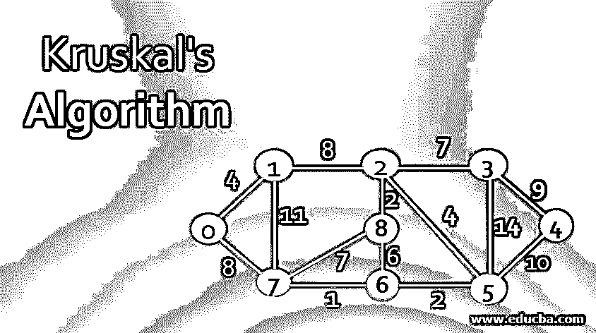

## 克鲁斯卡尔算法简介

它是为一个图寻找最小生成树的算法。这种方法试图为一个问题提供一个局部最优解，而这个局部最优解又可以为一个问题提供一个全局最优解，这就是所谓的贪婪方法。在本主题中，我们将学习 Kruskal 算法，此处将图作为该算法的输入，输出包括具有以下特征的图的节点子集之一

1.  可以形成包括图的每个顶点的树。
2.  在树的所有其他可能的子集中，权重的总和是最小的。

### 克鲁斯卡尔算法的例子

为了更好地理解，我们必须理解以下一些术语

<small>Hadoop、数据科学、统计学&其他</small>

*   **图的代价:**这是图的树中所有边的权重之和。这可以用来表示实现两个顶点之间的链接的估计成本。
*   **最小生成树:**它是以尽可能最小的代价连接所有图顶点的子图或树。

给定一个有 V 个顶点和 E 条边的图，称 T 是该图的最小生成树，当且仅当 T 包含 V 中的所有顶点和 T = n(V) -1 中的边数，并且该图中所有边的权重之和最小。

#### 克鲁斯卡尔算法

下面是克鲁斯卡尔算法的算法:-

1.该图的所有边都按权重的非降序排序。

2.开始从上面排序的列表中一个接一个地挑选边，并检查它是否不满足下面的任何条件，否则，将它们添加到生成树中:-

*   包括 MST 中的边缘，形成一个循环。
*   MST 中的边数大于或等于 V-1，其中 V 是顶点数。

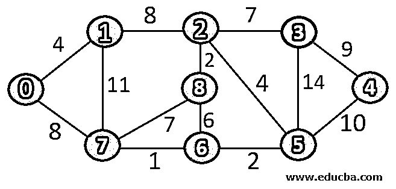

考虑图 G=(V，E ),其中 V 是 9 个顶点的集合，E 是 14 条边的集合。我们需要应用 KRUSKAL 算法来找出这个图中的最小生成树。

让我们用各自的权重来表示表格中的边。

| 边缘 | 重量 |
| V0V1 | Four |
| V0V7 | Eight |
| V1V7 | Eleven |
| V1V2 | Eight |
| V7V6 | One |
| V7V8 | Seven |
| V2V8 | Two |
| V8V6 | Six |
| V2V3 | Seven |
| V6V5 | Two |
| V5V3 | Fourteen |
| V2V5 | Four |
| V3V4 | Nine |
| V5V4 | Ten |

**步骤 1-**按权重的非递减顺序对上述边进行排序

| 边缘 | 重量 |
| V7V6 | One |
| V2V8 | Two |
| V6V5 | Two |
| V0V1 | Four |
| V2V5 | Four |
| V8V6 | Six |
| V7V8 | Seven |
| V2V3 | Seven |
| V0V7 | Eight |
| V1V2 | Eight |
| V3V4 | Nine |
| V5V4 | Ten |
| V1V7 | Eleven |
| V5V3 | Fourteen |

**第 2 步–**我们将一条一条地挑选边，如果它没有形成一个循环，就将其添加到生成树中。

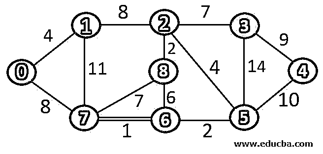

由于边 V7V6 没有形成任何循环，因此可以添加到 MST 中。

因此，边的数量是 MST = 1(

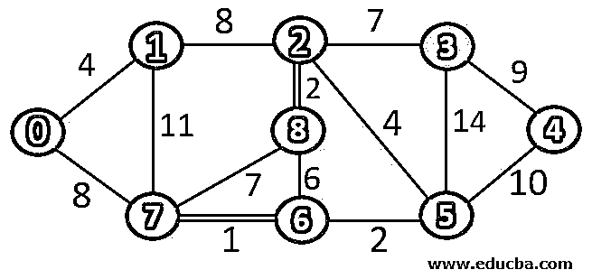

由于边缘 V2V8 没有形成任何循环，因此可以添加到 MST 中。

因此，边的数量是 MST = 2(

由于边 V6V5 没有形成任何循环，因此可以添加到 MST 中。

因此，边的数量是 MST = 3(

由于边沿 V0V1 没有形成任何循环，因此可以添加到 MST。

因此，边的数量是 MST = 4(

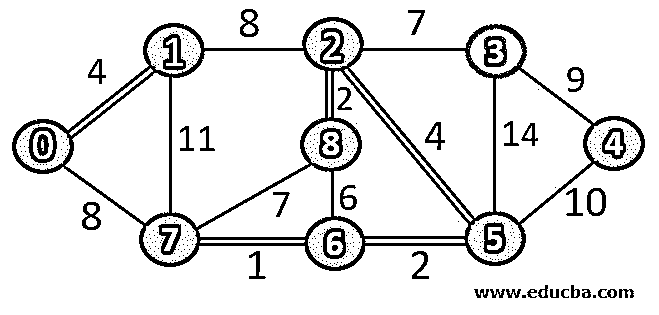

由于边 V2V5 没有形成任何循环，因此可以添加到 MST 中。

因此，边的数量是 MST = 5(

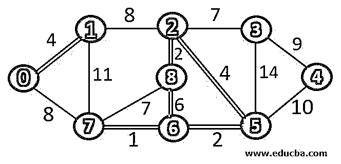

由于边缘 V8V6 正在形成循环，因此不能添加到 MST。

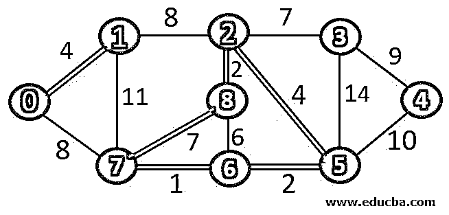

由于边缘 V8V7 正在形成一个循环，因此不能添加到 MST。

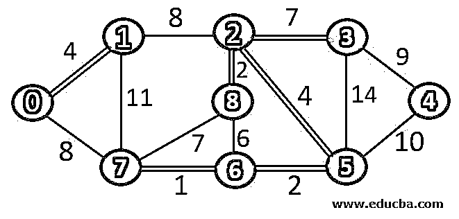

由于边 V2V3 没有形成任何循环，因此可以添加到 MST 中。

因此，边的数量是 MST = 6(

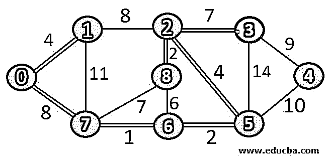

由于边沿 V0V7 没有形成任何循环，因此可以添加到 MST。

因此，边的数量是 MST = 7(

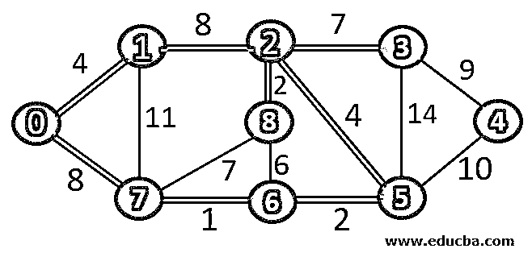

由于边缘 V8V7 正在形成一个循环，因此不能添加到 MST。

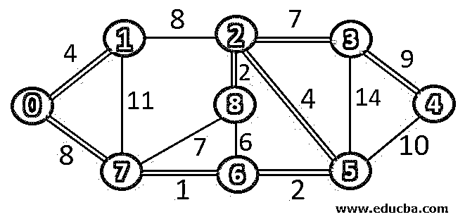

由于边沿 V0V7 没有形成任何循环，因此可以添加到 MST。

因此，边的数量是 MST = 6(

MST 中的顶点数= 8，因此满足停止条件之一。因此，下面是我们的最小生成树。

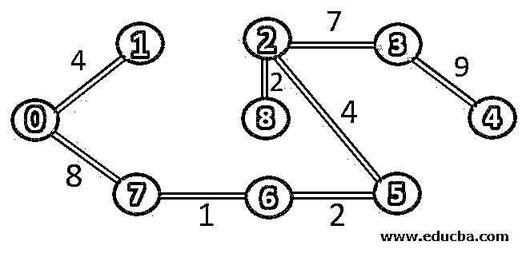

上面生成树的权重= 37。

用这种方法，人们可以很容易地找到给定图形的最小生成树。

下面是这个算法的伪代码:-

##### 伪码

`KRUSKAL(G,w)
1.A = NULL.
2.for each vertex v in G.V
MAKE-SET(v)
1.Sort the edges G.E into non-decreasing order by weight w.
2.For each edge (u,v) in G.E, taken in non decreasing order
a.If FIND-SET(u) != FIND-SET(v)
A= AU{(u,v)}
UNION(u,v)
3.Return A.`

大多数网络电缆公司都需要这种不相交的顶点集，以便在不同的城市中跨城市铺设电缆。因此，KRUSKAL 算法被用来找到这样一个不相交的顶点集，并应用最小成本。

### 结论

Kruskal 算法是一种从图中找出最小生成树的技术，最小生成树包含图的所有顶点和具有最小成本的 V-1 条边。这个图的复杂度是(VlogE)或(ElogV)。由该算法输出的不相交集合在大多数有线电视公司中被用于将电缆分布在城市中。

### 推荐文章

这是克鲁斯卡尔算法的指南。在这里，我们讨论了克鲁斯卡尔算法的例子，以及术语和伪代码。您也可以看看以下文章，了解更多信息–

1.  [感知器学习算法](https://www.educba.com/perceptron-learning-algorithm/)
2.  [DFS 算法](https://www.educba.com/dfs-algorithm/)
3.  [深度学习算法](https://www.educba.com/deep-learning-algorithms/)
4.  [对称算法](https://www.educba.com/symmetric-algorithms/)

