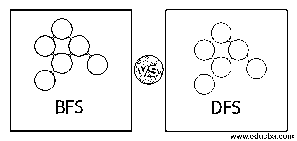
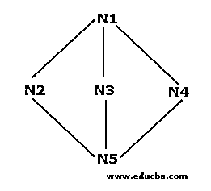
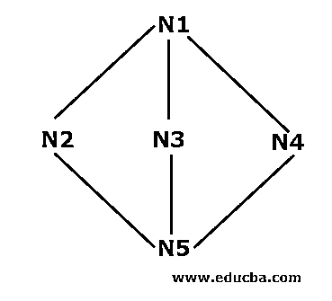
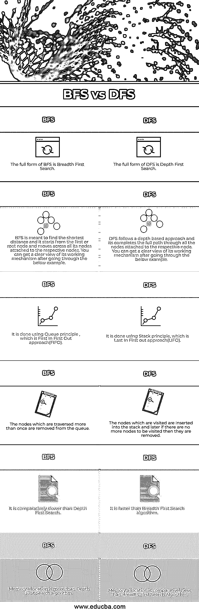

# BFS 与 DFS

> 原文：<https://www.educba.com/bfs-vs-dfs/>

## BFS 和 DFS 的区别

广度优先搜索(BFS)和深度优先搜索(DFS)是两种重要的搜索算法。广度优先搜索从第一个节点开始搜索，然后跨更近的层移动到根节点，而深度优先搜索算法从第一个节点开始，然后完成其到相应路径的末端节点的路径。这两种算法在搜索期间遍历每个节点。为两种算法编写不同的代码来执行遍历过程。它们也被认为是人工智能中重要的搜索算法[。](https://www.educba.com/what-is-artificial-intelligence/)

在本主题中，我们将了解 BFS 与 DFS。

<small>Hadoop、数据科学、统计学&其他</small>

### BFS 和 DFS 是如何工作的？

下面举例说明这两种算法的工作机制。请参考它们以更好地理解所使用的方法。

#### 广度优先搜索示例

*   第一步: N1 是根节点，因此它将从这里开始。N1 与三个节点 N2、N3 和 N4 相连。所有三个节点尚未被访问。所以，我们从 N2 开始，把它存储在队列中。因此，名为 Q 的队列只包含 N2。

问:N2

*   步骤 2: 接下来，连接到 N1 的节点是 N3。因为我们穿过或访问了节点，所以我们将它存储在队列中。因此，更新后的队列是

**问:N3，N2**

*   **步骤 3:** 接下来，连接到根节点的节点是 N4。我们将把它存储在队列中。

**问:N4，N3，N2**

*   **步骤 4:** 所有连接到 N1 的节点都存储在队列中。现在，我们根据先入先出原则(FIFO)将 N2 从队列中移除，并找到连接到 N2 的节点，即 N5。N5 没有被访问过一次，所以我们将它存储在队列中。

**问:N5，N4，N3**

*   步骤 5: 所有的顶点都被访问了，所以我们从队列中移除节点，直到队列为空。

#### 深度优先搜索示例

*   **步骤 1:** 我们将以 N1 作为起始节点开始，并将其存储在堆栈 s 中。N1 与三个相邻节点 N2、N3 和 N4 相连。从 N2 开始(你可以按字母顺序或数字顺序开始)，我们将把它放入堆栈。

N2(上)，N1

*   第二步:现在，N2 的邻居节点是 N1 和 N5。因为 N1 已经存在于堆栈中，这意味着它被访问了，所以我们将 N5 放入堆栈 s 中

**S: N5(上)，N2，N1**

*   **步骤 3:** 现在，N5 的邻居节点是 N3 和 N4。我们将 N3 放入堆栈。

N3(上)，N5，N2，N1

现在，N3 连接到已经存在于堆栈中的 N5 和 N1，这意味着根据后进先出原则(LIFO)访问它们以将 N3 从堆栈中移除。

**S: N5(上)，N2，N1**

*   **步骤 4:** 现在，我们将把最后一个节点，也就是我们在 N4 的整个遍历中没有遇到的节点，放入堆栈中。

**S: N4(上)，N5，N2，N1**

*   **步骤 5:** 现在我们没有遗漏任何其他节点，因此我们将在堆栈中检查是否有任何节点连接到其中存在的未被访问的相应节点。如果访问了所有连接的节点，那么我们将删除堆栈中存在的节点。例如，N4 没有我们没有检查以将其从堆栈中移除的连接节点。同样，我们可以检查其他节点。一旦堆栈为空，算法就停止。

### BFS 和 DFS 之间的直接对比(信息图)

以下是 BFS 与 DFS 之间的 6 大区别

### BFS 和 DFS 的主要区别

让我们讨论一下 BFS 与 DFS 之间的一些主要区别。

*   广度优先搜索(BFS)从根节点开始并访问连接到它的所有相应节点，而 DFS 从根节点开始并完成连接到该节点的完整路径。
*   BFS 遵循队列方法，而 DFS 遵循堆栈方法。
*   BFS 使用的方法是最佳的，而外勤支助部使用的流程不是最佳的。
*   如果我们的目标是寻找最短路径，那么 BFS 比 DFS 更好。

### BFS 和 DFS 对照表

让我们讨论一下 BFS 和 DFS 之间的顶级比较。

| **BFS** | **DFS** |
| BFS 的完整形式是广度优先搜索。 | DFS 的完整形式是深度优先搜索。 |
| BFS 旨在寻找最短的距离，它从第一个节点或根节点开始，经过连接到相应节点的所有节点。通过下面的例子，你可以清楚地了解它的工作机制。 | DFS 遵循基于深度的方法，它通过连接到相应节点的所有节点完成完整路径。通过下面的例子，你可以清楚地了解它的工作机制。 |
| 这是利用队列原理，先进先出的方法(FIFO)来完成的。 | 这是利用堆栈原理，即后进先出法(LIFO)完成的。 |
| 被遍历一次以上的节点被从队列中删除。 | 被访问的节点被插入到堆栈中，稍后如果没有更多的节点被访问，它们将被删除。 |
| 它比深度优先搜索相对较慢。 | 它比广度优先搜索算法更快。 |
| 内存分配不仅仅是深度优先搜索算法。 | 与广度优先搜索算法相比，内存分配相对较少。 |

### 结论

在许多应用中，上述算法被用作机器学习或寻找人工智能相关的解决方案等。它们主要用在图中，以确定它是否是二分的，检测连通分支的圈。它们也被认为是寻找路径或最短距离的重要算法。根据业务需求，我们可以使用两种算法。然而，广度优先搜索被认为是一种比深度优先搜索算法更好的方法。

### 推荐文章

这是一个 BFS VS DFS 的指南。在这里，我们通过信息图和比较表来讨论 BFS 和 DFS 的主要区别。您也可以看看以下文章，了解更多信息–

1.  [BFS 算法](https://www.educba.com/bfs-algorithm/)
2.  [Teradata vs 甲骨文](https://www.educba.com/teradata-vs-oracle/)
3.  [大数据 vs 数据仓库](https://www.educba.com/big-data-vs-data-warehouse/)

