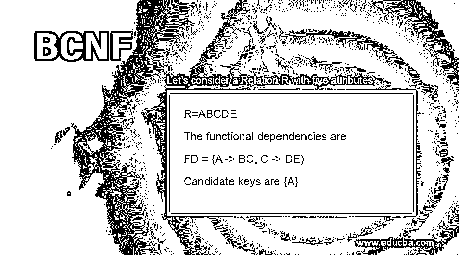

# BCNF

> 原文：<https://www.educba.com/bcnf/>

## 什么是 BCNF？

BCNF 可以扩展为 Boyce Codd 范式，即数据库的第四种范式。有必要将多维数据库系统规范化到规范化的最后一级，直到不再有空间进行规范化。规范化减少或删除数据中的冗余，从而维护数据库，使其没有任何重复值，也不会给数据库中的数据带来不一致。它可以应用于符合两个条件的数据库；也就是说，它应该处于 3NF 阶段，并且至少有一个引用表由主键组成。

默认情况下，Boyce Codd 标准格式的关系或表格被视为以下所有格式。

<small>Hadoop、数据科学、统计学&其他</small>

*   1NF
*   2NF
*   3NF

还有其他正常形式，如 4NF 和 5NF，但他们很少使用。

### BCNF 是如何工作的？

当一个表满足下面两个概念时，就说它是 BCNF 表

1.  它在 3NF。
2.  A->B，A 应该是任何函数依赖的超级键或候选键。换句话说，如果 B 是素属性，A 就不能是非素属性。

要了解更多，需要讨论的概念很少，比如键和属性。

*   **属性:**作为候选关键字一部分的属性称为主属性，其余的属性称为非主属性。
*   **超级键:**这是唯一标识表中行的列的组合。基于最小数量的属性从给定的超关键字中选择候选关键字。并且主键是候选键中的一个。

考虑一个具有属性 StudentID，Roll_no，Name 的学生表。

**超级键:**

{学生 ID }
{卷号}
{学生 ID，卷号}
{学生 ID，姓名}
{卷号，姓名}
{学生 id，卷号，姓名}

**候选键:**

{StudentID}
{Roll_no}

**主键:**

{学生 ID}或{Roll_no}

*   **功能依赖:**它是两个属性之间的关系——一个称为决定因素，另一个称为依赖因素。一个 FD 具有给定的表示 X- > Y，它表示 X 决定 Y

### 分解成 BCNF

当一个表是 3NF 格式时，它可能是也可能不是 Boyce Codd 标准格式。每个表/关系都有一组函数依赖关系。如果 FD 不满足 BCNF 的第二个条件，则递归地分解该表(分成更小的表),直到所有的函数依赖满足超级键标准。

分解所遵循的算法是，

1.  确定违反 BCNF 的函数依赖关系。
2.  对于每个违反的函数依赖 X->Y，将关系分解为 R-Y 和 XY。这里 R 是一个关系。
3.  重复，直到所有的关系满足 BCNF。

### 实施 BCNF 的示例

下面是一些例子:

#### 示例#1

让我们考虑一个有五个属性的关系 R。

R=ABCDE

功能依赖关系包括

FD = {A -> BC，C -> DE)

候选键是{A}

**算法:**

检查每个 FD，以检查它是否满足 BCNF 的第二个条件，因为它在 3NF 中。

*   第一个 FD A -> BC 因为 A 是 R 的一个键这个 FD 不违反 BCNF。
*   第二个 FD C -> DE，C 不是 R 的一个键我们把 R 分解成(CDE) (ABC)。

这两个模式是用 FD 属性创建的，这违反了，另一个模式是用原始属性减去违反 FD 的右侧属性创建的。现在，我们将检查这两个新创建的关系，以检查它们是否在 BCNF。a 是关键(ABC)，而 C 是关键(CDE)，他们不违反 BCNF。因此，关系是在 BCNF。

#### 实施例 2

让我们考虑一个有五个属性的关系 R。

R = (WXYZ)

功能依赖关系包括

F = {WX -> Y，X-> Z；Y -> W}

候选关键字是{WX，XY}

**算法:**

*   对于第一个 FD WX -> Y，由于 WX 是 R 的关键，所以它不违反 BCNF。
*   第二个 FD，X -> Z 违反了 BCNF，因为 X 不是键。因此，我们创建了两个关系(XZ)和(WXY)。

现在考察 BCNF 给出的两个关系，

对于(XZ)，候选键是 X。这里唯一适用的 FD 是 X -> Z，所以它在 BCNF。

对于(WXY)，候选键是 WX 和 XY。

1.  第一个 FD 适用，WX -> Y，WX 是一个键，所以它在 BCNF。
2.  第二个 FD 不适用(里面有任何 Z)。
3.  第三个 FD，Y->W，Y，不是超级键；因此，我们需要通过创建一个新的关系来进行分解。

(XZ)(YW)(XY)

*   XZ 仍然和以前一样在 BCNF。
*   **YW:**YW 把 Y 作为候选键，唯一适用的 FD 是 Y- > W，在 BCNF。
*   **XY:**XY 将 XY 作为候选键，没有应用 FD，所以它在 BCNF。

因此，我们的最终分解是:

(XZ)(YW)(XY)

### 优势

*   这是一种更受限制的规范化形式，这样数据库就不会以异常结束。
*   用函数依赖表达的业务规则是用键来执行的，BCNF 确保它被正确地遵循。

### 结论

第四种也是受限制的规范化形式是 BCNF，它确保表在 3NF 中，并且对于每个函数依赖，行列式是一个候选或超级键。如果关系在 BCNF，默认情况下它将满足 1NF、2NF 和 3NF。它确保对于每个函数依赖 X->Y，X 是表的超级键，使得 BCNF 成为 3NF 的更强变体。

### 推荐文章

这是 BCNF 旅游指南。这里我们讨论 BCNF 及其工作原理、分解、优点和例子。你也可以看看下面的文章来了解更多-

1.  [DBMS 键的前 7 种类型](https://www.educba.com/dbms-keys/)
2.  [DBMS 中的哈希是什么？](https://www.educba.com/hashing-in-dbms/)
3.  [RDBMS 面试问题](https://www.educba.com/rdbms-interview-questions/)
4.  [数据库管理系统中的范式](https://www.educba.com/normal-forms-in-dbms/)

