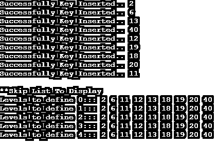

# 跳过列表

> 原文：<https://www.educba.com/skip-list/>

## 跳转列表的定义

计算机科学中的跳表被认为是一种概率数据结构，其中允许数组、链表和其他数据结构计算各自与某种搜索复杂性相关联的值。Skip list 与排序数组的集合很好地结合在一起，搜索和操作其中的元素变得增强和高效。它还允许链表数据结构以更快的速度维护插入顺序和其他元素操作，特别是在可访问性方面。通过跳过不相关的元素，从元素的每个子序列开始使用跳过列表进行搜索。

### 跳转列表是如何工作的？

整个跳过列表的意义在于它是如何工作的，让我们用一个实时的例子来看看。

<small>Hadoop、数据科学、统计学&其他</small>

假设一列超高速列车正在运行，但它不会一次遇到所有的站点，因此在这种情况下，它是列车将停靠的选定站点，因此它最受人们的青睐，因为它易于到达且耗时较少。

让我们用一个例子来讨论这个算法，并计算它的时间复杂度。

根据跳过列表遵循的算法，有四个主要的重要步骤被遵循:

**Search:** 这是主操作和初始操作，其中给函数的输入是一个键的形式，然后要估计的输出是一个位置 p，该位置的值被认为是最大的或小于或等于估计值。扫描以自顶向下的方式进行，然后向前扫描。

**某物:**

`Search_Key (Key_0)
p_0 = top_left node for_search
while (p_0 down ! = null) do
p_0 = p_0.down
while (key_0 >= p_0.next) do
p_0 = p_0.next
return p_0`

**索引:**索引操作的行为与搜索过程几乎相同，因此我们不会为此编写任何伪代码，它将与 Search_Key()函数算法完全相似。

**插入:**插入操作是索引后首选的下一个操作，其中输入到函数的输入也是一个键，则预期输出是输入在层次结构中的最顶端位置。因此，在这里，选择了具有确定性方法的头和尾的掷硬币方法，其中，如果插入的元素是 a，则另一个要插入的元素将仅仅是 b。

`Insert (Key_0)
P_1 = Search_Key(Key_0)
q_0 = null
k_1 = 1
repeat
K_1 = k_1 + 1
If k_1 > = height_0
Height = height_0+1
createNewLevelLinked_List()
while (P_1.up == null)
P_1 = P_1.previous_0
P_1 = P_1.above_0
q_0 = insertAfterKey(Key_0, P_1)
until coinFlip == ‘Tails_val’
j_0 = j_0 +1
return q_0`

**删除:**删除是最后一个操作，它跳过后面的列表，并对元素进行处理。删除操作从搜索操作中获得帮助，并且与实际的插入操作相比，它在使用上更容易。此外，删除功能的使用方式是一旦连接，就帮助删除所有关联的组件或节点。只需要一次性触发一次删除。

Delete (key_0)
开始搜索从 p_0 到…p_n 的所有位置需要操作的键，几乎所有的键都存在
如果没有找到
返回 val_0
然后，从位置 p_0…删除所有的 attached_nodes_from。p_n
移除层次树中附着的所有空层，降低复杂度。

### 例子

这个程序演示了 C++中的跳转列表，其中节点的创建、元素的插入和显示如输出所示。

`#include <bits/stdc++.h>
using namespace std;
class Node_0
{
public:
int key_1;
Node_0 **forward_ptr;
Node_0(int, int);
};
Node_0::Node_0(int key_1, int levl_0)
{
this->key_1 = key_1;
forward_ptr = new Node_0*[levl_0+1];
memset(forward_ptr, 0, sizeof(Node_0*)*(levl_0+1));
};
class SkipList_2
{
int MAXLVL_5;
float P_0;
int level_2;
Node_0 *header_1;
public:
SkipList_2(int, float);
int randomLevel_8();
Node_0* createNode_0(int, int);
void insertElement_1(int);
void displayList_3();
};
SkipList_2::SkipList_2(int MAXLVL_5, float P_0)
{
this->MAXLVL_5 = MAXLVL_5;
this->P_0 = P_0;
level_2 = 0;
header_1 = new Node_0(-1, MAXLVL_5);
};
int SkipList_2::randomLevel_8()
{
float r_5 = (float)rand()/RAND_MAX;
int lvl_1 = 0;
while (r_5 < P_0 && lvl_1 < MAXLVL_5)
{
lvl_1++;
r_5 = (float)rand()/RAND_MAX;
}
return lvl_1;
};
Node_0* SkipList_2::createNode_0(int key, int level_3)
{
Node_0 *n_9 = new Node_0(key, level_3);
return n_9;
};
void SkipList_2::insertElement_1(int key)
{
Node_0 *current = header_1;
Node_0 *update[MAXLVL_5+1];
memset(update, 0, sizeof(Node_0*)*(MAXLVL_5+1));
for (int i = level_2; i >= 0; i--)
{
while (current->forward_ptr[i] != NULL &&
current->forward_ptr[i]->key_1 < key)
current = current->forward_ptr[i];
update[i] = current;
}
current = current->forward_ptr[0];
if (current == NULL || current->key_1 != key)
{
int rlevel = randomLevel_8();
if (rlevel > level_2)
{
for (int i=level_2+1;i<rlevel+1;i++)
update[i] = header_1;
level_2 = rlevel;
}
Node_0* n_1 = createNode_0(key, rlevel);
for (int i=0;i<=rlevel;i++)
{
n_1->forward_ptr[i] = update[i]->forward_ptr[i];
update[i]->forward_ptr[i] = n_1;
}
cout << "Successfully_Key_Inserted.. " << key << "\n";
}
};
void SkipList_2::displayList_3()
{
cout<<"\n**Skip_List_To_Display"<<"\n";
for (int i=0;i<=level_2;i++)
{
Node_0 *node = header_1->forward_ptr[i];
cout << "Levels_to_define " << i << "::: ";
while (node != NULL)
{
cout << node->key_1<<" ";
node = node->forward_ptr[i];
}
cout << "\n";
}
};
int main()
{
srand((unsigned)time(0));
SkipList_2 lst_0(4, 2.3);
lst_0.insertElement_1(2);
lst_0.insertElement_1(6);
lst_0.insertElement_1(13);
lst_0.insertElement_1(40);
lst_0.insertElement_1(12);
lst_0.insertElement_1(19);
lst_0.insertElement_1(18);
lst_0.insertElement_1(20);
lst_0.insertElement_1(11);
lst_0.insertElement_1(12);
lst_0.displayList_3();
}`

**输出:**

**说明:**

在上面的程序中，首先实现一个类来创建一个节点，然后声明一个数组来保存该级别的不同节点的指针，然后分配一组特定的内存，然后用一组转发的值来填充该内存，以执行各种操作，如搜索、过滤、遍历等，这有助于在列表中插入元素以进行显示，如输出所示。

### 结论

从计算的角度来看，跳表是一个有益的过程，从开发人员的角度来看，它在实现时非常有用。它还使每个人保持一致，并有助于统计并发优先级，减少锁争用，以便正确有效地利用队列进行正确的操作和操作。

### 推荐文章

这是一个跳过列表的指南。在这里，我们讨论的定义，语法，如何跳表工程？并附有代码实现的示例。您也可以看看以下文章，了解更多信息–

1.  [链表类型](https://www.educba.com/linked-list-types/)
2.  [Java 收藏列表](https://www.educba.com/java-collection-to-list/)
3.  [月球清单](https://www.educba.com/lua-list/)
4.  [跳过列表数据结构](https://www.educba.com/skip-list-data-structure/)

