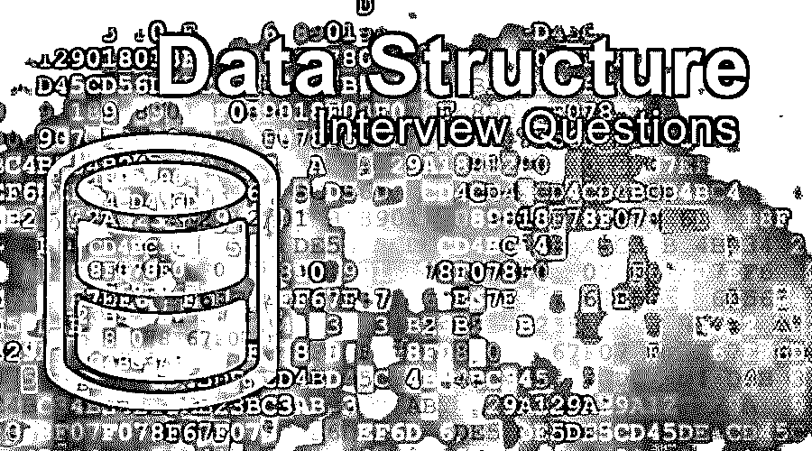

# 数据结构面试问题

> 原文：<https://www.educba.com/data-structure-interview-questions/>

## 数据结构概论面试问答

在当前的数字系统中，有各种类型的数据可用，所有这些数据有时都是非结构化的。处理这种数据是非常具有挑战性的，如果人们没有妥善保存这些数据，随时都有可能丢失数据。现在，数据结构主要用于随时维护数据的结构，以便更好、更有效地使用数据，而不会有丢失重要数据的大风险。市场上有各种各样的数据结构，它们都遵循一些独特的特征，因此它们总是市场上不同应用的一种可能的解决方案。一些数据结构非常专门地用于完成一个或多个单独的任务。例如，设计或准备一个适当的数据库结构(无论是关系型还是非关系型，都没有关系)organizer 通常遵循 B 树数据结构。

b 树数据结构恰当地提供了维护表或关系数据库结构的完整表示，这对于任何应用程序都很有用。目前，如果没有这种数据库结构，应用程序就不能正确地满足其需求。如果人们愿意通过查找标识符来标识某个特定的表，那么使用哈希表的最佳方式就是编译器实现。在俯视图中，通常使用两种数据结构:线性的(数组、堆栈、队列、链表)，另一种是非线性的(树或图)。

<small>Hadoop、数据科学、统计学&其他</small>

现在如果要找数据结构相关的工作，需要准备 2022 年的数据结构面试题目。根据不同的职位描述，每次面试都是不同的。在这里，我们准备了重要的面试问题和答案，帮助你在面试中取得成功。

在这篇文章中，我们将提出 10 个最重要和最常用的数据结构面试问题。这些问题将帮助学生围绕数据结构建立他们的概念，并帮助他们赢得面试。

### 第 1 部分-数据结构面试问题(基础)

这第一部分涵盖了面试问题和答案的基本数据结构。

#### Q1。提供更多关于不同数据结构执行的各种动作或操作的细节？

**答:**
不同种类的正常活动都是由数据结构完成的，如插入、删除、遍历、搜索和排序。

任何向数据项的特定集合添加新数据项的操作都可以被认为是对数据结构的插入活动。

从定义项集合中对现有数据项的相同删除可以被认为是对数据结构的删除[活动。](https://www.educba.com/what-is-data-structure/)

维护一个公共的和单一的方法来获取所有的数据项一次，并且处理相同的成功可以被认为是遍历。

在数据项的整个集合中找出确切的数据项。如果该特定数据项已经存在于该特定数据集合中，则它被认为是数据结构的搜索机制。

现在，维护特定集合中数据项的正确排序的一个重要要求是。对于集合中的数字数据项，它总是按照升序或降序对数据进行适当的排序；对于非数字数据，它总是按照字母顺序对数据进行排序。

#### Q2。解释一下链表和数组在数据结构情况下的区别？

**答案:**
链表和数组有很多结构上的区别；一些主要差异如下:

*   链表在定义大小的情况下总是动态的，其中数组大小的情况需要先初始化。
*   为链表这样的集合执行任何数据项的插入或删除非常容易，而为元素数组执行插入或删除活动的成本太高。
*   对于关键类型的应用程序，有时需要对特定的集合数据项进行随机访问。链表从不支持这种随机访问实用程序，而元素数组允许对特定数据项进行随机访问。
*   在内存利用方面，考虑到链表中的每个元素，链表总是需要一些额外的空间来存放特定的指针。但数组通常是基于初始化时定义的大小的恒定内存空间，不考虑应用程序是否在任何时候使用过该内存。

让我们进入下一个数据结构面试，问题和答案。

#### Q3。详细解释一下堆栈，以及在数据结构的情况下如何使用它？

**答:**
栈是线性数据结构的一个很大的例子。它通常遵循最流行的数据结构之一，比如基于[先进先出(FIFO)或后进先出(LILO)](https://www.educba.com/fifo-vs-lifo/) 实用程序维护顺序。堆栈通常遵循一些基本的操作，如 Pop、Push 或 Peek。

可以通过堆栈完成应用如下所述:

通过使用栈，从中缀到后缀的转换非常容易。

在表达式中，栈求值在后缀的情况下太普遍了。

在反转字符串的情况下，堆栈最终是有用的。

#### Q4。提供关于队列的详细解释，解释队列和堆栈之间的主要区别，并给出关于队列实现的更多细节。

**答案:**
这是在面试中被问到的基础数据结构面试问题。队列也是线性结构的一个流行例子，先入先出结构紧随其后。队列使用的基本操作是前端、排队、去排队和后端。

stack 和 queue 的主要区别在于 stack 通常会移除最近添加的一个项目。而队列总是移除最近最少添加项目。通过使用数组和链表，可以很容易地将它们集成在一起。

#### Q5。解释数据结构中不同的符号，如中缀、前缀或后缀？

**答案:**
中缀批注:

A*(B+C)/D

后缀符号:

ABC+*D/

前缀符号:

/*A+BCD

### 第 2 部分-数据结构面试问题(高级)

现在让我们来看看面试问题和答案的高级数据结构。

#### Q6。详细定义链表并解释链表中可用的各种类型？

**答案:**
三种类型，单链表，双向链表，循环链表。

#### Q7。在使用 BFS 和 DFS 生成图形的情况下，指示数据结构的细节？

**答:**
[BFS 的队列和](https://www.educba.com/bfs-vs-dfs/)DFS 的堆栈。

让我们进入下一个数据结构面试，问答。

#### Q8。在定义一个实际上在每个节点中保存一个指针的变量时，实现一个双重链接可能吗？

**答案:**
是的。

#### Q9。通过使用数据结构中的堆栈来提供实现请求队列的适当机制？

**答案:**
两个队列可以实现一个栈。

#### Q10。解释一下 LRU 缓存，并给出使用哪种合适的数据结构的全部细节？

**答案:**
队列和哈希这两种数据结构，都可以用来实现 LRU 缓存。在队列的情况下，需要实现双向链表来正确设计 LRU 缓存。并且在散列的情况下，相应队列节点的页号和地址可以作为用于维护 LRU 高速缓存方案的键和值来维护。

### 推荐文章

这是数据结构面试问题和答案列表的指南。这里我们列出了 10 个最佳面试问题，这样求职者就可以轻松地通过面试。您也可以阅读以下文章，了解更多信息——

1.  [热门 Teradata 面试问题](https://www.educba.com/teradata-interview-questions/)
2.  [甲骨文数据库面试](https://www.educba.com/oracle-database-interview-questions/)
3.  [数据建模面试问题|热门问题](https://www.educba.com/data-modeling-interview-questions/)
4.  [数据科学面试问题及答案](https://www.educba.com/data-science-interview-questions/)

