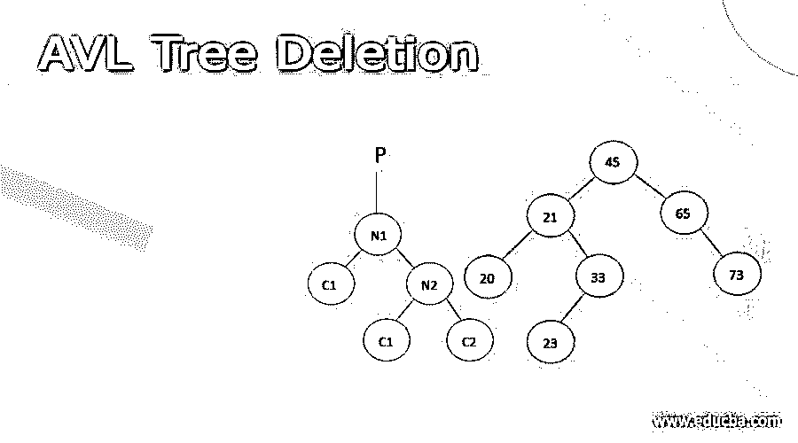
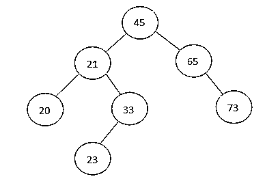
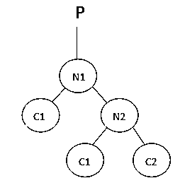
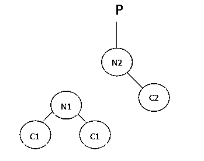
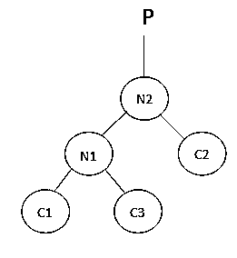

# AVL 树删除

> 原文：<https://www.educba.com/avl-tree-deletion/>

## AVL 树的定义

AVL 树也被称为自平衡二叉查找树(BST ),因为该树中的每个节点都有关于节点或节点位置的额外信息，称为平衡因子。平衡系数包含-1、0 或+1。

<small>Hadoop、数据科学、统计学&其他</small>

### AVL 树中的删除操作

当我们删除 AVL 树中的一个元素时，这扰乱了整个树的平衡因子，因此树需要再次被平衡。为了重新平衡它，对它进行旋转，即向左旋转和向右旋转。

#### 向左旋转

1.让我们假设下面的左旋转 AVL 树。

2.如果 N2 有左子树，那么将 N1 指定为 N2 左子树的父代。

如果 N1 没有父代，那么让 N2 成为 N1 的父代，这是树的根。如果 N1 是任何一个父母的左孩子，那么让 N2 成为那个父母的左孩子。
如果以上两个条件都不成立，那么就让 N2 成为父节点的正确子节点。

当我们对它进行左旋转时，这是最终的平衡树。右旋转也与 AVL 树类似。

### 

算法删除 AVL 树中的一个元素

节点应始终作为叶节点删除。当一个节点被删除时，树的平衡因子被扰乱，需要重新平衡树以获得正确的平衡因子。

1.使用递归算法找到要删除的节点。
2。删除节点
有三个条件，如果要删除的节点是叶节点，则直接删除该节点。
如果节点包含一个子节点，则交换它们，然后删除包含关键元素的叶节点。
如果节点包含两个子节点，则查找要删除的节点的有序后继节点，即小于键的值将在右边的子树中。
1。用 before 节点替换要删除的节点。
2。删除替换的叶节点。
3。使用任何合适的旋转技术来平衡树。

**源代码**

`# AVL tree implementation in Python
import sys
# Create a tree node
class TreeNode(object):
def __init__(self, key):
self.key = key
self.left = None
self.right = None
self.height = 1
class AVLTree(object):
# Function to insert a node
def insert_node(self, root, key):
# Find the correct location and insert the node
if not root:
return TreeNode(key)
elif key < root.key:
root.left = self.insert_node(root.left, key)
else:
root.right = self.insert_node(root.right, key)
root.height = 1 + max(self.getHeight(root.left),
self.getHeight(root.right))
# Update the balance factor and balance the tree
balanceFactor = self.getBalance(root)
if balanceFactor > 1:
if key < root.left.key:
return self.rightRotate(root)
else:
root.left = self.leftRotate(root.left)
return self.rightRotate(root)
if balanceFactor < -1:
if key > root.right.key:
return self.leftRotate(root)
else:
root.right = self.rightRotate(root.right)
return self.leftRotate(root)
return root
# Function to delete a node
def delete_node(self, root, key):
# Find the node to be deleted and remove it
if not root:
return root
elif key < root.key:
root.left = self.delete_node(root.left, key)
elif key > root.key:
root.right = self.delete_node(root.right, key)
else:
if root.left is None:
temp = root.right
root = None
return temp
elif root.right is None:
temp = root.left
root = None
return temp
temp = self.getMinValueNode(root.right)
root.key = temp.key
root.right = self.delete_node(root.right,
temp.key)
if root is None:
return root
# Update the balance factor of nodes
root.height = 1 + max(self.getHeight(root.left),
self.getHeight(root.right))
balanceFactor = self.getBalance(root)
# Balance the tree
if balanceFactor > 1:
if self.getBalance(root.left) >= 0:
return self.rightRotate(root)
else:
root.left = self.leftRotate(root.left)
return self.rightRotate(root)
if balanceFactor < -1:
if self.getBalance(root.right) <= 0:
return self.leftRotate(root)
else:
root.right = self.rightRotate(root.right)
return self.leftRotate(root)
return root
# Function to perform left rotation
def leftRotate(self, z):
y = z.right
T2 = y.left
y.left = z
z.right = T2
z.height = 1 + max(self.getHeight(z.left),
self.getHeight(z.right))
y.height = 1 + max(self.getHeight(y.left),
self.getHeight(y.right))
return y
# Function to perform right rotation
def rightRotate(self, z):
y = z.left
T3 = y.right
y.right = z
z.left = T3
z.height = 1 + max(self.getHeight(z.left),
self.getHeight(z.right))
y.height = 1 + max(self.getHeight(y.left),
self.getHeight(y.right))
return y
# Get the height of the node
def getHeight(self, root):
if not root:
return 0
return root.height
# Get balance factore of the node
def getBalance(self, root):
if not root:
return 0
return self.getHeight(root.left) - self.getHeight(root.right)
def getMinValueNode(self, root):
if root is None or root.left is None:
return root
return self.getMinValueNode(root.left)
def preOrder(self, root):
if not root:
return
print("{0} ".format(root.key), end="")
self.preOrder(root.left)
self.preOrder(root.right)
# Print the tree
def printHelper(self, currPtr, indent, last):
if currPtr != None:
sys.stdout.write(indent)
if last:
sys.stdout.write("R----")
indent += " "
else:
sys.stdout.write("L----")
indent += "| "
print(currPtr.key)
self.printHelper(currPtr.left, indent, False)
self.printHelper(currPtr.right, indent, True)
myTree = AVLTree()
root = None
nums = [33, 13, 52, 9, 21, 61, 8, 11] for num in nums:
root = myTree.insert_node(root, num)
myTree.printHelper(root, "", True)
key = 13
root = myTree.delete_node(root, key)
print("After Deletion: ")
myTree.printHelper(root, "", True)`

**输出:**

**AVL 树中删除的时间复杂度**

AVL 树的时间复杂度将与二叉查找树相同。通过执行各种旋转操作和更新平衡树的高度来获得平衡因子需要恒定的时间。因此，时间复杂度将类似于二叉查找树的时间复杂度，即 O(h)，其中 h 是树的高度。由于 AVL 树的高度是 log，删除 AVL 树中的一个元素的时间复杂度将是 O(logn)。

### 结论

*   AVL 树也被称为自平衡二叉查找树(BST ),因为该树中的每个节点都有关于节点或节点位置的额外信息，称为平衡因子。
*   我们只在 AVL 树的叶节点中删除一个元素，如果键不在叶节点中，我们执行顺序操作将它带到叶节点，然后我们删除该元素。
*   当我们删除 AVL 树中的一个元素时，这扰乱了整个树的平衡因子，因此树需要再次被平衡。
*   AVL 树的删除操作的时间复杂度是 O(logn)

### 推荐文章

这是一个 AVL 树删除的指南。这里我们讨论 AVL 树的定义，删除操作，删除 AVL 树中元素的算法。您也可以看看以下文章，了解更多信息–

1.  [二叉树 JavaScript](https://www.educba.com/binary-tree-javascript/)
2.  [生成树算法](https://www.educba.com/spanning-tree-algorithm/)
3.  [树遍历 Python](https://www.educba.com/tree-traversal-python/)
4.  [数据结构的二叉树](https://www.educba.com/binary-tree-in-data-structure/)

