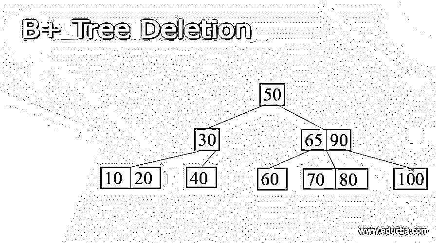
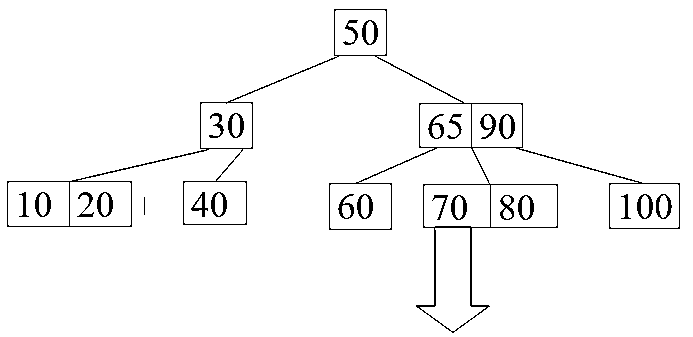
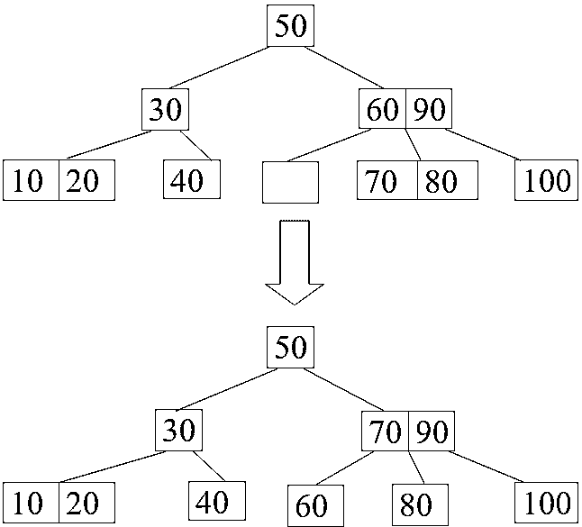
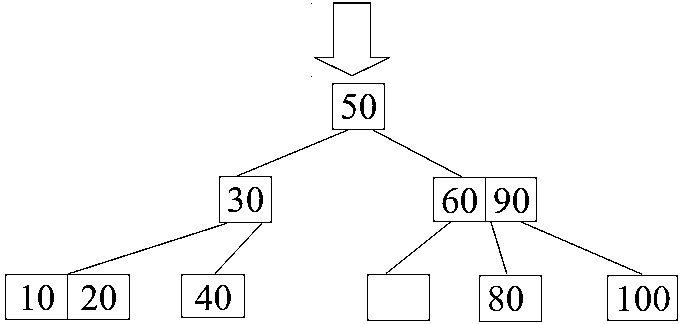
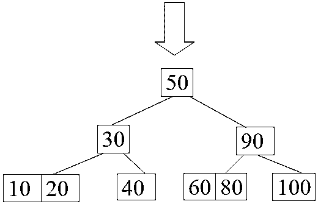
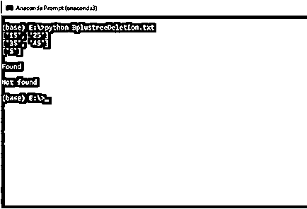

# B+树删除

> 原文：<https://www.educba.com/b-plus-tree-deletion/>

## B+树删除的定义

B+树是 B 树的扩展，允许比 B 树更有效的插入、删除和其他操作。删除 B+树中的元素包括三个操作:搜索、删除和平衡。首先，我们将搜索要删除的节点并对其执行删除操作，然后我们将平衡树作为最后一步。

### B+树删除算法

**步骤 1:** 接受键值中的输入，并搜索包含键值的叶节点。

<small>Hadoop、数据科学、统计学&其他</small>

**步骤 2:** 如果找到了关键字，则从叶子中移除该条目

如果叶片满足“半满标准”，则完成
，否则，叶片有一些数据条目。

**第三步:**如果叶子的右兄弟可以有条目。然后将最小的条目移动到叶子的右边。

否则，如果叶的左兄弟可以获取一个条目，则将最小的节点移动到该叶的左兄弟。

如果不满足以上两个标准，则合并叶节点和一个兄弟节点。

**步骤 4:** 在合并时，它递归地删除从父节点指向叶子或兄弟节点的条目。

第五步:合并会改变树的高度。

### 举例说明

让我们考虑如下所示的 B+树。

**从上述 B+树中删除 65**

**从上述 B+树中删除 70**

**源代码**

`import math
# Node creation
class Node:
def __init__(self, order):
self.order = order
self.values = [] self.keys = [] self.nextKey = None
self.parent = None
self.check_leaf = False
# Insert at the leaf
def insert_at_leaf(self, leaf, value, key):
if (self.values):
temp1 = self.values
for i in range(len(temp1)):
if (value == temp1[i]):
self.keys[i].append(key)
break
elif (value < temp1[i]):
self.values = self.values[:i] + [value] + self.values[i:] self.keys = self.keys[:i] + [[key]] + self.keys[i:] break
elif (i + 1 == len(temp1)):
self.values.append(value)
self.keys.append([key])
break
else:
self.values = [value] self.keys = [[key]] # B plus tree
class BplusTree:
def __init__(self, order):
self.root = Node(order)
self.root.check_leaf = True
# Insert operation
def insert(self, value, key):
value = str(value)
old_node = self.search(value)
old_node.insert_at_leaf(old_node, value, key)
if (len(old_node.values) == old_node.order):
node1 = Node(old_node.order)
node1.check_leaf = True
node1.parent = old_node.parent
mid = int(math.ceil(old_node.order / 2)) - 1
node1.values = old_node.values[mid + 1:] node1.keys = old_node.keys[mid + 1:] node1.nextKey = old_node.nextKey
old_node.values = old_node.values[:mid + 1] old_node.keys = old_node.keys[:mid + 1] old_node.nextKey = node1
self.insert_in_parent(old_node, node1.values[0], node1)
# Search operation for different operations
def search(self, value):
current_node = self.root
while(current_node.check_leaf == False):
temp2 = current_node.values
for i in range(len(temp2)):
if (value == temp2[i]):
current_node = current_node.keys[i + 1] break
elif (value < temp2[i]):
current_node = current_node.keys[i] break
elif (i + 1 == len(current_node.values)):
current_node = current_node.keys[i + 1] break
return current_node
# Find the node
def find(self, value, key):
l = self.search(value)
for i, item in enumerate(l.values):
if item == value:
if key in l.keys[i]:
return True
else:
return False
return False
# Inserting at the parent
def insert_in_parent(self, n, value, ndash):
if (self.root == n):
rootNode = Node(n.order)
rootNode.values = [value] rootNode.keys = [n, ndash] self.root = rootNode
n.parent = rootNode
ndash.parent = rootNode
return
parentNode = n.parent
temp3 = parentNode.keys
for i in range(len(temp3)):
if (temp3[i] == n):
parentNode.values = parentNode.values[:i] + \
[value] + parentNode.values[i:] parentNode.keys = parentNode.keys[:i +
1] + [ndash] + parentNode.keys[i + 1:] if (len(parentNode.keys) > parentNode.order):
parentdash = Node(parentNode.order)
parentdash.parent = parentNode.parent
mid = int(math.ceil(parentNode.order / 2)) - 1
parentdash.values = parentNode.values[mid + 1:] parentdash.keys = parentNode.keys[mid + 1:] value_ = parentNode.values[mid] if (mid == 0):
parentNode.values = parentNode.values[:mid + 1] else:
parentNode.values = parentNode.values[:mid] parentNode.keys = parentNode.keys[:mid + 1] for j in parentNode.keys:
j.parent = parentNode
for j in parentdash.keys:
j.parent = parentdash
self.insert_in_parent(parentNode, value_, parentdash)
# Delete a node
def delete(self, value, key):
node_ = self.search(value)
temp = 0
for i, item in enumerate(node_.values):
if item == value:
temp = 1
if key in node_.keys[i]:
if len(node_.keys[i]) > 1:
node_.keys[i].pop(node_.keys[i].index(key))
elif node_ == self.root:
node_.values.pop(i)
node_.keys.pop(i)
else:
node_.keys[i].pop(node_.keys[i].index(key))
del node_.keys[i] node_.values.pop(node_.values.index(value))
self.deleteEntry(node_, value, key)
else:
print("Value not in Key")
return
if temp == 0:
print("Value not in Tree")
return
# Delete an entry
def deleteEntry(self, node_, value, key):
if not node_.check_leaf:
for i, item in enumerate(node_.keys):
if item == key:
node_.keys.pop(i)
break
for i, item in enumerate(node_.values):
if item == value:
node_.values.pop(i)
break
if self.root == node_ and len(node_.keys) == 1:
self.root = node_.keys[0] node_.keys[0].parent = None
del node_
return
elif (len(node_.keys) < int(math.ceil(node_.order / 2)) and node_.check_leaf == False) or (len(node_.values) < int(math.ceil((node_.order - 1) / 2)) and node_.check_leaf == True):
is_predecessor = 0
parentNode = node_.parent
PrevNode = -1
NextNode = -1
PrevK = -1
PostK = -1
for i, item in enumerate(parentNode.keys):
if item == node_:
if i > 0:
PrevNode = parentNode.keys[i - 1] PrevK = parentNode.values[i - 1] if i < len(parentNode.keys) - 1:
NextNode = parentNode.keys[i + 1] PostK = parentNode.values[i] if PrevNode == -1:
ndash = NextNode
value_ = PostK
elif NextNode == -1:
is_predecessor = 1
ndash = PrevNode
value_ = PrevK
else:
if len(node_.values) + len(NextNode.values) < node_.order:
ndash = NextNode
value_ = PostK
else:
is_predecessor = 1
ndash = PrevNode
value_ = PrevK
if len(node_.values) + len(ndash.values) < node_.order:
if is_predecessor == 0:
node_, ndash = ndash, node_
ndash.keys += node_.keys
if not node_.check_leaf:
ndash.values.append(value_)
else:
ndash.nextKey = node_.nextKey
ndash.values += node_.values
if not ndash.check_leaf:
for j in ndash.keys:
j.parent = ndash
self.deleteEntry(node_.parent, value_, node_)
del node_
else:
if is_predecessor == 1:
if not node_.check_leaf:
ndashpm = ndash.keys.pop(-1)
ndashkm_1 = ndash.values.pop(-1)
node_.keys = [ndashpm] + node_.keys
node_.values = [value_] + node_.values
parentNode = node_.parent
for i, item in enumerate(parentNode.values):
if item == value_:
p.values[i] = ndashkm_1
break
else:
ndashpm = ndash.keys.pop(-1)
ndashkm = ndash.values.pop(-1)
node_.keys = [ndashpm] + node_.keys
node_.values = [ndashkm] + node_.values
parentNode = node_.parent
for i, item in enumerate(p.values):
if item == value_:
parentNode.values[i] = ndashkm
break
else:
if not node_.check_leaf:
ndashp0 = ndash.keys.pop(0)
ndashk0 = ndash.values.pop(0)
node_.keys = node_.keys + [ndashp0] node_.values = node_.values + [value_] parentNode = node_.parent
for i, item in enumerate(parentNode.values):
if item == value_:
parentNode.values[i] = ndashk0
break
else:
ndashp0 = ndash.keys.pop(0)
ndashk0 = ndash.values.pop(0)
node_.keys = node_.keys + [ndashp0] node_.values = node_.values + [ndashk0] parentNode = node_.parent
for i, item in enumerate(parentNode.values):
if item == value_:
parentNode.values[i] = ndash.values[0] break
if not ndash.check_leaf:
for j in ndash.keys:
j.parent = ndash
if not node_.check_leaf:
for j in node_.keys:
j.parent = node_
if not parentNode.check_leaf:
for j in parentNode.keys:
j.parent = parentNode
# Print the tree
def printTree(tree):
lst = [tree.root] level = [0] leaf = None
flag = 0
lev_leaf = 0
node1 = Node(str(level[0]) + str(tree.root.values))
while (len(lst) != 0):
x = lst.pop(0)
lev = level.pop(0)
if (x.check_leaf == False):
for i, item in enumerate(x.keys):
print(item.values)
else:
for i, item in enumerate(x.keys):
print(item.values)
if (flag == 0):
lev_leaf = lev
leaf = x
flag = 1
record_len = 3
bplustree = BplusTree(record_len)
bplustree.insert('5', '33')
bplustree.insert('15', '21')
bplustree.insert('25', '31')
bplustree.insert('35', '41')
bplustree.insert('45', '10')
printTree(bplustree)
print()
if(bplustree.find('5', '33')):
print("Found")
else:
print("Not found")
print()
if(bplustree.find('5', '34')):
print("Found")
else:
print("Not found")`

**输出:**

### B+树的时间复杂度

*   **最佳情况时间复杂度**

B+树的删除操作的最佳情况时间复杂度与 B+树中的搜索操作相同。因此，B+树删除的最佳时间复杂度是θ(logn)

*   **平均案件时间复杂度**

B+树的平均案例时间复杂度为θ(logn)。B+树的删除算法也花费与执行搜索操作相同的时间。所以搜索和删除的时间复杂度是相等的。

*   **最坏情况时间复杂度**

B+树的最坏情况时间复杂度是θ(logn)。

*   **B+树的空间复杂度**

在 B+树中，平均情况空间复杂度和最坏情况空间复杂度相等。

平均案例空间复杂度是θ(n)

最好的空间复杂度是θ(n)

### B+树的应用

*   在 B+树中，我们将所有数据存储在叶节点中，这使得树更短，并且在这些树中有更多分支，从而减少了磁盘 I/O。因此，我们可以在辅助存储设备中实施这些。
*   通过使用 B+树，可以进行部分检索或范围检索。遍历 B+树使这变得更容易

### B+树的优势

*   通过使用光盘存取，可以非常容易地搜索和存取任何记录。
*   与其他树相比，B+树的高度保持短而平衡。
*   B+树中的数据可以顺序访问，也可以直接访问。
*   由于数据存储在叶节点中，因此可以快速访问。

### 结论

*   B+树是 B 树的扩展，允许比 B tree 更有效的插入、删除和其他操作
*   删除 B+树中的元素包括三个操作:搜索、删除和平衡
*   如果 B+树的高度缩小，继续进一步的处理将变得非常复杂。

### 推荐文章

这是一个 B+树删除的指南。本文讨论了 B+树删除的定义、算法，并举例说明了代码实现和优点。您也可以看看以下文章，了解更多信息–

1.  [数据结构中的 B+树](https://www.educba.com/b-plus-tree-in-data-structure/)
2.  [B 树 vs B +树](https://www.educba.com/b-tree-vs-b-tree/)
3.  [树遍历 Python](https://www.educba.com/tree-traversal-python/)
4.  [生成树算法](https://www.educba.com/spanning-tree-algorithm/)

